# ByteDrive-Toy

<p align="center">
  <strong>面向 CARLA 合成数据的单目、双帧时序、开放环端到端驾驶研究原型</strong><br/>
  冻结 DINOv3 视觉骨干 · 语义/深度感知预训练 · 几何感知 BEV · 道路线图 · 三场建模 · 多模态轨迹与行为联合预测
</p>

<p align="center">
  
  
  
  
</p>

> [!IMPORTANT]
> ByteDrive-Toy 当前是**双帧时序开放环（open-loop）研究代码**，不是可直接部署到真实车辆的完整自动驾驶系统。
> 主流程已经覆盖 CARLA 数据采集、感知预训练、BEV 驾驶训练和离线可视化；闭环行为克隆目录
> `clone_loop/` 尚未实现，当前也没有在 CARLA 中接管车辆并完成闭环评测的入口。

> [!IMPORTANT]
> 此README在GitHub上渲染异常，建议下载到本地用专业MarkDown阅读器阅读。

---

## 目录

- [项目概览](#项目概览)
- [可视化效果](#可视化效果)
- [系统全景](#系统全景)
- [模型架构](#模型架构)
  - [张量尺寸总览](#张量尺寸总览)
  - [感知模型](#感知模型)
  - [驾驶模型](#驾驶模型)
  - [BEV 坐标与输出定义](#bev-坐标与输出定义)
  - [参数量与精度边界](#参数量与精度边界)
- [数据系统](#数据系统)
- [训练策略与训练方法](#训练策略与训练方法)
- [预训练权重下载](#预训练权重下载)
- [环境安装](#环境安装)
- [快速开始](#快速开始)
- [配置系统](#配置系统)
- [可视化工具](#可视化工具)
- [代码调用示例](#代码调用示例)
- [仓库结构](#仓库结构)
- [当前边界与已知注意事项](#当前边界与已知注意事项)
- [开发约定与许可证](#开发约定与许可证)

---

## 项目概览

ByteDrive-Toy 把自动驾驶研究流程拆成两个连续阶段：

1. **感知预训练**：以冻结的 DINOv3 ViT-S+/16 为视觉骨干，融合浅/中/深层完整 Token 序列，联合学习
   29 类语义分割与米制深度估计。
2. **驾驶学习**：复用感知表征，以相机 frustum 与纯 BEV xyz 几何把当前图像聚合到前向 BEV，
   再查询刚性对齐的上一帧 BEV；同时预测风险场、可行驶场、轨迹分布场、独立道路线图、8 模态未来轨迹、
   模态置信度和 8 类行为标签。规划分支以目标点与 ego 平面速度为条件，用 8 个可学习 Mode Token 查询
   BEV 主干第 3、6 层特征。

项目的核心特点如下。

| 能力 | 当前实现 |
| --- | --- |
| 视觉输入 | 当前帧 + 同场景上一帧单目 `front` RGB，默认 `W×H = 768×384`；首帧用 identity + 无效位 |
| 视觉骨干 | 本地 DINOv3 ViT-S+/16，参数永久冻结，提取第 3/6/12 层完整 Token 序列 |
| 感知任务 | 29 类语义分割；Symlog 深度回归；深度量程内/外二分类 |
| 几何建模 | 相机内外参反投影；每个 patch 中心与四角沿深度近密远疏采样 |
| BEV | 前向 `64 m × 64 m`，工作网格 `32×32`，场输出 `256×256` |
| 驾驶输出 | 三场；道路线与方向；相关停止线与灯色；8 模态 × 8 航点；8 类行为 |
| 训练 | AdamW；BF16 主干 + FP32 末端/损失；感知模块差分小学习率 |
| 数据 | CARLA 0.9.15；RGB/H.265 + 非 RGB/LMDB；严格同步多传感器采集 |
| 可视化 | 原始数据交互浏览、感知预测对照、驾驶 BEV 场与轨迹对照 |
| 检查点 | 自动续训；检查点排除可重新加载的冻结 DINOv3 骨干 |

### 当前完成度

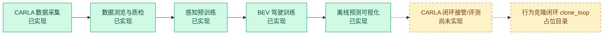

---

## 可视化效果

### 感知预测与真值对照

下图由 `vis/pred_vis/run.py` 直接生成。每列是一帧，从上到下依次为 RGB、预测语义、预测深度、
语义真值和深度真值。

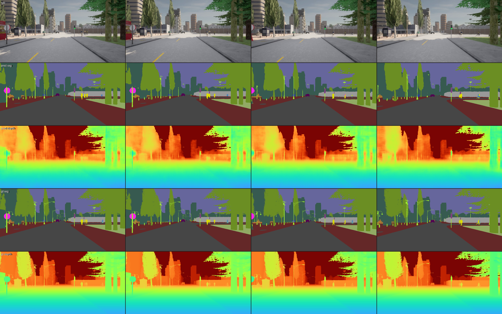

### 驾驶三场、道路线、交通控制与多模态轨迹

下图由 `vis/driving_vis/run.py` 生成，展示 RGB/语义/深度、风险场、可行驶场、轨迹分布场、独立道路线图及候选轨迹。
道路线图按类别着色，并以稀疏箭头显示 ego 坐标系中的有向切向量，具体类别/方向编码见“独立道路线图”章节。
`gt` 与 `pred` 行采用相同几何范围和着色口径，可直接观察 BEV 空间对齐情况。

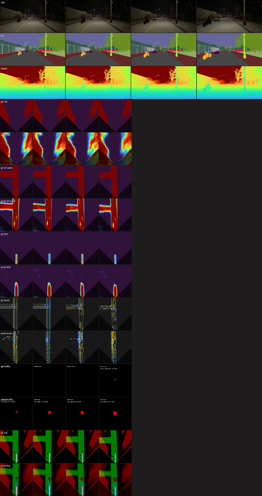

最新版额外输出 `gt traffic` / `pred traffic` 行：停止线按红/黄/绿灯态着色，未知灯态显示为白色，并叠加到
轨迹 BEV 以检查空间关系。下图使用真实数据第 12 个样本的 GT，左侧为独立交通控制层，右侧为停止线与三场、
GT 轨迹的叠加结果；该样本为绿灯，沿专家路线距离 32.3 m。

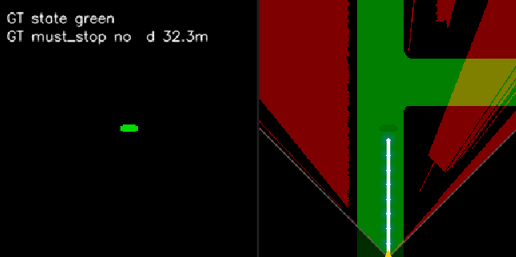

---

## 系统全景

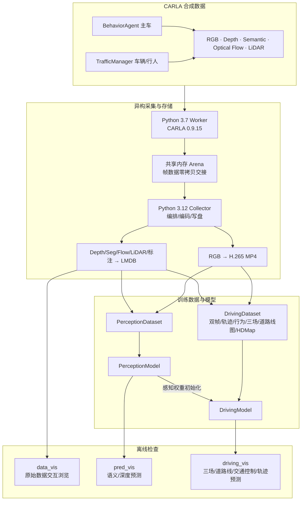

代码遵循“配置、实现、检查”分离：实验参数集中在 `config/default.yaml`，模块实现放在对应目录，
运行期输入检查放在模块内的 `checks/` 子目录。

---

## 模型架构

### 张量尺寸总览

以下尺寸按默认配置和当前/上一帧单目输入 `rgb, previous_rgb [B,3,384,768]` 计算。

| 阶段 | 张量 | 默认形状 | 说明 |
| --- | --- | --- | --- |
| 输入 | RGB | `[B,3,384,768]` | BGR 解码后转 RGB，并做 DINO ImageNet 归一化 |
| 输入 | `previous_rgb` | `[B,3,384,768]` | 同场景上一帧；首帧回退当前图像 |
| DINO 多层序列 | `dino_sequences` | `[B,3,1157,384]` | 每层完整保留 1 CLS + 4 register + 1152 patch |
| Pred Token 序列 | `trunk_tokens` | `[B,1157,384]` | 层融合后经 3 层 Pre-Norm Transformer，特殊 Token 仍保留 |
| 感知共享特征 | `trunk_feat` | `[B,384,24,48]` | 进入像素头前才取序列末部 patch 还原网格 |
| 语义输出 | `semantic` | `[B,29,384,768]` | 29 类 logits |
| 深度输出 | `depth` | `[B,2,384,768]` | ch0=Symlog 深度；ch1=量程内 logit |
| 驾驶图像特征 | `image_feat` | `[B,384,24,48]` | trunk + DINO 原始末层 + frustum 几何 |
| 初始 BEV 查询 | `bev_query` | `[B,384,32,32]` | 仅编码 BEV xyz 几何，不注入目标点 |
| 上一帧 BEV | `previous_bev` | `[B,384,32,32]` | 上一帧图像编码的 BEV 骨干末端输出 |
| 历史几何 | `previous_geometry` | `[B,384,32,32]` | 上一帧 cell 坐标刚性变换到当前 ego 系后重新编码 |
| BEV 特征 | `bev_feat` | `[B,384,32,32]` | 两段交叉注意力 + 4 个无位置 BEV 寄存器 + 6 层 Pre-Norm Transformer |
| 三场输出 | `risk/drivable/distribution` | 各 `[B,1,256,256]` | 三级 PixelShuffle，输出 logits |
| 道路线图 | `lane_class_logits` | `[B,5,256,256]` | 独立解码器，5 类类别 logits |
| 道路线方向 | `lane_direction` | `[B,2,256,256]` | 独立解码器，有向切向量原始输出 |
| 相关停止线 | `stop_line_logits` | `[B,1,256,256]` | 复用道路线高分辨率特征的二值 logits |
| 停止线灯色 | `traffic_light_state_logits` | `[B,3,256,256]` | red/yellow/green，仅在相关停止线区域监督 |
| 轨迹残差 | `trajectory_residuals` | `[B,8,8,2]` | 轨迹头对 8 扇区中线基线的物理残差（米），零初始化时为 0 |
| 多模态轨迹 | `trajectories` | `[B,8,8,2]` | 8 扇区中线米制基线 + 物理残差，直接为 ego 系米制航点 |
| 模态置信度 | `confidence` | `[B,8]` | 未归一化 logits |
| 行为输出 | `behavior_logits` | `[B,8]` | 8 类独立多标签 logits |

### 感知模型

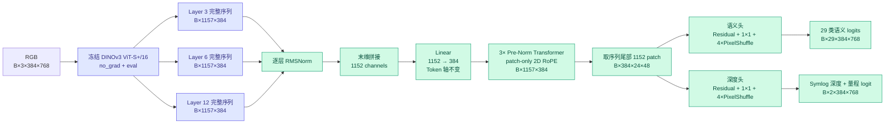

#### 1. 冻结 DINOv3，而不是端到端微调全部骨干

`DinoV3Backbone` 通过 `local_files_only=True` 从本地目录加载模型；全部参数
`requires_grad=False`，前向使用 `torch.no_grad()`，并覆写 `train()` 保证外层模型进入训练模式时骨干仍保持
`eval()`。这样可以：

- 避免在检查点中重复保存约 109.5 MiB 的骨干权重；
- 显著降低反向传播显存占用；
- 把有限的训练数据和算力集中在任务特定的融合、主干和解码头上。

#### 2. 多层特征融合

DINO 第 3/6/12 层分别偏向局部纹理、中层结构和高层语义。每层都完整保留
`[CLS, register..., patch...]` 的 1157 Token 顺序；独立 RMSNorm 后沿末维拼接为
`3×384=1152` 维，再用 Linear 降到 384 维，Token 轴全程不变。

#### 3. 感知共享主干

融合序列通过 3 层 Pre-Norm 自注意力 + SwiGLU 前馈。每层都对全序列做注意力，
但二维 RoPE 只施加于 patch query/key：左上 patch 坐标为 `(1,1)`，行列步长都为 1，
CLS 和 4 个 register Token 不施加位置编码。第 3 层后才取末部 1152 个 patch Token 还原为
`[24,48]` 网格；语义与深度头共享此前全部计算，再各自上采样到原图尺寸。

#### 4. 深度的两通道定义

- `depth[:,0]`：预测 `scale × symlog(depth_m)`；只在 `<128 m` 的有效像素上回归。
- `depth[:,1]`：预测该像素是否在有效深度范围内；以全图 BCE 监督。

其中：

```math
\operatorname{symlog}(x)=\operatorname{sign}(x)\ln(1+|x|),\qquad
y=s\cdot\operatorname{symlog}(x)
```

默认 `s=1/7≈0.14285714`。Symlog 在零附近近似线性，同时压缩远距离的大动态范围。

### 驾驶模型

Driving 只构造 `PerceptionFeatureEncoder`（DINOv3 + fusion + trunk），模型树中不存在 Pred 的语义头和深度头；
从感知检查点初始化时使用 CPU 内存映射，并且只读取 `fusion.*`、`trunk.*` 权重。

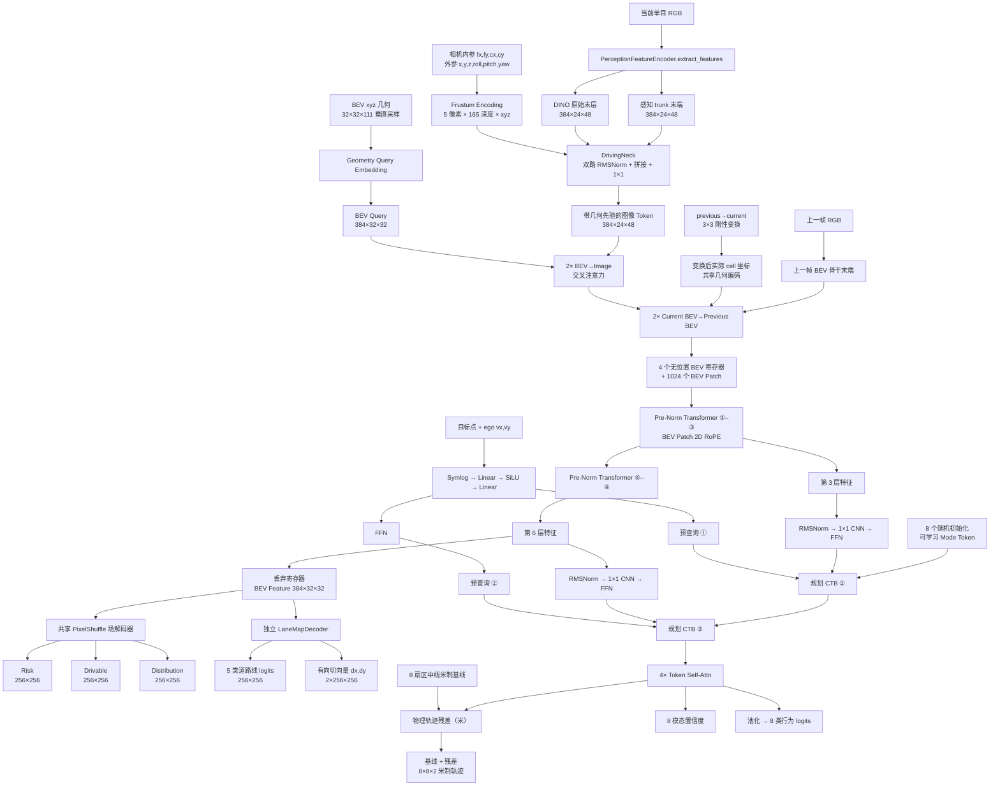

#### 1. DrivingNeck：把表观与几何放到同一特征空间

驾驶前端同时接收：

- 感知 trunk 末端特征：已带语义和深度任务信息；
- DINO 原始末层特征：保留通用视觉纹理与对象表征。

两路分别 RMSNorm 后拼接并用 `1×1` 卷积投影到 384 维，再叠加 frustum 几何位置编码，最后通过 2 个
2D 残差块提炼。

#### 2. Frustum Encoding：给单目 patch 注入可能的 3D 位置

单目图像没有唯一深度，因此模型没有把 patch 强行投到单个 3D 点。对每个 patch，代码选取中心和四角
5 个像素，并沿视线从 `0.1 m` 到 `64 m` 做近密远疏采样。默认配置实际产生 165 个深度样本，得到：

```text
[B, 24×48 patches, 5 pixels, 165 depths, 3 xyz]
```

像素点先从图像平面系变换到传感器系，再依据相机外参变到 ego 系；坐标经 Symlog 归一化后展平，
由 `Linear → SiLU → Linear` 编码成每个 patch 的 384 维几何特征。

#### 3. BEV Query Embedding：纯几何查询初始化

BEV 每个 cell 的中心 `(x,y)` 扩展为 `z∈[-3,8] m`、步长 `0.1 m` 的 111 层垂直列。每个采样点仅包含：

```text
(grid_x, grid_y, grid_z)
```

3 维几何向量经过 MLP 后沿 z 求均值，形成该 BEV cell 的初始查询；查询初始化不再编码目标点。

#### 4. BEV Encoder：先查询当前图像，再查询上一帧 BEV

当前帧的 `32×32=1024` 个 BEV 查询 Token 先通过两层 Pre-Norm 交叉注意力查询当前图像 Token。上一帧以
同一套纯几何查询得到其 BEV 骨干末端特征；每个上一帧 cell 的 `(x,y)` 再由
`previous_to_current` 刚性变换到当前 ego 系，并通过与当前查询共享的几何 MLP 编码变换后的真实坐标。
当前查询随后用两层交叉注意力查询这些历史 Token，再与 4 个本编码器自有的可学习寄存器 Token 拼成统一序列，
进入 6 层 Pre-Norm Transformer。二维 RoPE 只施加于 1024 个 BEV Patch，坐标从 `(1,1)` 起；寄存器无位置，
用于吸纳噪声并在还原网格前丢弃。场景首帧用 identity 和 `previous_valid=0` 跳过时序残差，不构造全零历史特征。

#### 5. 三场解码

BEV 特征经残差块、通道压缩和三级 PixelShuffle，从 `32×32` 放大到 `256×256`。三个 `1×1` 头共享
上采样特征，分别输出未经过 sigmoid 的 logits：

| 场 | 监督来源 | 含义 |
| --- | --- | --- |
| `risk` | GT 深度反投影后的方位包络 | 视场内、观测外缘之后的遮挡/未观测区域为高风险 |
| `drivable` | HDMap 车道栅格减去可见运动 box 足迹 | 只考虑 vehicle/pedestrian，二者统一为占用；框内至少 10 个深度像素 |
| `distribution` | 未来 GT 航点高斯软化 | 期望未来轨迹经过位置的空间分数场 |

#### 6. 独立道路线图

道路线图不与三场共享上采样参数，单独解码 5 类 logits：`background / centerline / lane_separator /
road_boundary / other_marking`。当前 Town01 HD Map 的映射为 `Center / Broken / NONE → 1 / 2 / 3`，未知
非触发区标线落入 `other_marking`。另一路输出每个道路线像素的有向单位切向量 `(dx,dy)`；方向直接由 HD Map
采样点 yaw 变换到当前 ego 系，因此 `v` 与 `-v` 表示相反行驶方向。

交通控制头复用道路线图的细线高分辨率特征，只新增停止线二值头和三类灯色头。HD Map 的
`Trigger_Volumes/TrafficLight` 四边形与当前路线走廊相交才算候选；多候选取沿路线最先到达者，避免把横向道路
或转弯后的灯关联给当前车道。四边形的 `ParentActor_Location` 与场景交通灯 actor 匹配后读取逐帧状态。红灯状态
始终监督；停车行为与越线损失仅在车辆静止，或剩余距离不小于“反应距离 + 舒适制动距离 + 安全余量”时激活，
避免刚变红但已进入不可停车区间的样本与专家轨迹冲突。

#### 7. 条件化多 Mode 规划 Token

规划使用 8 个随机初始化、在训练中持续更新的 Mode Token。目标点与 ego 平面速度 `(vₓ,vᵧ)` 先经 Symlog
和 `Linear → SiLU → Linear` 得到第一路预查询，再经 FFN 得到第二路预查询。两个规划 CTB 依次查询 BEV
六层主干的第 3、6 层特征；两路特征分别做 RMSNorm，共享 `1×1 CNN` 降维，再由独立 FFN 适配。随后四层
Token 自注意力协调 8 个 Mode：

- 每个 Mode 只回归其扇区中线米制基线的物理残差（米）；残差头零初始化，初始输出严格等于基线；
- 每个 Mode 输出 8 个未来航点和 1 个置信度，供推理时排序；
- 8 个 Mode 特征均值输出 8 个独立行为 logits；
- 行为顺序为：障碍停车、红灯停车、加速、直行、左转、右转、减速、静止；其中红灯停车在相关停止线为红灯时
  提前激活，不再等车辆完全静止。

### BEV 坐标与输出定义

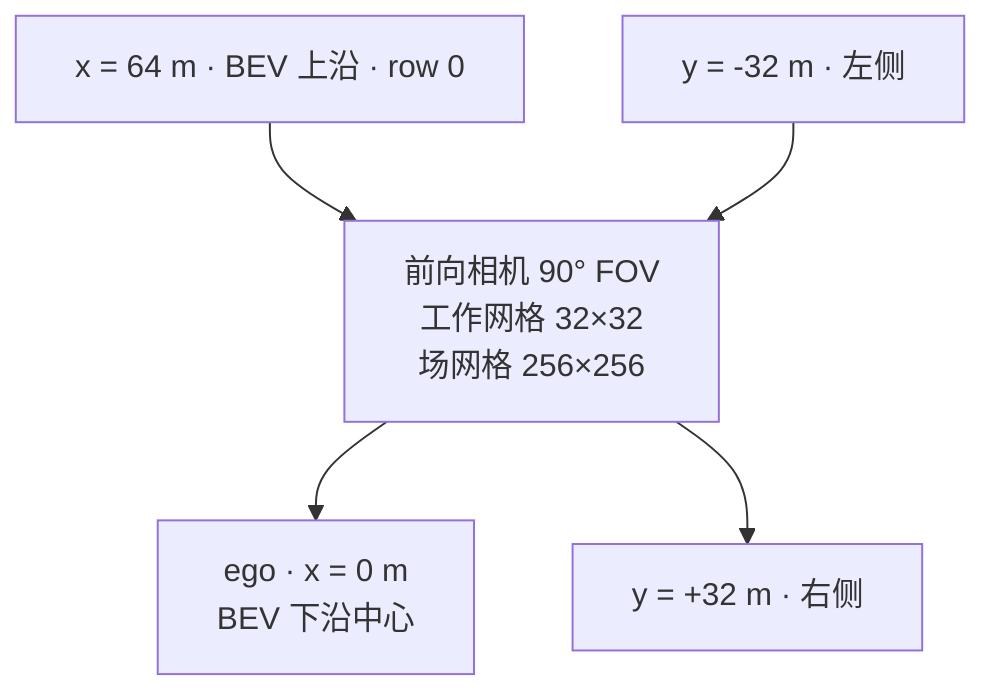

约定与 CARLA ego 坐标保持一致：`x` 向前，`y` 向右，`z` 向上；BEV 图像第 0 行对应远端，最后一行
对应近端。三场和道路线图只在 90° 前向视场内计主要监督，视场外通过 `inview` 掩码剔除。

### 参数量与精度边界

参数量由当前默认配置和本地 DINOv3 权重实际构造后统计：

| 模型 | 总参数 | 默认可训练参数 | 冻结参数 |
| --- | ---: | ---: | ---: |
| `PerceptionModel` | 35,128,815 | 6,435,951 | 28,692,864 |
| `DrivingModel` | 58,504,711 | 29,811,847 | 28,692,864 |

默认 `model.driving.freeze_perception=false`，因此驾驶模型的 29.81M 非冻结参数包含视觉 fusion/trunk、
时序 BEV 与各驾驶解码器；语义/深度头未被构造。DINOv3 的 28.69M 参数始终冻结。
若设为 `true`，视觉 fusion/trunk 也会完全冻结。

混合精度边界不是由训练循环隐式决定，而是模型内部显式划分：

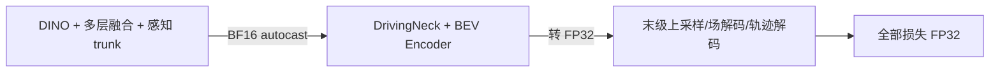

BF16 具有与 FP32 相同的指数范围，训练循环不使用 `GradScaler`。几何反投影、Symlog 坐标构造等数值路径
固定使用 FP32，MLP/主干部分再进入 BF16 autocast。

---

## 数据系统

### CARLA 异构双进程采集

CARLA 0.9.15 的 Python 客户端运行在 Python 3.7 worker；现代模型、编码和写盘运行在 Python 3.12
collector。两者通过 JSON 行协议传控制消息，通过命名共享内存传大体积传感器数据。

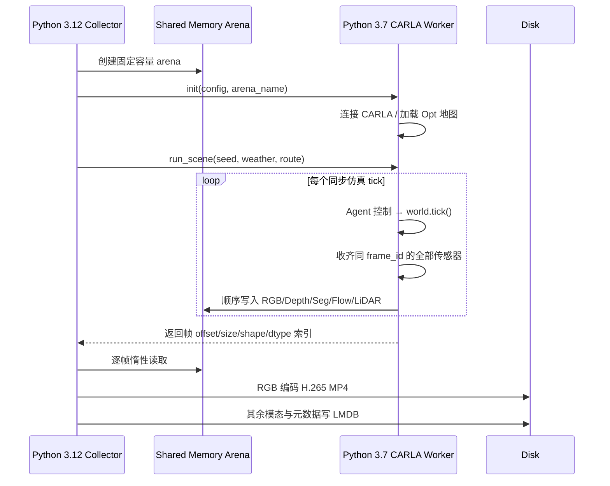

采集模块的完整设计和字段说明见
[data/carla_data_collector/README.md](data/carla_data_collector/README.md)。

### 单场景落盘结构

```text
data/carla_data_collector/dataset/
└── scenes/
    └── scene_000000/
        ├── rgb_front.mp4
        ├── rgb_front_left.mp4        # 仅在对应相机启用时存在
        └── lmdb/
            ├── data.mdb
            └── lock.mdb
```

LMDB 主要键：

| 键 | 内容 |
| --- | --- |
| `meta` | 场景 ID、地图、天气、路线、seed、相机内外参、静态框、交通灯等 |
| `num_frames` | 场景帧数 |
| `{i}/meta` | 第 i 帧时间、ego 状态、动态框、交通灯状态 |
| `{i}/depth/{cam}` | 米制 `float32 [H,W]` 深度 |
| `{i}/semantic/{cam}` | CityScapes/CARLA 标签 `uint8 [H,W]` |
| `{i}/optical_flow/{cam}` | `float32 [H,W,2]` 光流，可选 |
| `{i}/lidar` | 带 `obj_idx/obj_tag` 的结构化语义 LiDAR 点，可选 |

### 数据集读取路径

`SingleFrameSceneBase` 在初始化时只轻量读取各场景 LMDB 的 `num_frames`，把所有帧展开为
`(scene_dir, frame_idx)` 索引；`SceneReader` 和视频解码器在 DataLoader worker 内惰性创建，避免跨进程共享
`cv2.VideoCapture`。每个 worker 只保留 `data.scene_cache_size` 个场景的 LRU 缓存，淘汰时显式关闭视频与
LMDB，内存上限不随数据集场景总数增长。训练 batch 优先由同场景连续帧组成，再在 batch 粒度打乱，减少 H.265
随机 seek；驾驶双帧读取还复用最近已解码帧，避免重叠历史帧回跳重解码。

#### PerceptionDataset 输出

| 键 | 形状 | 含义 |
| --- | --- | --- |
| `rgb` | `[3,H,W]` | DINO 归一化 RGB |
| `semantic` | `[H,W]` | `long` 语义标签 |
| `depth_target` | `[H,W]` | `scale × symlog(depth_m)` |
| `depth_inrange` | `[H,W]` | `< depth_max_m` 为 1 |

#### DrivingDataset 输出

| 类别 | 键 | 含义 |
| --- | --- | --- |
| 模型输入 | `rgb` | 归一化单目图像 |
| 模型输入 | `previous_rgb` | 同场景上一帧归一化单目图像；场景首帧回退当前图像 |
| 模型输入 | `previous_to_current/previous_valid` | 上一帧 ego xy 到当前 ego xy 的 `3×3` 刚性矩阵及有效位 |
| 模型输入 | `intrinsics` | `[fx,fy,cx,cy]` |
| 模型输入 | `extrinsics` | 相机在 ego 系的 `[x,y,z,roll,pitch,yaw]` |
| 模型输入 | `target_point` | 未来 16–32 m 窗口内随机导航目标点，同时用于规划条件和路线相关监督 |
| 模型输入 | `ego_velocity` | 世界速度旋转到当前 ego 系后的 `[vₓ,vᵧ]` |
| 轨迹监督 | `trajectory/traj_valid` | 未来航点及有效掩码；匹配关系由预测与 GT 动态计算 |
| 行为监督 | `behavior` | 8 类多热向量 |
| 场监督 | `risk/drivable/distribution/inview` | 三场与视场掩码；drivable 已扣除可见 box 占用 |
| 道路线监督 | `lane_class/lane_direction` | 5 类道路线索引与 ego 系有向单位切向量 `[2,H,W]` |
| 交通控制监督 | `stop_line/traffic_light_state/state_valid` | 当前路线第一条停止线、灯色与状态有效掩码 |
| 红灯越线监督 | `stop_point/stop_direction/red_stop_valid` | 停止区中心、路线切向与红灯有效位 |
| 可行驶约束 | `offroad_distance` | 可行驶处为 0，道路外或可见 box 占用内为米制距离 |

未来轨迹取同场景后续 8 个采集帧的 ego 位姿并变换到当前 ego 系。默认采集频率为 2 Hz，因此 8 个航点
覆盖约 4 秒；场景末尾不足 8 帧时补零，并由 `traj_valid` 排除无效位置。

### 场与道路线图监督如何生成

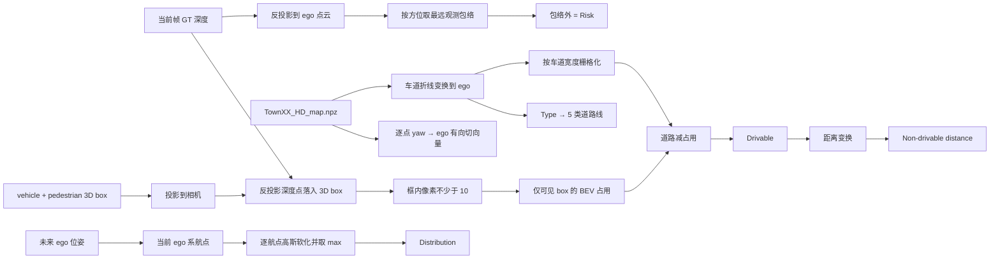

---

## 训练策略与训练方法

### 推荐的两阶段训练顺序


#### 阶段 1：感知预训练

默认可训练部分为多层 Token 融合、3 层 Pre-Norm Transformer、语义头和深度头。DINOv3 永久冻结。

感知总损失：

```math
\mathcal{L}_{perception}=
K_1\mathcal{L}_{semantic}+
K_2\mathcal{L}_{depth}+
K_3\mathcal{L}_{depth\_grad}+
K_4\mathcal{L}_{depth\_range}
```

| 分量 | 实现 |
| --- | --- |
| `semantic` | 29 类交叉熵；忽略标签 0/Unlabeled |
| `depth` | Symlog 空间 SmoothL1；仅量程内；近处权重 1 线性降到远处 0.1 |
| `depth_grad` | 预测与 GT 的水平/垂直相邻差 SmoothL1；只要求边两端都在量程内 |
| `depth_range` | 全图 BCE-with-logits，判断深度是否 `<128 m` |

掩码损失使用有效像素权重和作为分母，而不是全图像素数，避免天空/超量程比例变化导致有效学习率漂移。

#### 阶段 2：驾驶训练

从感知检查点只筛选 `fusion.*`、`trunk.*` 初始化 `DrivingModel.perception`；语义/深度头权重明确排除。
默认 `freeze_perception=false`：

- 新增驾驶模块学习率：`5e-5`；
- 感知 fusion/trunk 学习率：`5e-5 × 0.01 = 5e-7`；Driving 中不构造语义/深度头；
- DINOv3：始终冻结，不进入优化器。

驾驶总损失：

```math
\begin{aligned}
\mathcal{L}_{driving}={}&
k_1\mathcal{L}_{trajectory}+
k_2\mathcal{L}_{confidence}+
k_3\mathcal{L}_{behavior}\\
&+k_4\mathcal{L}_{distribution}+
K_5\mathcal{L}_{risk}+
K_6\mathcal{L}_{drivable}+
K_7\mathcal{L}_{lane\_class}+
K_8\mathcal{L}_{lane\_direction}+
K_9\mathcal{L}_{boundary}+
K_{10}\mathcal{L}_{stop\_line}+
K_{11}\mathcal{L}_{light\_state}+
K_{12}\mathcal{L}_{stop\_crossing}
\end{aligned}
```

| 分量 | 实现 |
| --- | --- |
| `risk` | 视场掩码内 BCE-with-logits |
| `drivable` | 视场掩码内 BCE-with-logits |
| `distribution` | 视场内空间 softmax，与归一化 GT 高斯软占据做交叉熵 |
| `lane_class` | 视场内 5 类加权交叉熵，背景权重 0.1，细线类别权重 1.0 |
| `lane_direction` | 仅道路线像素上的有向余弦距离，保留正反行驶方向 |
| `trajectory` | 米制 ADE 做 8×1 匈牙利匹配、Symlog 空间回归；最相似 Mode 全权重，其余 7 个 Mode 以 0.05 小权重更新 |
| `confidence` | 以匈牙利匹配结果为标签的 8 Mode 交叉熵 |
| `behavior` | 8 类独立 BCE-with-logits，允许同一帧多个行为同时激活 |
| `boundary` | 对全部模态/航点可微采样道路外/可见占用距离；超出 BEV 另加坐标越界距离 |
| `stop_line` | 前景/背景分别归一的均衡 BCE，避免稀疏停止线被背景淹没 |
| `traffic_light_state` | 仅在相关停止线且状态已知区域做 red/yellow/green 交叉熵 |
| `stop_crossing` | 红灯时按路线切向惩罚全部候选航点越过带安全余量的停止位置 |

`boundary` 对所有候选轨迹等权约束，因此低置信度模态也不能无代价地逃逸到道路外。

### 默认优化配置

| 配置 | 默认值 | 说明 |
| --- | ---: | --- |
| 优化器 | AdamW | 只接收可训练参数 |
| `epochs` | 10 | 目标**总** epoch 数，不是本次额外训练轮数 |
| `batch_size` | 32 | 对显存要求高，首次运行建议先用 1–4 验证 |
| `num_workers` | 4 | Windows 下入口已有 `if __name__ == "__main__"` 保护 |
| `data.scene_cache_size` | 2 | 每个 worker 最多常驻的场景 reader 与驾驶状态数 |
| `shuffle` / `drop_last` | true / true | 同场景连续帧成批后打乱 batch；仅丢全局最终尾批 |
| `pin_memory` | true | 仅 CUDA 设备实际启用锁页内存 |
| `persistent_workers` | true | 场景缓存有界后跨 epoch 安全复用 worker |
| `lr` | `1e-4` | 驾驶新增模块/感知训练基础学习率 |
| `weight_decay` | `1e-5` | AdamW 权重衰减 |
| `grad_clip_norm` | 0 | 0 表示关闭裁剪 |
| `log_every` | 20 | 每 20 step 打印一次 |
| `resume` | true | 自动搜索当前任务目录下最大 epoch 检查点 |

### 检查点语义

训练器把 `cfg.train.ckpt_dir` 再按任务名分目录：

```text
train/checkpoints/
├── perception/epoch_001.pt
└── driving/epoch_001.pt
```

每个训练检查点包含：

```python
{
    "epoch": 已完成的_epoch数,
    "model": 不含任何名为_backbone_的冻结骨干权重,
    "optimizer": AdamW状态,
    "optimizer_param_names": 与优化器参数组逐项对齐的稳定参数名,
}
```

恢复训练使用 `strict=False`，缺失的 DINOv3 骨干键由本地骨干目录重新加载。

> [!CAUTION]
> `--perception-ckpt` 用于“从感知权重初始化一次新的驾驶训练”；`--resume` 用于“恢复同一任务的模型、
> 优化器和 epoch”。若 `train.resume=true` 且驾驶检查点目录中已有文件，自动恢复会在感知初始化之后执行并覆盖它。
> 开启全新阶段 2 实验时，请使用环境覆盖把 `resume` 设为 `false`，或确认目标检查点目录为空。

`train.epochs` 表示最终要训练到的总轮数。比如检查点已经是 epoch 40，必须把 `epochs` 设为大于 40；
若仍保持默认 10，恢复成功后训练区间为空，程序不会再执行任何 epoch。

模型结构新增辅助头时，resume 会按键名与形状复用旧模型参数；新增参数保留构造期初始化。优化器状态按参数名迁移，
旧版检查点未保存参数名时按“过滤新增参数后的稳定顺序”迁移，因此停止线头加入前的 driving checkpoint 可直接自动恢复；
新头的 AdamW 动量在第一次 `step` 时自动建立。AdamW 本身按需创建状态：参数从未得到梯度时只有参数组条目、没有
`exp_avg/exp_avg_sq`；恢复日志会把这种“旧档未建状态”与真正的“新增无旧状态”分开报告。

### 当前训练器尚未自动完成的事项

代码提供了 `evaluate()` 和 `evaluate_driving()` 函数，但 `train/run.py` 当前只执行训练，不会自动：

- 划分 train/validation/test；
- 每个 epoch 运行验证与保存 best checkpoint；
- 计算 IoU、深度误差、ADE/FDE、碰撞率等任务指标；
- 配置学习率 scheduler、warmup、EMA 或早停；
- 做图像增强或时间序列建模。

因此正式实验应先按场景划分数据，避免相邻帧跨集合泄漏，并在独立脚本中调用已有 evaluate 函数或扩展训练入口。

---

## 预训练权重下载

### 百度网盘

- 下载地址：[ByteDrive-Toy 预训练权重](https://pan.baidu.com/s/1Fc8xh40ODsYug3Sc2GMBjQ?pwd=v5pw)
- 提取码：`v5pw`

> [!NOTE]
> 百度网盘页面无法通过本项目代码自动校验登录态或下载状态。请在浏览器/客户端中下载，并只加载你信任来源的
> `.pt` 文件；PyTorch 检查点本质上是可序列化对象，不应加载来源不明的文件。

### 期望目录布局

解压后确认文件位于以下位置。路径不一致时可移动文件，或修改 `config/default.yaml`/命令行覆盖。

```text
ByteDrive-Toy/
├── model/
│   └── dinov3-vits16plus-pretrain-lvd1689m/
│       ├── config.json
│       └── model.safetensors
├── train/
│   └── ckpt/
│       ├── perception.pt
│       └── driving/
│           └── driving.pt
└── data/
    └── map/
        └── Town01_HD_map.npz
```

### 文件作用与当前版本信息

| 文件 | 大小约 | 内容 | 使用方式 |
| --- | ---: | --- | --- |
| `model.safetensors` | 109.5 MiB | DINOv3 ViT-S+/16 冻结骨干 | 构造任一模型时自动本地加载 |
| `perception.pt` | 73.9 MiB | 感知 epoch 40；模型+优化器 | 感知推理/续训；初始化驾驶感知模块 |
| `driving.pt` | 258.2 MiB | 驾驶 epoch 10；模型+优化器 | 驾驶推理/续训 |
| `Town01_HD_map.npz` | 7.3 MiB | Town01 车道折线 HDMap | 生成可行驶场和越界距离场 |

快速检查权重能否被当前代码识别：

```powershell
python -c "from config import load_config; from model.perception_model import PerceptionModel; PerceptionModel(load_config()); print('DINOv3 OK')"
python -c "import torch; print(torch.load('train/ckpt/perception.pt', map_location='cpu', weights_only=False)['epoch'])"
python -c "import torch; print(torch.load('train/ckpt/driving/driving.pt', map_location='cpu', weights_only=False)['epoch'])"
```

---

## 环境安装

### 运行环境分工

| 环境 | 用途 | 关键依赖 |
| --- | --- | --- |
| Python 3.12 主环境 | 数据编码/读取、训练、推理、可视化 | PyTorch、Transformers、PyYAML、NumPy、OpenCV、LMDB、msgpack、PyAV |
| Python 3.7 worker 环境 | 连接 CARLA 0.9.15 并采集 | `carla`、NumPy、Shapely、NetworkX |

仓库当前开发环境可成功加载的参考版本为 Python 3.12.9、PyTorch 2.12.1、Transformers 5.13.0、
PyYAML 6.0.3、NumPy 2.4.6、OpenCV 4.13.0、LMDB 2.2.1、msgpack 1.2.1、PyAV 17.1.0。
这些是参考环境而不是严格锁定；仓库目前没有 `requirements.txt`/`pyproject.toml`，尤其是 GPU 版 PyTorch
应按本机驱动和 CUDA 版本选择。

### 创建 Python 3.12 主环境

Windows PowerShell：

```powershell
py -3.12 -m venv .venv
Set-ExecutionPolicy -Scope Process Bypass
.\.venv\Scripts\Activate.ps1
python -m pip install --upgrade pip

# 按 https://pytorch.org/get-started/locally/ 选择匹配本机 CUDA 的 torch 安装命令。
# 下行只列出项目直接使用的其余依赖：
pip install transformers pyyaml numpy opencv-python lmdb msgpack av
```

若只安装了 CPU 版 PyTorch，配置中的 `device: cuda` 会在训练入口回退到 CPU；但 DINOv3 和高分辨率场解码
在 CPU 上非常慢，完整训练建议使用支持 BF16 的 CUDA GPU。

### 创建 CARLA Python 3.7 worker 环境

```powershell
py -3.7 -m venv data/carla_data_collector/py37_venv
.\data\carla_data_collector\py37_venv\Scripts\Activate.ps1
python -m pip install numpy==1.21.6 shapely networkx

# 按 CARLA 0.9.15 安装包位置安装 carla wheel/egg；安装方式取决于你的 CARLA 分发包。
```

随后确认 `config/default.yaml` 中：

```yaml
carla_collector:
  worker:
    python_exe: data/carla_data_collector/py37_venv/Scripts/python.exe
    carla_host: 127.0.0.1
    carla_port: 2000
```

### CARLA 与编码器前置条件

- 启动 CARLA 0.9.15 服务端，并确保 `127.0.0.1:2000` 可连接；
- 项目采集器只接受 `*_Opt` 地图，默认 `Town01_Opt`；
- PyAV 构建需要可用的 `libx265` 编码器才能写 H.265；若编码失败，先检查 `av.codec.Codec('libx265','w')`；
- 驾驶数据集需要匹配地图的 `data/map/{Town}_HD_map.npz`。

---

## 快速开始

以下命令均从仓库根目录执行，并假设 Python 3.12 主环境已经激活。

### 1. 配置与骨干自检

```powershell
python -c "from config import load_config; c=load_config(); print(c.train.device, c.model.driving.work_dim)"
python -c "from model.perception_model import PerceptionModel; from config import load_config; m=PerceptionModel(load_config()); print(sum(p.numel() for p in m.parameters()))"
```

预期第二条命令能从本地 `model/dinov3-vits16plus-pretrain-lvd1689m/` 加载权重，并输出 `35128815`。

### 2. 采集少量 CARLA 数据

先启动 CARLA 服务端，再运行：

```powershell
python data/carla_data_collector/collector/run.py --config config/default.yaml --max-scenes 2
```

采集器会自动派生 Python 3.7 worker，无需手动启动 worker。首次验证建议：

- `--max-scenes 1` 或 2；
- 减少交通参与者；
- 仅启用 `front` 相机；
- 暂时关闭 Optical Flow 和 LiDAR；
- 确认 H.265/LMDB 都能写入后再扩大规模。

### 3. 浏览原始场景

```powershell
python vis/data_vis/run.py --scene 0
```

`--scene` 可以是整数索引、`scene_000000` 场景名或完整目录路径。

### 4. 训练感知模型

```powershell
python train/run.py --task perception
```

训练结果保存到：

```text
train/checkpoints/perception/epoch_001.pt
...
```

从下载的 epoch 40 检查点续训：

```yaml
# config/continue_perception.yaml
train:
  epochs: 50
```

```powershell
python train/run.py --task perception --env continue_perception --resume train/ckpt/perception.pt
```

### 5. 用感知权重初始化并训练驾驶模型

全新阶段 2 实验应先在环境覆盖中设置 `train.resume: false`，然后：

```powershell
python train/run.py --task driving --env fresh_driving --perception-ckpt train/ckpt/perception.pt
```

从下载的驾驶检查点恢复：

```yaml
# config/continue_driving.yaml
train:
  epochs: 20
```

```powershell
python train/run.py --task driving --env continue_driving --resume train/ckpt/driving/driving.pt
```

### 6. 直接可视化下载的权重

感知：

```powershell
python vis/pred_vis/run.py --checkpoint train/ckpt/perception.pt
```

驾驶：

```powershell
python vis/driving_vis/run.py --checkpoint train/ckpt/driving/driving.pt
```

> [!NOTE]
> 感知训练器实际保存到 `train/checkpoints/perception/`，而默认配置中的
> `pred_vis.checkpoint` 当前写的是 `train/checkpoints/epoch_010.pt`。使用训练产物时请显式传
> `--checkpoint train/checkpoints/perception/epoch_010.pt`，或在环境覆盖文件中修正路径。

---

## 配置系统

`config/default.yaml` 是全部可调参数的唯一默认值来源，`config/schema.py` 定义类型和约束，
`config.load_config()` 负责读取、深度合并环境覆盖并校验。

### 环境覆盖

例如创建 `config/fresh_driving.yaml`：

```yaml
train:
  device: cuda
  batch_size: 2
  num_workers: 2
  epochs: 10
  resume: false

model:
  driving:
    freeze_perception: false
```

运行时使用：

```powershell
python train/run.py --task driving --env fresh_driving --perception-ckpt train/ckpt/perception.pt
```

覆盖文件只需要写变化项；其余键递归继承 `default.yaml`。

### 关键配置导航

| 配置段 | 控制内容 |
| --- | --- |
| `carla_collector.worker/ipc/simulation` | 双进程、共享内存、CARLA 地图和步长 |
| `carla_collector.cameras/lidar` | 传感器模态、分辨率、FOV、外参 |
| `carla_collector.route/traffic/ego/weather` | 路线、交通流、主车和天气 |
| `data_vis` | 原始数据浏览样式与图层 |
| `model.dinov3_backbone` | 本地骨干路径、patch size、抽取层 |
| `model.feature_trunk/heads/physics` | 感知主干、双头和物理量编码 |
| `model.driving.bev/query/frustum` | BEV 几何、目标查询和视锥采样 |
| `model.driving.attention/bev_encoder` | 当前图像/上一帧 BEV 注意力和 BEV 空间提炼 |
| `model.driving.fields/lane_map/traffic_control/trajectory/behavior` | 三场、道路线、停止线灯色、轨迹和行为输出 |
| `data.dataset/data.driving` | 场景根、归一化、HDMap 与标签阈值 |
| `train` | 设备、批量、优化器、续训和损失权重 |
| `pred_vis/driving_vis` | 权重、场景、帧数、保存目录和配色 |

### 显存不足时优先调整

1. 将 `train.batch_size` 从 32 降到 1–4；
2. 训练驾驶模型时设 `model.driving.freeze_perception: true`；
3. 降低 `model.driving.fields.up_channels` 的通道数，而不是随意改变列表长度；改变长度会改变场分辨率；
4. 减少 `model.driving.bev_encoder.num_register_tokens`（Transformer 层数固定为 6）；
5. 谨慎调整 frustum 采样——更小步长会扩大 MLP 输入和中间几何张量。

改变输入宽高时，必须保证二者均可被 `patch_size=16` 整除；语义/深度头四级上采样倍率固定为 16，
因此 DINO patch 网格会恰好恢复到输入分辨率。

---

## 可视化工具

### 原始数据交互浏览器

```powershell
python vis/data_vis/run.py --scene scene_000000
```

| 按键 | 功能 |
| --- | --- |
| `Space` | 播放/暂停 |
| `A` / `,` / `←` | 上一帧 |
| `.` / `→` | 下一帧 |
| `R` | RGB 图层 |
| `D` | Depth 图层 |
| `M` | Semantic 图层 |
| `F` | Optical Flow 图层 |
| `V` | BEV/LiDAR 图层 |
| `B` | 动态包围框 |
| `S` | 静态包围框 |
| `W` | 保存当前合成截图到工作目录 |
| `Q` / `Esc` | 退出 |

### 感知预测可视化

```powershell
python vis/pred_vis/run.py `
  --checkpoint train/ckpt/perception.pt
```

默认最多取同一场景前 4 帧，保存到 `vis/pred_vis/out/`。若检查点不存在，脚本会告警并用随机初始化模型继续，
这只能用于验证渲染管线，不能解释为有效预测。

### 驾驶预测可视化

```powershell
python vis/driving_vis/run.py `
  --checkpoint train/ckpt/driving/driving.pt
```

三场 logits 在显示前经过 sigmoid；道路线类别 logits 使用 argmax，并按配置中的类别色板着色；方向向量沿通道
归一化后，以稀疏箭头标出实际行驶方向。停止线概率超过配置阈值后按预测灯态着色，GT 行同时显示是否必须停车与
沿路线距离；两者都叠加到各自轨迹 BEV。多模态轨迹使用置信度着色，并可与 GT 航点叠加。旧权重新增输出头保持
零初始化时，停止线概率恰为 0.5；默认阈值采用严格大于判断，因此不会误显示整幅停止线。

修改具体场景、最大帧数、是否显示 GT、色图、道路线配色/箭头样式、交通控制配色/阈值/叠加强度和缩放比例，
请使用 `pred_vis`/`driving_vis` 配置段或环境覆盖。

---

## 代码调用示例

### 感知推理

```python
import torch

from config import load_config
from data.perception_dataset import PerceptionDataset
from model.perception_model import PerceptionModel

cfg = load_config()
device = torch.device("cuda" if torch.cuda.is_available() else "cpu")

model = PerceptionModel(cfg).to(device).eval()
ckpt = torch.load("train/ckpt/perception.pt", map_location=device, weights_only=False)
model.load_state_dict(ckpt["model"], strict=False)  # DINO 骨干键由本地目录加载

sample = PerceptionDataset(cfg)[0]
with torch.no_grad():
    output = model(sample["rgb"].unsqueeze(0).to(device))

print(output["semantic"].shape)  # [1, 29, 384, 768]
print(output["depth"].shape)     # [1, 2, 384, 768]
```

### 驾驶推理

```python
import torch

from config import load_config
from data.driving_dataset import DrivingDataset
from model.driving_model import DrivingModel

cfg = load_config()
device = torch.device("cuda" if torch.cuda.is_available() else "cpu")

model = DrivingModel(cfg).to(device).eval()
ckpt = torch.load("train/ckpt/driving/driving.pt", map_location="cpu", weights_only=True, mmap=True)
current = model.state_dict()
compatible = {name: value for name, value in ckpt["model"].items()
              if name in current and value.shape == current[name].shape}
model.load_state_dict(compatible, strict=False)

sample = DrivingDataset(cfg)[0]
inputs = [sample[name].unsqueeze(0).to(device) for name in
          ("rgb", "intrinsics", "extrinsics", "target_point", "ego_velocity", "previous_rgb",
           "previous_to_current", "previous_valid")]

with torch.no_grad():
    output = model(*inputs)

print(output["risk"].shape)             # [1, 1, 256, 256]
print(output["lane_class_logits"].shape)  # [1, 5, 256, 256]
print(output["lane_direction"].shape)     # [1, 2, 256, 256]
print(output["stop_line_logits"].shape)   # [1, 1, 256, 256]
print(output["traffic_light_state_logits"].shape)  # [1, 3, 256, 256]
print(output["trajectories"].shape)     # [1, 8, 8, 2]
print(output["behavior_logits"].shape)  # [1, 8]
```

模型输出的三场、停止线、置信度、行为和类别图都是 logits；三场/停止线使用 `sigmoid`，道路线/灯色类别用
`argmax`，方向向量沿通道归一化。轨迹模态选择可对 `confidence` 使用 `softmax`/`argmax`；
`trajectories` 即 ego 系米制 `(x,y)` 航点（扇区中线基线 + 物理残差），全程物理空间、无 Symlog 编解码。

---

## 仓库结构

```text
ByteDrive-Toy/
├── config/
│   ├── default.yaml                  # 全部默认参数的唯一来源
│   ├── schema.py                     # dataclass schema 与配置校验
│   └── __init__.py                   # load_config + 环境覆盖深度合并
├── data/
│   ├── carla_data_collector/         # CARLA Py3.7/Py3.12 双进程采集系统
│   ├── single_frame_base/            # 场景索引、惰性 reader、RGB 归一化
│   ├── perception_dataset/           # 感知单帧数据集
│   ├── driving_dataset/              # 驾驶输入与多任务 GT
│   ├── driving_targets/              # 轨迹、行为、风险/分布场纯 NumPy 编码
│   ├── hd_map/                       # HDMap 栅格化与道路外距离场
│   ├── target_encoding/              # Symlog 物理量监督
│   └── map/                          # TownXX_HD_map.npz（下载/本地文件）
├── model/
│   ├── dinov3_backbone/              # 冻结本地 DINOv3 多层完整 Token 序列
│   ├── feature_fusion/               # 逐层 RMSNorm + 末维拼接 + Linear 融合
│   ├── feature_trunk/                # 感知 3 层 Pre-Norm Transformer
│   ├── perception_head/              # 语义/深度 PixelShuffle 头
│   ├── perception_model/             # 共享视觉编码器 + Pred 双头总模型
│   ├── frustum_encoding/             # patch 视锥 3D 候选编码
│   ├── driving_neck/                 # 感知+DINO+几何融合
│   ├── bev_query_embedding/          # 纯 xyz 几何 BEV 查询
│   ├── attention/                    # Pre-Norm SDPA + SwiGLU + patch-only 2D RoPE
│   ├── bev_encoder/                  # BEV 交叉注意力 + 无位置寄存器 + 6 层 2D RoPE Transformer
│   ├── field_decoder/                # 风险/可行驶/轨迹分布三场
│   ├── trajectory_decoder/           # 多模态轨迹/置信度/行为联合 Token
│   ├── driving_model/                # 驾驶总模型
│   └── residual_block/ ...           # 可复用基础构件及 checks
├── train/
│   ├── run.py                        # perception/driving 统一 CLI
│   ├── loop/                         # 训练与评估循环
│   ├── losses/                       # 感知/驾驶多任务损失
│   ├── optimizer/                    # AdamW 与差分学习率分组
│   ├── ckpt/                         # 下载的示例预训练检查点
│   └── checkpoints/                  # 本地训练输出（默认）
├── vis/
│   ├── data_vis/                     # 原始数据交互浏览器
│   ├── pred_vis/                     # 感知预测/GT 对照
│   └── driving_vis/                  # 三场/道路线/交通控制/轨迹预测与 GT 对照
├── assets/
│   └── visualizations/               # README 展示用的可视化结果图
├── clone_loop/                       # 行为克隆闭环占位，尚未实现
├── Doc/
│   ├── Index.md                      # 文件与文档索引
│   └── 开发规范.md                   # 项目开发约定
├── LICENSE                           # Apache License 2.0
└── README.md
```

大多数模块采用同构布局：

```text
<module>/
├── __init__.py                       # 稳定重导出 API
├── <module>.py                       # 核心实现
└── checks/
    ├── __init__.py
    └── <module>_checks.py            # 输入/形状/运行期约束
```

`model/rope_3d` 等基础模块已实现并带检查，但当前 `PerceptionModel`/`DrivingModel` 主前向没有调用；
阅读架构时应以两个总模型的实际依赖为准，而不是仅凭目录名判断已接入功能。

---

## 当前边界与已知注意事项

### 研究边界

- 当前模型是双帧时序、单目、开放环预测，只融合一帧历史 BEV，不包含长时序记忆、车辆控制器和闭环接管；
- 训练数据默认把所有帧展开、同场景连续帧成批并在 batch 粒度 shuffle，没有官方 train/val/test 划分；
- 默认没有数据增强、学习率调度器、指标评测、早停或 best checkpoint；
- `clone_loop/` 是占位目录；
- 当前主配置只启用 `front` 相机，虽然采集器支持多相机 rig；
- 驾驶标签依赖 CARLA 真值深度、语义、交通灯状态和 HDMap，迁移到真实数据需要重新设计监督来源；
- 代码是研究原型，不应直接用于真实道路安全决策。

### 常见问题

<details>
<summary><strong>1. 报错找不到 DINOv3 / 只尝试访问 Hugging Face 网络</strong></summary>

本项目明确使用 `local_files_only=True`，不会自动下载。确认以下两个文件存在：

```text
model/dinov3-vits16plus-pretrain-lvd1689m/config.json
model/dinov3-vits16plus-pretrain-lvd1689m/model.safetensors
```

若放在别处，覆盖 `model.dinov3_backbone.model_dir`。
</details>

<details>
<summary><strong>2. 配置要求 CUDA，但程序回退 CPU</strong></summary>

`train/run.py` 检测到 `torch.cuda.is_available()==False` 时会回退 CPU。检查是否安装了与驱动匹配的 CUDA
版 PyTorch，而不是 CPU wheel。
</details>

<details>
<summary><strong>3. 驾驶数据集提示缺少 HDMap</strong></summary>

场景元数据中的 `Town01_Opt` 会去掉 `_Opt`，解析为 `data/map/Town01_HD_map.npz`。为使用其他地图，
提供同格式 `TownXX_HD_map.npz`，或覆盖 `data.driving.map_dir/map_name_template`。
</details>

<details>
<summary><strong>4. DataLoader worker / VideoCapture 在 Windows 上异常</strong></summary>

请从 `python train/run.py ...` 的正式入口运行，不要在没有 `__main__` 保护的临时脚本顶层创建多 worker
DataLoader。排查时先把 `train.num_workers` 设为 0。
</details>

<details>
<summary><strong>5. 感知可视化找不到默认检查点</strong></summary>

训练器保存到 `train/checkpoints/perception/epoch_XXX.pt`；显式传：

```powershell
python vis/pred_vis/run.py --checkpoint train/checkpoints/perception/epoch_010.pt
```
</details>

<details>
<summary><strong>6. 使用 --perception-ckpt 后似乎仍加载了旧驾驶模型</strong></summary>

默认 `train.resume=true`。若驾驶检查点目录已有文件，自动恢复会在感知初始化之后覆盖模型。新实验请设置
`resume:false`；旧实验续训则直接用 `--resume <driving.pt>`，不要同时依赖两种语义。
</details>

<details>
<summary><strong>7. H.265 编码失败</strong></summary>

确认当前 PyAV/FFmpeg 构建包含 `libx265`，并检查 `carla_collector.output.video_codec`。采集器默认使用 H.265，
不是所有精简 FFmpeg 构建都带 x265 编码能力。
</details>

---

## 开发约定与许可证

- 文件导航：[Doc/Index.md](Doc/Index.md)
- 开发规范：[Doc/开发规范.md](Doc/开发规范.md)
- 采集模块详解：[data/carla_data_collector/README.md](data/carla_data_collector/README.md)

项目要求可调参数集中到 `config/`，Python 实现文件使用中文注释/docstring，新增或删除文件时同步维护
`Doc/Index.md`，输入检查放在模块邻近的 `checks/` 目录。

本项目采用 [Apache License 2.0](LICENSE)。
