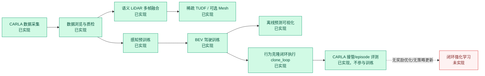
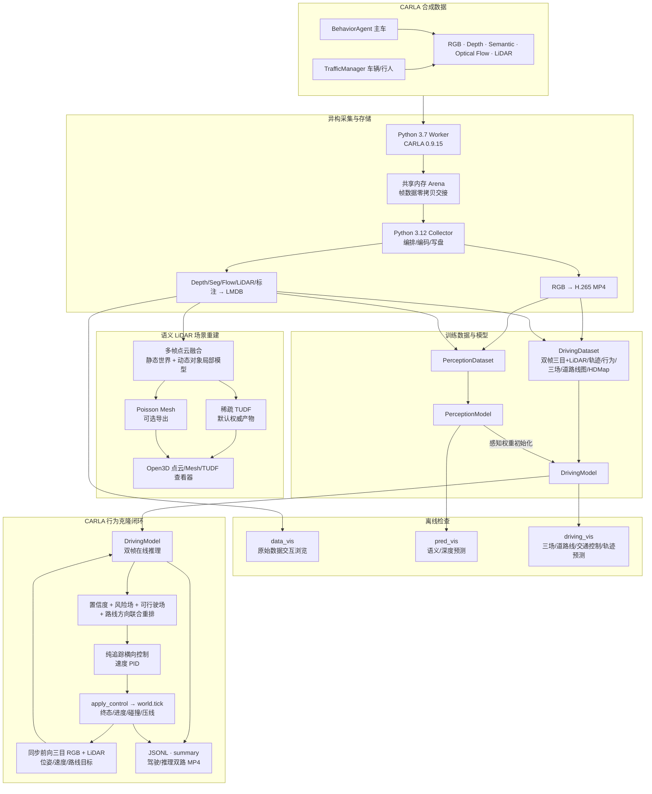
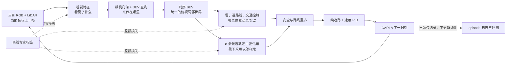
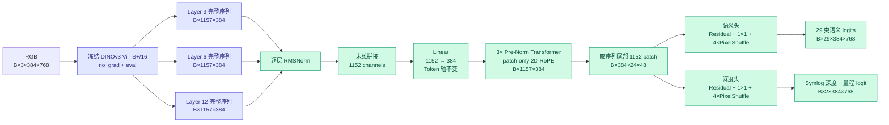
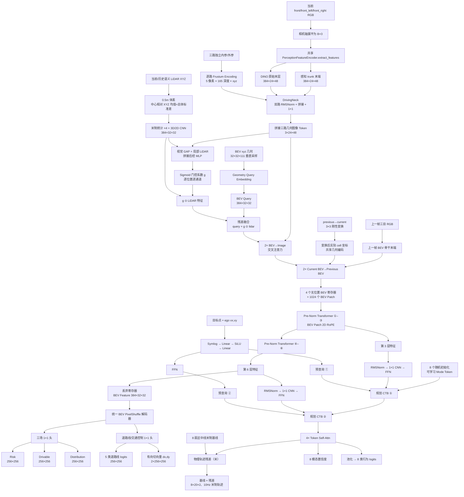
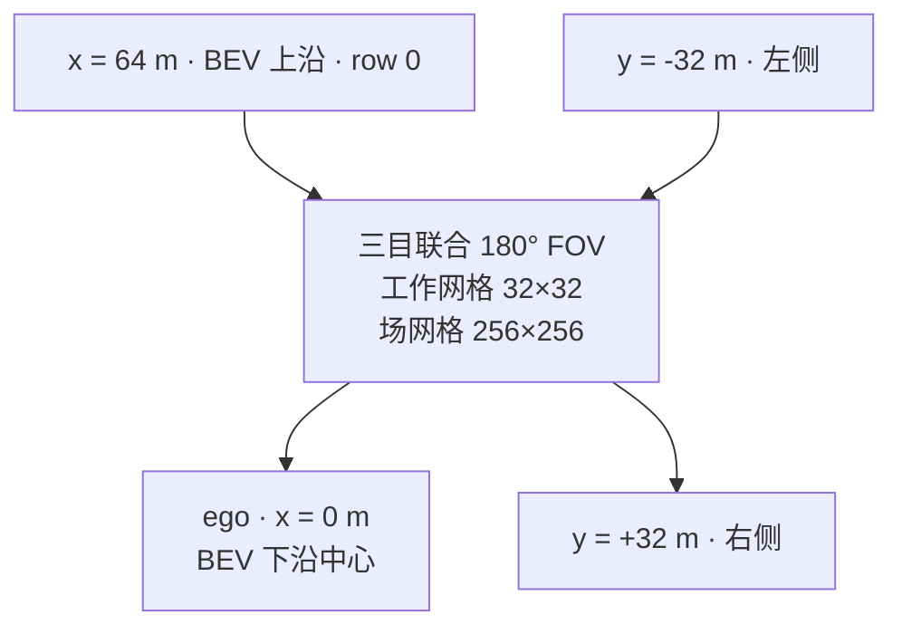
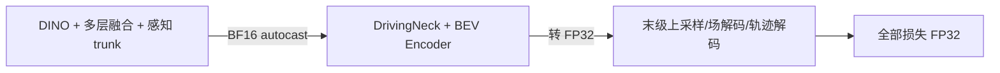
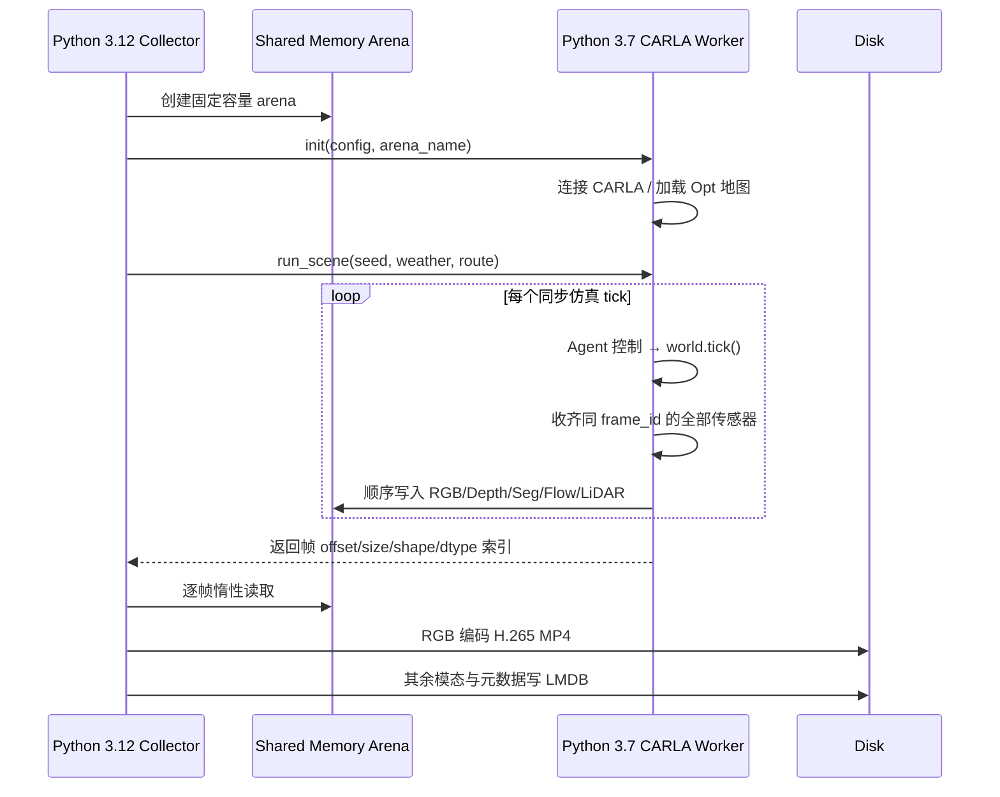
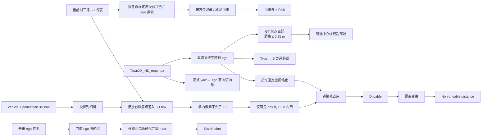

# ByteDrive-Toy

<p align="center">
  
</p>

<p align="center">
  <strong>面向 CARLA 合成数据的三目+LiDAR、双帧时序行为克隆驾驶研究原型</strong><br/>
  冻结 DINOv3 视觉骨干 · 语义/深度感知预训练 · 几何感知 BEV · 多模态轨迹与行为联合预测 · CARLA 闭环评测
</p>

<p align="center">
  
  
  
  
</p>

> [!IMPORTANT]
> ByteDrive-Toy 当前已经覆盖 CARLA 数据采集、感知预训练、BEV 驾驶训练、离线预测与可视化以及
> **CARLA 0.9.15 行为克隆闭环驾驶**。`clone_loop/` 可在同步仿真中完成双帧推理、候选轨迹安全重排、
> 车辆控制、episode 评测与录像。它仍是仿真研究原型，不是可直接部署到真实车辆的完整自动驾驶系统。

> [!WARNING]
> 当前驾驶模型是用 CARLA `BehaviorAgent` 专家轨迹做监督学习的**行为克隆（Behavior Cloning）模型**。
> 仓库没有实现基于环境奖励的闭环强化学习，也不会用闭环 episode 自动回传梯度或在线改进策略；这里的“闭环”仅指
> 模型输出经规则重排和低层控制器作用于 CARLA 后，再读取下一帧继续推理。现有数据分布也较单一：当前训练/演示数据
> 集中在 `Town02_Opt`、单一专家行为风格和固定采集配方。行为克隆在闭环中容易遭遇分布偏移与误差累积，因此当前权重
> 出现停车、偏航、碰撞、路线完成率低或泛化性能不佳属于现阶段的正常预期，不代表本项目已经达到可用驾驶性能。

> [!IMPORTANT]
> 此README在GitHub上渲染异常，建议下载到本地用专业MarkDown阅读器阅读。

---

## 目录

- [项目概览](#项目概览)
- [可视化效果](#可视化效果)
- [系统全景](#系统全景)
- [模型架构导读：从像素到方向盘](#模型架构导读从像素到方向盘)
  - [先补齐几个自动驾驶语境里的概念](#先补齐几个自动驾驶语境里的概念)
  - [先抓住一条主线](#先抓住一条主线)
  - [为什么先做感知，再做驾驶](#为什么先做感知再做驾驶)
  - [感知前端：每个模块在解决什么](#感知前端每个模块在解决什么)
  - [驾驶主干：把多传感器信息变成局部世界](#驾驶主干把多传感器信息变成局部世界)
  - [空间任务和规划任务为什么要同时预测](#空间任务和规划任务为什么要同时预测)
  - [各个输出究竟怎样把梯度送回主干](#各个输出究竟怎样把梯度送回主干)
  - [从轨迹到方向盘：模型之后还有一层系统](#从轨迹到方向盘模型之后还有一层系统)
  - [为什么只有监督行为克隆，很难得到稳定闭环](#为什么只有监督行为克隆很难得到稳定闭环)
  - [强化学习补上的是什么，又补不上什么](#强化学习补上的是什么又补不上什么)
- [模型架构](#模型架构)
  - [张量尺寸总览](#张量尺寸总览)
  - [感知模型](#感知模型)
  - [驾驶模型](#驾驶模型)
  - [BEV 坐标与输出定义](#bev-坐标与输出定义)
  - [参数量与精度边界](#参数量与精度边界)
- [数据系统](#数据系统)
- [训练策略与训练方法](#训练策略与训练方法)
- [预训练权重下载](#预训练权重下载)
- [环境安装](#环境安装)
- [快速开始](#快速开始)
- [使用方法：从零跑通基本链路](#使用方法从零跑通基本链路)
- [配置系统](#配置系统)
- [可视化工具](#可视化工具)
- [代码调用示例](#代码调用示例)
- [仓库结构](#仓库结构)
- [当前边界与已知注意事项](#当前边界与已知注意事项)
- [开发约定与许可证](#开发约定与许可证)

---

## 项目概览

ByteDrive-Toy 把自动驾驶研究流程拆成两个连续阶段：

1. **感知预训练**：以冻结的 DINOv3 ViT-S+/16 为视觉骨干，融合浅/中/深层完整 Token 序列，联合学习
   29 类语义分割与米制深度估计。
2. **驾驶学习**：复用感知表征，以三路相机 frustum 与纯 BEV xyz 几何把当前图像聚合到前向 BEV，
再查询刚性对齐的上一帧 BEV；同时预测风险场、可行驶场、轨迹分布场、道路线图、8 模态未来轨迹、
   模态置信度和 8 类行为标签。规划分支以目标点与 ego 平面速度为条件，用 8 个可学习 Mode Token 查询
   BEV 主干第 3、6 层特征。

训练完成后，闭环运行器把 `DrivingModel` 接入 CARLA 同步仿真，形成“观测 → 双帧推理 → 轨迹选择 →
纯追踪/PID 控制 → 下一观测”的反馈闭环，并按路线记录终态、进度、控制量、模型诊断和录像。

项目的核心特点如下。

| 能力 | 当前实现 |
| --- | --- |
| 学习范式 | CARLA `BehaviorAgent` 专家数据上的监督行为克隆；无在线采样更新、无奖励函数、无闭环强化学习 |
| 视觉输入 | 当前帧 + 同场景上一帧 `front/front_left/front_right` RGB，每路默认 `768×384`；首帧用 identity + 无效位 |
| 视觉骨干 | 本地 DINOv3 ViT-S+/16，参数永久冻结，提取第 3/6/12 层完整 Token 序列 |
| 感知任务 | 29 类语义分割；Symlog 深度回归；深度量程内/外二分类 |
| 几何建模 | 相机内外参反投影；每个 patch 中心与四角沿深度近密远疏采样 |
| BEV | 前向 `64 m × 64 m`，工作网格 `32×32`，场输出 `256×256` |
| 驾驶输出 | 三场；道路线与方向；相关停止线与灯色；8 模态 × 20 个 10Hz 航点；8 类行为 |
| 训练 | AdamW；BF16 主干 + FP32 末端/损失；感知模块差分小学习率 |
| 数据 | CARLA 0.9.15；RGB/H.265 + 非 RGB/LMDB；传感器 2Hz、运动学 10Hz 异频采集 |
| 场景重建 | 语义 LiDAR 多帧融合；静态世界/动态对象分离；稀疏 TUDF 默认输出，可选 Poisson Mesh |
| 可视化 | 原始数据交互浏览、感知预测对照、驾驶 BEV 场与轨迹对照 |
| 闭环驾驶 | CARLA 同步仿真；双帧在线推理；轨迹安全重排；纯追踪横向控制 + 速度 PID；episode 评测与录像 |
| 检查点 | 自动续训；检查点排除可重新加载的冻结 DINOv3 骨干 |

### 当前完成度


```mermaid
flowchart LR
    A["CARLA 数据采集<br/>已实现"] --> B["数据浏览与质检<br/>已实现"]
    B --> C["感知预训练<br/>已实现"]
    B --> R1["语义 LiDAR 多帧融合<br/>已实现"]
    R1 --> R2["稀疏 TUDF / 可选 Mesh<br/>已实现"]
    C --> D["BEV 驾驶训练<br/>已实现"]
    D --> E["离线预测可视化<br/>已实现"]
    D --> F["行为克隆闭环执行 clone_loop<br/>已实现"]
    F --> G["CARLA 接管/episode 评测<br/>已实现，不参与训练"]
    G -.->|"无奖励优化/无策略更新"| H["闭环强化学习<br/>未实现"]

    classDef done fill:#d1fae5,stroke:#059669,color:#064e3b;
    classDef absent fill:#fef2f2,stroke:#dc2626,color:#7f1d1d;
    class A,B,C,D,E,F,G,R1,R2 done;
    class H absent;
```

---

## 可视化效果

### CARLA 闭环驾驶

下面的视频记录了一次 `clone_loop` 闭环 episode 的在线推理过程：顶部为左/前/右三目与车辆状态，中部为风险场、
可行驶场、轨迹分布场及道路线/交通控制预测，底部展示全部候选轨迹与最终执行轨迹。

<video src="assets/visualizations/driving_video_1.mp4" controls="controls" width="768">
</video>
<video src="assets/visualizations/driving_video_2.mp4" controls="controls" width="768">
</video>

[ CARLA 闭环驾驶成功案例视频 1](assets/visualizations/driving_video_1.mp4)
[ CARLA 闭环驾驶成功案例视频 2](assets/visualizations/driving_video_2.mp4)

### 感知预测与真值对照

下图由 `vis/pred_vis/run.py` 直接生成。每列是一帧，从上到下依次为 RGB、预测语义、预测深度、
语义真值和深度真值。


### 驾驶三场、道路线、交通控制与多模态轨迹

下图由 `vis/driving_vis/run.py` 生成，展示 RGB/语义/深度、风险场、可行驶场、轨迹分布场、道路线图及候选轨迹。
道路线图按类别着色，并以稀疏箭头显示 ego 坐标系中的有向切向量，具体类别/方向编码见“道路线图”章节。
`gt` 与 `pred` 行采用相同几何范围和着色口径，可直接观察 BEV 空间对齐情况。


最新版额外输出 `gt traffic` / `pred traffic` 行：停止线按红/黄/绿灯态着色，未知灯态显示为白色，并叠加到
轨迹 BEV 以检查空间关系。下图使用真实数据第 12 个样本的 GT，左侧为独立交通控制层，右侧为停止线与三场、
GT 轨迹的叠加结果；该样本为绿灯，沿专家路线距离 32.3 m。


---

## 系统全景


```mermaid
flowchart TB
    subgraph SIM["CARLA 合成数据"]
        C1["BehaviorAgent 主车"]
        C2["TrafficManager 车辆/行人"]
        C3["RGB · Depth · Semantic · Optical Flow · LiDAR"]
        C1 --> C3
        C2 --> C3
    end

    subgraph STORE["异构采集与存储"]
        W["Python 3.7 Worker<br/>CARLA 0.9.15"]
        SHM["共享内存 Arena<br/>帧数据零拷贝交接"]
        COL["Python 3.12 Collector<br/>编排/编码/写盘"]
        MP4["RGB → H.265 MP4"]
        DB["Depth/Seg/Flow/LiDAR/标注 → LMDB"]
        W --> SHM --> COL
        COL --> MP4
        COL --> DB
    end

    subgraph RECON["语义 LiDAR 场景重建"]
        FUSE["多帧点云融合<br/>静态世界 + 动态对象局部模型"]
        TUDF["稀疏 TUDF<br/>默认权威产物"]
        MESH["Poisson Mesh<br/>可选导出"]
        RVIS["Open3D 点云/Mesh/TUDF 查看器"]
        FUSE --> TUDF --> RVIS
        FUSE --> MESH --> RVIS
    end

    subgraph LEARN["训练数据与模型"]
        DS1["PerceptionDataset"]
        DS2["DrivingDataset<br/>双帧三目+LiDAR/轨迹/行为/三场/道路线图/HDMap"]
        P["PerceptionModel"]
        D["DrivingModel"]
        DS1 --> P
        DS2 --> D
        P -->|"感知权重初始化"| D
    end

    subgraph VIS["离线检查"]
        V1["data_vis<br/>原始数据交互浏览"]
        V2["pred_vis<br/>语义/深度预测"]
        V3["driving_vis<br/>三场/道路线/交通控制/轨迹预测"]
    end

    subgraph CLOSED["CARLA 行为克隆闭环"]
        OBS["同步前向三目 RGB + LiDAR<br/>位姿/速度/路线目标"]
        INF["DrivingModel<br/>双帧在线推理"]
        SELECT["置信度 + 风险场 + 可行驶场<br/>+ 路线方向联合重排"]
        CTRL["纯追踪横向控制<br/>速度 PID"]
        STEP["apply_control → world.tick<br/>终态/进度/碰撞/压线"]
        LOG["JSONL · summary<br/>驾驶/推理双路 MP4"]
        OBS --> INF --> SELECT --> CTRL --> STEP --> OBS
        INF --> LOG
        STEP --> LOG
    end

    SIM --> W
    MP4 --> DS1
    DB --> DS1
    MP4 --> DS2
    DB --> DS2
    DB --> FUSE
    DB --> V1
    P --> V2
    D --> V3
    D --> INF
```

代码遵循“配置、实现、检查”分离：实验参数集中在 `config/default.yaml`，模块实现放在对应目录，
运行期输入检查放在模块内的 `checks/` 子目录。

---

## 模型架构导读：从像素到方向盘

这一节面向了解张量、卷积和 Transformer，但还没有完整做过端到端驾驶系统的读者。它不重复下一节的精确尺寸，
而是回答三个更重要的问题：**信息怎样流过模型、每个模块为什么存在，以及为什么离线指标不错仍不等于能稳定闭环驾驶。**

### 先补齐几个自动驾驶语境里的概念

这一章会频繁使用下面这些词。它们在通用深度学习中并不陌生，但放进自动驾驶后含义更具体：

| 词 | 在本项目中的含义 | 可以怎样直观理解 |
| --- | --- | --- |
| ego / 自车系 | 以主车为原点的右手坐标系，`x` 向前、`y` 向右、`z` 向上 | 不问物体在地图的绝对经纬度，只问它在车前多少米、车身左/右多少米 |
| BEV | Bird's-Eye View，俯视空间表征 | 把三个透视相机看到的内容统一画到一张以米为单位的俯视纸上 |
| patch / Token | DINO 把 `16×16` 像素块编码成的向量，以及附加的 CLS/register 向量 | 一个 patch Token 是一小块图像的描述，不是一个语义类别，也不是一个确定 3D 点 |
| Query | 注意力中的“我要查什么” | 一个 BEV Query 可以理解成“车前 20 m、右侧 4 m 这个格子里有什么？” |
| Key / Value | 可被 Query 检索的上下文及其内容 | 图像 Token 提供可匹配线索和真正被取回的视觉信息 |
| Frustum / 视锥 | 某个像素或 patch 沿相机光线在 3D 空间中的所有可能位置 | 只知道像素坐标时能确定方向，不能确定距离，因此它对应一条有深度范围的射线束 |
| Head / 预测头 | 从共享特征解码某个任务的轻量分支 | 同一个 BEV 可以分别接风险头、车道头和轨迹头，类似共享主干的多任务网络 |
| Logit | Sigmoid/Softmax 前的未归一化分数 | `risk=2` 不是 2 倍风险，必须经过 Sigmoid 才是 `[0,1]` 概率式分数 |
| 场 / Field | BEV 上每个位置都有一个标量的稠密输出 | 风险场像一张代价地图，轨迹经过的每个位置都可以从中采样代价 |

BEV 尤其重要。透视图中同样长的车道线，离相机越远占的像素越少；左右相机中的同一个物体还处于完全不同的像素位置。
如果直接在图像平面规划，“前进 10 m”“车宽 1.9 m”“距离停止线 3 m”都很难自然表达。变换到 BEV 后，距离、车道宽度、
轨迹和车辆 Box 可以使用统一的米制坐标，规划与控制就不必理解三台相机各自的透视规律。

但本项目的 BEV 也不是完整 3D 世界模型。它把 `z∈[-3,8] m` 的信息压进每个平面 cell 的特征向量，本质上是一个带有
高度线索的二维潜变量网格。这样计算成本远低于稠密 3D 体素，但天桥、上下层道路等真正多层结构会更难表达。

### 先抓住一条主线

ByteDrive-Toy 并不是把图像直接回归成方向盘和油门。它先把传感器观测整理成“以自车为中心的局部世界”，
再从这个局部世界里提出多条未来轨迹，最后由传统控制器把选中的轨迹变成车辆控制量：


```mermaid
flowchart LR
    S["三目 RGB + LiDAR<br/>当前帧与上一帧"] --> V["视觉特征<br/>看见了什么"]
    V --> G["相机几何 + BEV 查询<br/>东西在哪里"]
    G --> B["时序 BEV<br/>统一的俯视局部世界"]
    B --> H["场、道路线、交通控制<br/>哪些位置安全/合法"]
    B --> P["8 条候选轨迹 + 置信度<br/>接下来可以怎样走"]
    H --> R["安全与路线重排"]
    P --> R
    R --> C["纯追踪 + 速度 PID"]
    C --> E["CARLA 下一时刻"]
    E --> S

    T["离线专家标签"] -.->|"监督损失"| V
    T -.->|"监督损失"| H
    T -.->|"监督损失"| P
    E -.->|"当前仅记录，不更新参数"| L["episode 日志与评测"]
```

这里有两个容易混淆的“闭环”：车辆运行时，最后一条实线确实把控制结果反馈成了下一帧观测，所以
`clone_loop` 是**执行闭环**；但新的观测不会进入训练缓冲区，也不会依据碰撞、进度等奖励更新模型，所以它还不是
**学习闭环**。这个区别正是后文讨论稳定性的关键。

按默认配置，一条样本实际经历的主要形状变化如下。这里 `B` 是 batch size，在线闭环时通常为 1：

| 步骤 | 形状 | 这一维到底表示什么 |
| --- | --- | --- |
| 当前/上一帧 RGB | 各 `[B,3,3,384,768]` | 第一个 `3` 是左前/正前/右前三台相机，第二个 `3` 是 RGB 通道 |
| 每台相机的 patch 网格 | `[B,3,384,24,48]` | 图像被 `16×16` 切块，因此高宽分别为 `384/16=24`、`768/16=48` |
| 三目图像 Token | `[B,3456,384]` | 每台相机 `24×48=1152` 个 patch，三台相机拼成 `3456` 个可查询视觉 Token |
| BEV 工作网格 | `[B,384,32,32]` | 共 `1024` 个空间查询；64 m 纵横范围在主干内约为每格 2 m |
| 高分辨率 BEV 场 | 各 `[B,1,256,256]` | 解码后约每格 0.25 m，用于风险、可行驶和轨迹分布等稠密任务 |
| 多模态轨迹 | `[B,8,20,2]` | 8 种候选未来，每种含 20 个 `(x,y)` 米制点，间隔 0.1 s，覆盖未来约 2 s |
| 控制输出 | 3 个标量 | 选中一条轨迹后再计算归一化 `steer/throttle/brake`，不是神经网络直接输出 |

这里故意同时保留“低分辨率 BEV 特征”和“高分辨率 BEV 输出”。主干在 `32×32` 上做注意力，可以把计算集中在语义关系；
空间头最后再上采样到 `256×256`，以便画细车道线和沿轨迹采样。如果从头到尾都在 `256×256=65536` 个 Token 上做
全局自注意力，注意力矩阵会比 `1024` Token 的版本大约多 `4096` 倍，远超这个 Toy 项目的计算预算。

### 为什么先做感知，再做驾驶

如果直接用有限的 CARLA 数据从 RGB 学到轨迹，模型必须同时自行发现“像素是什么物体”“物体离我多远”
“三台相机怎样对应同一个空间”和“应该走哪条路”。这些问题纠缠在一个轨迹损失里，任何一项学错都很难定位。
项目因此采用两阶段设计：

1. 感知预训练先用像素级语义和深度给视觉表征立规矩，使它对道路、车辆、行人和空间结构敏感；
2. 驾驶训练复用这套表征，再学习跨相机几何、时序 BEV、场预测和规划。驾驶阶段可以用较小学习率微调
   `fusion/trunk`，但不会构造语义/深度像素头，也不会为不参与前向的头浪费显存。

这是一种“先学会描述世界，再学会在世界里行动”的工程折中。它比完全端到端多了一些人工结构，却换来了更强的
数据效率、可解释性和故障定位能力。代价是上游表征和人工坐标约定如果有系统误差，下游也会继承它。

### 感知前端：每个模块在解决什么

下面只列实际进入 `PerceptionModel` / `DrivingModel` 前向的模块。仓库中存在但未被总模型调用的实验基础模块，
不应仅凭目录名理解为已经接入。

| 模块 | 它解决的问题 | 为什么这样设计 | 主要代价或边界 |
| --- | --- | --- | --- |
| 冻结的 DINOv3 ViT-S+/16 | 从 RGB 中提取通用纹理、结构和对象 Token | 大规模预训练表征比从少量驾驶数据随机初始化可靠；冻结后可显著减少显存、检查点体积和过拟合 | 骨干不能主动适应 CARLA 特有外观；域差异只能由后续模块吸收 |
| 第 3/6/12 层特征融合 | 单独用末层容易保留语义却损失细边界 | 浅层偏局部纹理，中层偏形状，深层偏语义；RMSNorm 后拼接再降维，让三种尺度互补 | 额外计算和显存；“哪几层最好”仍是经验选择 |
| `FeatureTrunk` | 把通用 DINO Token 整理成驾驶相关表征 | 3 层 Pre-Norm Transformer 允许远距离 patch 交互；patch-only 2D RoPE 提供图像位置，同时保留 CLS/register 的全局信息 | 仍是二维表征，不知道真实米制位置 |
| 语义头 | 区分道路、车辆、行人等类别 | 给共享主干提供“是什么”的密集监督，也方便直接可视化排错 | 类别正确不代表几何位置或运动趋势正确 |
| 深度双通道头 | 估计“有多远”，并判断是否超出可靠量程 | Symlog 压缩 0–128 m 的动态范围；把深度值与量程内/外拆开，避免强迫模型给不可可靠估计的远处像素编造精确米数 | 单目深度仍有尺度和遮挡歧义；驾驶前向不会直接读取这个深度图 |
| PixelShuffle 上采样头 | 从 `24×48` patch 网格恢复像素输出 | 逐级把通道重排为空间，计算量低，并保留可训练的细节恢复能力 | 上采样只能重建主干中尚存的信息，不能凭空恢复被 patch 化抹掉的细节 |

把这张表展开成一次前向过程，会更容易理解：

1. **切 patch，但不立刻做像素分类。** `384×768` 图像经 patch size 16 的 ViT 变成 `24×48=1152` 个 patch。
   DINOv3 还在序列前放置 1 个 CLS 和 4 个 register，所以每个被选中层的完整序列长度是 `1157`。
2. **从三个深度拿特征。** 第 3、6、12 层各输出 `[B,1157,384]`。逐层 RMSNorm 是为了先对齐数值尺度，
   否则某一层仅因激活幅度大就可能在拼接后占主导。三层沿通道拼成 1152 维，再由 Linear 压回 384 维。
3. **让通用特征适应驾驶语境。** 融合后的完整序列再过 3 层 `FeatureTrunk`。自注意力允许一个车道边缘 patch
   联系远处消失点或车辆 patch；SwiGLU 前馈负责逐 Token 的非线性变换；Pre-Norm 则让较深堆叠的梯度更稳定。
4. **只在需要空间输出时还原网格。** CLS/register 没有固定像素位置，不能塞回图像；代码只取末尾 1152 个 patch，
   按行主序恢复成 `[B,384,24,48]`。
5. **两个头各自解码。** 语义头输出 29 类 logits；深度头输出一个 Symlog 深度值和一个量程内 logit。二者共享前面
   所有特征，因此道路边界、车辆轮廓等信息可以同时受到“类别”和“几何”两种监督。

深度不用普通米制 MSE，是因为 1 m 误差在 3 m 近处和 100 m 远处的重要性不同，而且原始深度跨度太大。Symlog
`sign(x)·ln(1+|x|)` 在零附近近似线性，远处逐渐压缩；再配合近处更高的距离权重和深度梯度损失，网络会优先学好
影响驾驶的近距结构与物体边缘。量程通道则把“这个像素超过 128 m”与“我预测它刚好是 128 m”区分开。

一个看似反直觉的点是：驾驶模型复用了受语义/深度监督塑形的 `trunk` 特征，却没有把预测深度图直接投影到 BEV。
这样做可以避免一次“先把每个像素压成唯一深度、再投影”的硬决策；真正的几何对应关系交给后面的 frustum 编码和
交叉注意力软选择。换句话说，深度任务负责教会特征理解远近，frustum 负责告诉驾驶模型每个 patch **可能**位于哪里。

### 驾驶主干：把多传感器信息变成局部世界

驾驶部分可以理解为“查询式建图”：先在车前方放置 `32×32` 个 BEV 查询格，每个格子主动去三目图像、LiDAR 和
上一帧中寻找与自己位置相关的信息，而不是把每个图像像素粗暴地塞进某个俯视格。

| 模块 | 它解决的问题 | 为什么这样设计 | 主要代价或边界 |
| --- | --- | --- | --- |
| 三目共享视觉编码器 | 同时覆盖左前、正前、右前约 180° 视野 | 三路相机共享参数可减少参数量，并保证同类物体在不同视角用同一种视觉语言表示；相机身份由各自标定和 frustum 区分 | 标定错误会系统性污染空间融合；三路编码仍占主要算力 |
| `DrivingNeck` | DINO 原始特征与感知 `trunk` 特征分布不同 | 两路分别归一化后拼接、`1×1` 投影：既保留通用表观，也利用被语义/深度任务塑形的特征 | 两路信息可能冗余，融合层需要足够数据学会取舍 |
| Frustum Encoding | 图像 patch 有方向但没有唯一深度 | 对 patch 中心和四角沿视线取近密远疏的 3D 候选点，再编码整条视锥；交叉注意力可结合上下文决定关注哪个深度 | 候选采样比单点投影贵；它表达“可能在哪里”，并不自动保证几何正确 |
| 纯几何 BEV Query | 为俯视网格中的每个位置建立查询身份 | 每个 cell 对一根 z 向立柱采样并编码 xyz，明确告诉模型“我在查询车前多少米、左右多少米”；不混入目标点，避免场景表征随导航命令漂移 | 固定 `64 m × 64 m` 范围和 `32×32` 工作分辨率限制了远距与细粒度能力 |
| LiDAR 体素统计与视觉门控 | 给图像难以确定的几何提供直接测距证据 | 体素内相对坐标均值/标准差比原始点数稳定；门控让模型逐位置逐通道决定信任多少 LiDAR，并对整帧缺失做显式旁路 | 当前只用 XYZ 几何统计，不用语义；稀疏、反射缺失和标定误差仍会传入 BEV |
| BEV→图像交叉注意力 | 把三路透视图汇聚到统一俯视坐标 | 每个 BEV 查询从全部图像 Token 中软检索相关证据，不要求预先确定唯一深度或唯一相机 | 全局注意力开销较大，也可能在数据不足时学到错误对应 |
| 上一帧 BEV 刚性对齐 | 单帧无法稳定判断运动、遮挡和短暂消失 | 先用自车位姿把上一帧 cell 变到当前 ego 系，再由当前查询读取历史；首帧通过有效位旁路，避免把零张量当真实历史 | 只保留一帧历史；动态物体本身不是刚体静态世界，对齐后仍需模型识别其运动 |
| `detach_previous` | 双帧训练的显存随历史反向图显著增加 | 默认把上一帧作为无梯度上下文，贴近在线缓存特征的使用方式，并控制显存 | 当前损失不能通过时间反向传播去专门改善上一帧编码 |
| 4 个无位置 register Token | 给自注意力提供吸纳全局信息和异常噪声的槽位 | 它们参与 BEV Transformer，但不绑定某个物理格，输出前再丢弃，避免噪声被迫写入真实地图 cell | 作用是软性的，不能视为显式记忆或安全机制 |
| 6 层 BEV Transformer + 2D RoPE | 在局部世界中传播道路连续性、物体关系和上下文 | 自注意力让远处格与近处格交互；RoPE 保留相对二维位置，使“相邻车道”“前后车辆”更容易表达 | 工作网格越大，注意力成本增长越快；短时序仍限制运动建模 |
| 统一 BEV Decoder | 把低分辨率共享世界恢复成 `256×256` 空间输出 | 风险、可行驶、轨迹分布、道路线和交通控制共享一次昂贵上采样，再用轻量头分工；多任务监督也会约束同一个 BEV | 多个任务可能梯度冲突；共享错误会同时影响多个输出 |

#### 相机特征怎样“搬到”BEV

这不是一个固定的图像变换。对第 `i` 个 BEV cell，模型先根据它的米制 xyz 生成查询 `q_i`；每个图像 patch 则产生
key `k_j` 和 value `v_j`。一层交叉注意力可简化写成：

```math
\operatorname{CrossAttn}(Q,K,V)=
\operatorname{softmax}\left(\frac{QK^\mathsf{T}}{\sqrt{d}}\right)V.
```

`q_i·k_j` 越大，就表示第 `j` 个图像 patch 越值得用于更新第 `i` 个 BEV 位置。softmax 权重不是人工标注的投影矩阵，
而是由最终多任务损失学出来的软对应。两层级联交叉注意力允许第一层做粗匹配、第二层基于已聚合的信息继续修正。

仅靠内容相似度会有歧义：两段灰色路面 patch 看起来可能几乎一样。因此，图像 Token 在成为 K/V 之前已经叠加 frustum
几何。内参 `(f_x,f_y,c_x,c_y)` 把 patch 像素坐标变成相机射线，外参再把射线从各自传感器系变到统一 ego 系。
每个 patch 不是只取中心，而是取中心加四角；每条射线又有 165 个近密远疏深度样本，也就是每个 patch 显式描述
`5×165` 个候选 3D 位置。近处以更细步长采样，是因为同样 1 m 深度误差在车前 2 m 比在 60 m 更危险、投影变化也更大。

这套方法与“先预测一张深度图再硬投影”相比，保留了深度不确定性。比如一块属于车辆的 patch 可能覆盖车头、背景和地面，
强行指定单个深度容易把整块内容投错；视锥编码允许 BEV Query 根据周围车道、相邻 patch 和 LiDAR 再决定应取哪一段深度。
代价是几何编码和注意力都更贵，而且没有显式约束保证注意力峰值一定落在物理正确的位置。

#### LiDAR 为什么不直接拼到图像上

LiDAR 天然是 3D 米制点，若先投影回图像，会重新遇到遮挡、视角和像素稀疏问题。本项目把点云直接体素化到 ego 空间：

1. 先剔除自车 Box 内的回波，避免车顶/车身点成为虚假障碍；
2. 在 `0.5 m` 三维体素中统计点相对体素中心的 xyz 均值和标准差，而不是依赖点的排列顺序；
3. 用 3D/2D 卷积把 `22×128×128` 的高程体素压成与 `32×32` BEV 对齐的 384 通道特征；
4. 把三目视觉的全局池化向量与每个位置的 LiDAR 特征送入门控 MLP，得到 `g∈[0,1]`；
5. 做残差注入 `Q_fused=Q+g⊙F_lidar`，然后才让 Query 去读取图像。

门控的意义不是判定“LiDAR 好还是相机好”这么粗，而是逐位置、逐通道决定：某个格子的高度/占用线索可以多信 LiDAR，
类别或道路纹理可能多依赖相机。最终对齐卷积和门控 logits 的零初始化还使 LiDAR 支路刚加入训练时残差严格为零，网络先从
稳定的纯几何 Query 起步，再逐渐学会使用点云。`lidar_valid` 与空体素也必须分开：前者是“传感器整帧缺失”，后者是
“传感器正常但这里没打到点”，两者在驾驶语义上完全不同。

#### 上一帧为何要先做自车运动补偿

如果车辆向前开了 2 m，上一帧“车前 10 m”的静态路牌在当前帧只剩约 8 m。直接把两个同索引 BEV cell 相加，会把同一个
物体错开 2 m。代码用两帧世界位姿构造 `T_previous→current=T_current⁻¹T_previous`，把上一帧每个 cell 的中心变到
当前 ego 系，再用共享几何 MLP 重新编码其真实位置。当前 BEV Query 随后通过两层时序交叉注意力读取对齐后的历史 Token。

这个变换只补偿自车运动，不会抵消其他车辆和行人的自主运动。恰恰相反：静态背景对齐后，动态物体在两帧中的残余位移
会更突出，模型可以据此推断短时运动。但只使用一帧历史意味着它很难区分复杂加速度、长时间遮挡或周期性动作；
它更接近“两帧差分增强”，不是完整的视频世界模型。

#### BEV 自注意力在交叉注意力之后做什么

交叉注意力回答“每个位置从传感器取回什么”，后续 6 层 BEV 自注意力回答“这些局部证据彼此是否一致”。例如一个格子
看似可行驶，但它左右连续格都是道路边界，模型应重新判断；远处停止线也需要与附近红绿灯和当前车道方向关联。
2D RoPE 被加到 Q/K 上，让相同内容位于不同 BEV 坐标时产生不同的相位关系，从而表达相对位置。4 个 register Token
没有物理坐标，更像共享草稿纸：它们可聚合全局路况或吸收难以落格的噪声，但在输出空间图前会被丢弃。

这里坚持“BEV 查询只含几何，目标点只进入规划分支”很重要。目标点代表**想去哪**，BEV 代表**世界是什么样**。
若过早把目标点写进 BEV，同一个路口仅因导航命令不同就可能得到不同的道路或风险表征，不利于复用和排错。

### 空间任务和规划任务为什么要同时预测

模型没有只输出一条轨迹，而是输出一组互相补充的中间量：

| 输出 | 回答的问题 | 在训练或闭环中的作用 |
| --- | --- | --- |
| `risk` | 哪些区域因遮挡、未观测或边界外推而不值得冒险 | 训练时学习风险先验；闭环重排时惩罚穿过高风险区的候选轨迹 |
| `drivable` | 哪些位置属于可行驶道路且未被可见车辆/行人占用 | 以 BCE 学习可行空间，并供在线安全重排；轨迹边界损失使用与它同源的 GT 距离场，而不是反传预测图 |
| `distribution` | 专家未来轨迹通常经过哪些位置 | 用软空间分布补充逐航点回归，降低“只差一点但被当成完全错误”的监督不连续性 |
| 道路线类别与方向 | 车道中心、分隔线、边界在哪里，合法行驶方向是什么 | 作为辅助任务强化 BEV 的道路拓扑和方向感；轨迹中心线损失另用同源 GT 距离场 |
| 停止线与灯色 | 当前路线相关的停车位置和信号状态是什么 | 把“看见红灯”和“应该在哪停”绑定起来；同源 GT 还用于红灯越线损失和红灯停车行为标签 |
| 8 条轨迹与置信度 | 在岔路、绕障等多解场景中有哪些可行未来，优先选哪条 | 避免单轨迹回归把左转和右转平均成一条不可行中线 |
| 8 类行为 | 当前是否需要停车、加减速、转向或保持静止 | 给闭环控制提供高层处置提示；障碍停车/红灯停车可把目标速度门控为零 |

轨迹分支使用 8 个可学习 Mode Token，而不是把一个共享向量硬拆成 8 份。每个 Token 可以逐渐专门化为一种驾驶假设；
目标点和自车速度只作为规划条件，分别辅助查询 BEV 第 3、6 层特征。较浅层保留更多局部几何，较深层包含更强的
全局语义，两次查询相当于先看细节、再看全局。

更具体地说，目标点 `(x_goal,y_goal)` 回答“导航希望往哪个方向走”，ego 速度 `(v_x,v_y)` 回答“当前动力学状态允许怎样走”。
四个物理量先经 Symlog 压缩，再由 MLP 变成与 Mode Token 同维的条件向量。第一组条件帮助 8 个 Mode 查询主干第 3 层，
第二组条件经过额外 FFN 后帮助它们查询第 6 层；这两次规划 CTB 都是“规划 Token 作 Q、BEV Token 作 K/V”的交叉注意力，
因此不同 Mode 可以在同一张 BEV 上关注不同车道或绕障空间。

随后 4 层 Token 自注意力只在少量规划 Token 之间运行，让候选彼此看到对方。这样做的目的不是把 8 条轨迹平均，而是让它们
协调分工：如果已有 Token 覆盖直行解，其他 Token 可以保留左转、右转或避障方向。最后每个 Token 单独输出轨迹残差和
置信度；所有 Mode 特征取均值后输出 8 个行为 logits，使行为判断利用整组规划假设，而不是押注某一条候选。

每个 Mode 从一条扇区中线米制基线出发，只学习物理残差。末层零初始化时，初始模型至少输出规则、有限的扇形轨迹，
不会在训练开始就产生任意大坐标。训练时，以加权米制 ADE 选出最接近专家 GT 的 Mode 作为主匹配对象；其余 Mode
仍以小权重更新，置信度头学习把主匹配 Mode 排在前面。这个设计缓解多模态坍缩，但每个样本仍只有一条专家未来，
所以未被专家选择的合理解并没有完整的正标签。

### 各个输出究竟怎样把梯度送回主干

多头不是为了展示更多好看的图，而是给共享特征提供不同角度的训练信号。总损失是各分量的加权和；一次反向传播中，
空间头和轨迹头的梯度都会回到 BEV Encoder，未冻结时还会以较小学习率继续更新感知 `fusion/trunk`。冻结的 DINOv3
始终处于 `no_grad + eval`，所以梯度在它之前停止。

感知预训练阶段包含四类约束：

| 损失 | 监督对象 | 为什么不只保留一个损失 |
| --- | --- | --- |
| 语义交叉熵 | 每个像素的 29 类标签，忽略 `Unlabeled` | 让特征回答“是什么”，但不关心同类物体内部的米制深度 |
| Symlog 深度 SmoothL1 | 量程内像素的深度值，近处权重大 | SmoothL1 比 MSE 不易被少数巨大误差支配；距离权重突出近处驾驶相关区域 |
| 深度梯度 SmoothL1 | 相邻像素的深度差 | 单独回归深度容易得到过平滑表面；梯度项强调车辆轮廓、路沿和遮挡边界 |
| 深度量程 BCE | 像素是否小于 128 m | 让网络显式承认“超出可靠范围”，而不是用一个裁剪深度混淆远处和无效值 |

驾驶阶段的监督更多，可以按功能分成四组：

1. **场监督**：`risk`、`drivable` 在三目有效视场内做 BCE；`distribution` 不把每个格子当独立二分类，
   而是在整个有效 BEV 上做空间 Softmax，再与 GT 航点高斯化后的软分布做交叉熵。后者只要求专家附近的相对能量更高，
   比要求所有像素拟合固定高斯数值更符合“路径偏好图”的含义。
2. **道路与交通监督**：道路线类别使用降低背景权重的交叉熵，避免大面积背景淹没细线；方向只在有效线像素上做
   有向余弦损失，因此 `v` 与 `-v` 不会被视作同一方向；停止线以前景/背景平衡 BCE 训练，灯色只在相关停止线区域做 CE。
3. **轨迹与模式监督**：先按有效 GT 航点计算米制 ADE，近端权重大、远端保留最低权重、弯道再额外增权。8 条候选对
   单条 GT 的 `8×1` 匈牙利匹配，在数学上就是选代价最小的 Mode；匹配 Mode 权重为 1，其余为 0.05。置信度用 CE 学习
   这次匹配出的索引，行为则因“减速且左转”等标签可以同时成立而使用 8 个独立 BCE，而不是互斥 Softmax。
4. **轨迹几何与规则监督**：中心线损失沿轨迹采样 GT 中心线距离场；边界损失不只检查轨迹中心点，还把自车长宽展开成
   `3×3` 有向足迹，惩罚道路外和可见占用内的米制距离；红灯越线损失则把所有 Mode 都约束在安全停止点之前，避免
   一个低置信度的违规候选在线重排后意外被选中。

这也解释了为什么“预测了可行驶场”之后仍要单独做轨迹边界损失：如果轨迹损失只通过预测场间接约束，场和轨迹可能一起
犯同一种错误；直接从 GT 距离场给轨迹坐标梯度，相当于增加一条不依赖预测场是否正确的监督路径。同理，停止线像素头
负责让 BEV 理解交通控制几何，越线损失则直接约束最终候选轨迹，两者分工不同。

多任务并不保证一定互相促进。语义边界想保留高频细节，轨迹规划可能更偏好平滑全局结构；稀疏停止线梯度也可能被大量
道路像素淹没。因此项目使用任务权重、背景降权、有效区 mask 和差分学习率控制梯度尺度。真正调参时应分别观察每项损失、
预测图和闭环事件，不能只看加权后的 `total loss`。

还有几项不直接出现在架构图里、但会显著影响训练是否稳定的设计：

| 设计 | 原因 |
| --- | --- |
| DINOv3 永久冻结且保持 `eval()` | 既不保存骨干梯度，也避免外层 `model.train()` 意外改变骨干行为；将有限数据用于任务模块 |
| 驾驶阶段 `fusion/trunk` 使用主学习率的 0.1 倍 | 允许视觉表征适应规划，又降低下游大梯度破坏感知预训练能力的风险 |
| 主干使用 BF16，几何构造、末级解码和全部损失使用 FP32 | BF16 节省激活显存且指数范围与 FP32 相同；米制坐标、场采样和小损失保留 FP32 可减少数值误差 |
| 轨迹残差头零初始化 | 初始输出等于规则扇区基线，避免随机大轨迹导致损失和闭环控制瞬间失控 |
| LiDAR 对齐卷积与门控 logits 零初始化 | 新支路初始对 Query 的残差为零，可从视觉/几何基线平滑学到多传感器融合 |
| `previous_valid` / `lidar_valid` 显式有效位 | “没有历史/传感器掉线”和“观测到一个空场景”不是同一语义，不能都编码为全零张量让网络猜 |

### 从轨迹到方向盘：模型之后还有一层系统

在线推理不会简单选择置信度最大的 Mode。`clone_loop` 沿每条候选轨迹采样风险场和可行驶场，再比较终点与导航目标的
方向。忽略实现中的平均与归一化细节，其排序可以概括为：

```math
S_m=\alpha c_m-\beta R_m-\gamma(1-D_m)-\eta A_m,
```

其中 `c` 是模型置信度，`R` 是沿轨迹风险，`D` 是沿轨迹可行驶概率，`A` 是与导航目标的方向代价。
选中轨迹后，纯追踪根据前视点曲率计算转向，轨迹点间距给出目标速度，PID 再把速度误差转成油门或制动；
若障碍停车或红灯停车概率超过阈值，目标速度直接置零。

一次在线循环可以按以下顺序理解：

1. CARLA 在同步 tick 上产出三目 RGB、LiDAR、自车位姿、速度和路线目标点；
2. 推理器从历史队列中取与训练时距匹配的上一帧，计算 `previous→current` 平面刚体变换；episode 首帧用当前帧回填，
   同时令 `previous_valid=0`，使时序分支真正旁路；
3. `DrivingModel` 一次前向输出 8 条轨迹、各类 BEV 场和行为 logits；
4. 对每条轨迹的 20 个点做 `grid_sample`，计算平均风险、平均可行驶程度与目标方向差，再和置信度合成 `S_m`；
5. 取最高分 Mode。若它超出 BEV，风险按 1、可行驶按 0 的最坏值处理，防止越界成为逃避场约束的捷径；
6. 纯追踪从轨迹上选接近 6 m 前视距离的点，由曲率和轴距求转角并做时间平滑；
7. 前若干航点的位移中位数除以 0.1 s 得到目标速度，速度 PID 计算油门/刹车；停车行为可覆盖该目标为 0；
8. 控制量施加到车辆，世界推进一个 tick，碰撞、压线、进度、录像和诊断被写入日志，然后回到第 1 步。

第 8 步之后**没有**“把失败帧加入 DataLoader 并继续反向传播”。因此这条链路虽然是完整的控制反馈环，训练参数却冻结；
下文所说的“没有闭环学习”具体就是缺少这条从 episode 结果回到数据或优化器的边。

低层控制本身也不神秘。若前视点在 ego 系为 `(x_L,y_L)`，纯追踪近似曲率与前轮转角为：

```math
\kappa=\frac{2y_L}{x_L^2+y_L^2},\qquad
\delta=\arctan(L_{\mathrm{wheelbase}}\kappa).
```

PID 则令速度误差 `e_t=v_target-v_t`，用
`u_t=K_p e_t+K_i∑e_tΔt+K_d(e_t-e_{t-1})/Δt` 产生纵向控制，`u>0` 映射油门、`u<0` 映射制动。
所以模型轨迹的横向形状影响转向，航点时间间距影响速度；即使两个候选终点相同，中间曲率和点间距不同，车辆动作也会不同。

保留传统控制器有两个原因：第一，轨迹是米制、可画出来、可单独评估，比直接回归方向盘更容易诊断；第二，纯追踪和 PID
提供平滑、确定的低层行为，让神经网络把容量集中在感知与规划上。它的局限也很明确：控制器不是训练目标的一部分，
模型并不知道某条看似相近的轨迹经过控制器和车辆动力学后会产生多大横向误差，控制延迟、转向限幅和 PID 状态都会形成
新的分布偏移。

### 为什么只有监督行为克隆，很难得到稳定闭环

先给出准确结论：**强化学习不是稳定闭环驾驶的逻辑必要条件，但仅靠当前这种固定专家数据上的离线监督行为克隆，
通常很难稳定。** 扰动恢复数据、DAgger 和干预学习也能让策略学会处理自己访问到的状态；MPC 或安全屏障甚至可以在
不更新神经网络的情况下增强闭环纠错。对当前这种学习式规划器而言，最关键的缺口是训练信号没有覆盖
“策略自己造成的状态及其长期后果”。

这里的“稳定”可以借用控制系统的直觉来定义：给车辆一个小横向偏移、速度扰动或短暂感知噪声后，闭环应把误差逐步压回，
而不是越放越大。若把车道偏差记为 `e_t`，整套“模型 + 轨迹选择 + 控制器 + 车辆”可抽象成
`e_{t+1}=F(e_t)`。在某个工作点附近，若微小扰动满足 `|∂F/∂e|<1`，误差倾向收敛；若大于 1，则同向小误差会被放大。
离线 ADE 只测模型在专家状态上的单次输出差，并没有测这个复合反馈映射的增益，更没有保证车辆偏离后还能回到工作点。

三种常被混用的流程如下：

| 流程 | 数据来自谁 | 执行结果会不会改变后续输入 | 结果会不会更新策略 |
| --- | --- | --- | --- |
| 开环监督训练 | 固定的 `BehaviorAgent` 专家轨迹 | 不会；样本从数据集独立读取 | 会，依据逐帧监督损失更新 |
| 闭环执行/评测（当前 `clone_loop`） | 当前模型在 CARLA 中实际跑出的状态 | 会；本帧控制决定下一帧观测 | 不会；只记录成功、碰撞、偏航等结果 |
| 闭环学习（RL、DAgger 等） | 当前策略访问到的状态 | 会 | 会；长期结果或专家纠正重新影响参数 |

行为克隆优化的是专家状态分布上的误差：

```math
L_{\mathrm{BC}}=\mathbb{E}_{s\sim d_{\mathrm{expert}}}
\left[\ell\left(\pi_\theta(s),a_{\mathrm{expert}}\right)\right].
```

这里的 `a_expert` 是行为克隆的抽象写法；对应到本项目，主要是专家未来轨迹、行为与空间监督，低层方向盘/油门仍由
轨迹之后的传统控制器生成。

真正部署时，状态却来自模型自己的策略 `d_π`，而且满足
`s_{t+1}=f(s_t,π(s_t))`。两者不一致会产生几个相互放大的问题：

1. **协变量偏移**：专家大多稳定在车道中央，因此数据里很少有“已经偏到线边应该怎样救回来”的样本。
   模型第一次小幅打偏后，下一帧就进入训练集稀少的状态。
2. **误差会改变未来输入**：普通图像分类错一张不会改变下一张图；驾驶中一次转向误差会改变相机视角、LiDAR 点云、
   目标点相对方向和历史 BEV，继而提高下一次出错概率。在经典最坏情况分析中，长度为 `T` 的序列代价可能由
   单步误差 `ε` 放大到 `O(T²ε)` 量级，而不是简单的 `O(Tε)`。
3. **专家数据缺少恢复因果**：数据只告诉模型“正确状态下专家做了什么”，没有告诉它“我的错误造成了什么后果，
   哪个动作能恢复”。继续拟合更多居中直行帧，未必能改善压线后的恢复。
4. **逐帧代理损失不等于 episode 目标**：ADE、场 BCE、车道交叉熵都可以下降，但稳定闭环真正关心的是几分钟内
   不碰撞、不越线、不过红灯、持续前进且乘坐平顺。少数关键时刻的错误会让整个 episode 失败，却容易被大量简单帧
   在平均损失中淹没。
5. **多模态标签不完整**：一个路口可能有多条安全轨迹，固定专家只展示其中一条。模型可能学到专家风格，而不是所有
   可恢复行为；置信度在离线分布外也未必校准。
6. **模型、重排器、控制器共同形成反馈系统**：感知误差会影响场，场影响轨迹选择，轨迹再经过纯追踪/PID 改变车辆。
   各模块单独的离线误差很小，不代表组合后的闭环增益小于 1；延迟或连续同向偏差仍可能振荡、蛇形或逐步离路。

一个直观例子是：专家数据中的车辆始终在中心线附近，模型某一帧把弯道航点向外预测了 20 cm；纯追踪照此转向后，
下一帧相机看到的车道位置已经整体平移，上一帧 BEV 对齐也落在模型较少见的姿态。若模型再次同向偏 20 cm，误差就不是
两次离线 ADE 的简单相加，而是模型主动把自己推向更陌生的输入。风险场重排和 PID 平滑能降低概率，却不能从新状态中
学习正确恢复动作。

### 强化学习补上的是什么，又补不上什么

强化学习直接让策略在自己访问到的轨迹上优化长期回报，例如把路线进度、碰撞、压线、红灯、舒适性和停滞组合为：

```math
J(\pi)=\mathbb{E}_{\tau\sim\pi}
\left[\sum_{t=0}^{T}\gamma^t r(s_t,a_t)\right].
```

映射到这个项目，`s_t` 可以包含双帧三目、LiDAR、速度和路线目标，`a_t` 可以定义为被选中的轨迹或最终控制量，CARLA
负责状态转移。奖励可由正向路线进度、到达终点给正值，由碰撞、压线、闯红灯、停滞和过大加速度给负值。算法通过多次
rollout 估计“某个动作不仅当前像专家，而且最终是否让 episode 更好”，再更新策略或价值函数。CARLA 的物理过程本身
不需要可微，因为策略梯度/价值学习使用采样回报建立学习信号；这与监督学习必须为每个状态准备专家标签不同。

它的关键价值不是“用了 reward 就更高级”，而是训练分布会随策略变化：模型偏离车道后仍要继续面对自己造成的状态，
碰撞或成功的长期后果能反向影响此前动作。因此，RL 有机会学习恢复、风险权衡和长时序信用分配，而这些信息在固定
专家帧的监督损失中并不存在。

但 RL 也不会自动带来稳定驾驶。奖励写错会产生投机行为，碰撞奖励稀疏会导致探索效率低，在线探索在真实道路上不可接受，
仿真中的策略还可能利用 CARLA 特性而无法迁移。更稳妥的工程路线通常是：先把监督行为克隆训练到可用并建立可靠的
闭环指标；再注入横向偏移、速度误差和传感器扰动，采集专家恢复数据；随后使用 DAgger/人工干预聚合当前策略访问到的
状态；最后如有需要，在 CARLA 中以行为克隆正则约束的 RL 或离线 RL 做长期目标微调。

几种升级路线解决的问题并不相同：

| 方法 | 新增的学习信息 | 能主要缓解什么 | 仍然缺少什么 |
| --- | --- | --- | --- |
| 扩充普通专家数据 | 更多地图、天气、交通和路线上的专家帧 | 覆盖不足与过拟合 | 专家仍很少访问模型自己造成的偏航状态 |
| 扰动 + 专家恢复数据 | 人为把车放偏、速度打乱后由专家救回 | 恢复动作缺失，实施成本相对低 | 扰动分布是人工设定，未必等于当前策略真实错误 |
| DAgger / 干预学习 | 当前策略跑到的状态及其专家纠正 | 直接缩小 `d_expert` 与 `d_π` 的差异 | 需要频繁调用可靠专家，且仍主要模仿短期动作 |
| Offline RL | 固定日志中的奖励与长时序转移 | 在不在线探索时利用长期结果 | 对日志覆盖极敏感，分布外动作的价值估计可能失真 |
| Online RL（仿真） | 当前策略 rollout、奖励和失败后果 | 恢复、信用分配、策略自身分布 | 样本昂贵、训练不稳定、奖励投机和 sim-to-real |
| 世界模型 / MPC | 可预测的未来状态与显式规划代价 | 在执行前比较多个长期未来 | 世界模型误差会随 rollout 累积，规划计算也更重 |

对 ByteDrive-Toy 更现实的顺序通常不是删掉全部监督头直接从零做 RL，而是把当前驾驶权重作为初始策略，保留轨迹、边界、
红灯等监督损失作为行为先验，再用闭环数据或奖励做小步更新。这样既利用已经学到的视觉/几何能力，也能降低 RL 初期
随机探索导致的大量碰撞和模式崩坏。

因此，当前架构中的双帧历史、LiDAR、三场、多模态轨迹、安全重排和传统控制器都属于有价值的**归纳偏置与安全护栏**，
它们能让监督策略更容易学、失败更容易查，却没有改变训练数据仍来自 `d_expert` 这一事实。要从“偶尔能完整跑完”提升到
“长期、跨场景、受扰动后仍能恢复”，核心升级不是再堆一个预测头，而是把当前只用于评测的执行闭环进一步变成数据或
奖励能够回到模型参数的学习闭环。

---

## 模型架构

### 张量尺寸总览

以下尺寸按默认配置和当前/上一帧三目输入 `rgb, previous_rgb [B,3,3,384,768]` 计算；视觉编码时
相机轴展平为 `B×3`，三路共享全部参数。

| 阶段 | 张量 | 默认形状 | 说明 |
| --- | --- | --- | --- |
| 输入 | RGB | `[B,3,3,384,768]` | 相机轴为 front/front_left/front_right，逐路 DINO 归一化 |
| 输入 | `previous_rgb` | `[B,3,3,384,768]` | 同场景上一帧三目；首帧回退当前三目 |
| DINO 多层序列 | `dino_sequences` | `[B×3,3,1157,384]` | 相机轴展平后，每层保留 CLS/register/patch |
| Pred Token 序列 | `trunk_tokens` | `[B×3,1157,384]` | 三路共享同一感知主干参数 |
| 感知共享特征 | `trunk_feat` | `[B×3,384,24,48]` | 逐相机 patch 网格 |
| 语义输出 | `semantic` | `[B,29,384,768]` | 29 类 logits |
| 深度输出 | `depth` | `[B,2,384,768]` | ch0=Symlog 深度；ch1=量程内 logit |
| 驾驶图像特征 | `image_feat` | `[B,3,384,24,48]` | 每路按自身内外参注入 frustum 几何 |
| 初始 BEV 查询 | `bev_query` | `[B,384,32,32]` | 仅编码 BEV xyz 几何，不注入目标点 |
| 上一帧 BEV | `previous_bev` | `[B,384,32,32]` | 上一帧图像编码的 BEV 骨干末端输出 |
| 历史几何 | `previous_geometry` | `[B,384,32,32]` | 上一帧 cell 坐标刚性变换到当前 ego 系后重新编码 |
| BEV 特征 | `bev_feat` | `[B,384,32,32]` | 两段交叉注意力 + 4 个无位置 BEV 寄存器 + 6 层 Pre-Norm Transformer |
| 三场输出 | `risk/drivable/distribution` | 各 `[B,1,256,256]` | 三级 PixelShuffle，输出 logits |
| 道路线图 | `lane_class_logits` | `[B,5,256,256]` | 独立解码器，5 类类别 logits |
| 道路线方向 | `lane_direction` | `[B,2,256,256]` | 独立解码器，有向切向量原始输出 |
| 相关停止线 | `stop_line_logits` | `[B,1,256,256]` | 复用道路线高分辨率特征的二值 logits |
| 停止线灯色 | `traffic_light_state_logits` | `[B,3,256,256]` | red/yellow/green，仅在相关停止线区域监督 |
| 轨迹残差 | `trajectory_residuals` | `[B,8,20,2]` | MLP 轨迹头对 8 扇区中线基线的物理残差（米），末层零初始化时为 0 |
| 多模态轨迹 | `trajectories` | `[B,8,20,2]` | 8 扇区中线米制基线 + 物理残差，直接为 ego 系 10Hz 米制航点 |
| 模态置信度 | `confidence` | `[B,8]` | 未归一化 logits |
| 行为输出 | `behavior_logits` | `[B,8]` | 8 类独立多标签 logits |

### 感知模型


```mermaid
flowchart LR
    RGB["RGB<br/>B×3×384×768"] --> DINO["冻结 DINOv3 ViT-S+/16<br/>no_grad + eval"]
    DINO --> L3["Layer 3 完整序列<br/>B×1157×384"]
    DINO --> L6["Layer 6 完整序列<br/>B×1157×384"]
    DINO --> L12["Layer 12 完整序列<br/>B×1157×384"]

    L3 --> NORM["逐层 RMSNorm"]
    L6 --> NORM
    L12 --> NORM
    NORM --> CAT["末维拼接<br/>1152 channels"]
    CAT --> FUSE["Linear<br/>1152 → 384<br/>Token 轴不变"]
    FUSE --> TRUNK["3× Pre-Norm Transformer<br/>patch-only 2D RoPE<br/>B×1157×384"]
    TRUNK --> PATCH["取序列尾部 1152 patch<br/>B×384×24×48"]

    PATCH --> SH["语义头<br/>Residual + 1×1 + 4×PixelShuffle"]
    PATCH --> DH["深度头<br/>Residual + 1×1 + 4×PixelShuffle"]
    SH --> SEG["29 类语义 logits<br/>B×29×384×768"]
    DH --> DEPTH["Symlog 深度 + 量程 logit<br/>B×2×384×768"]

    classDef frozen fill:#e0e7ff,stroke:#4f46e5,color:#312e81;
    classDef trainable fill:#d1fae5,stroke:#059669,color:#064e3b;
    class DINO,L3,L6,L12 frozen;
    class NORM,CAT,FUSE,TRUNK,PATCH,SH,DH,SEG,DEPTH trainable;
```

#### 1. 冻结 DINOv3，而不是端到端微调全部骨干

`DinoV3Backbone` 通过 `local_files_only=True` 从本地目录加载模型；全部参数
`requires_grad=False`，前向使用 `torch.no_grad()`，并覆写 `train()` 保证外层模型进入训练模式时骨干仍保持
`eval()`。这样可以：

- 避免在检查点中重复保存约 109.5 MiB 的骨干权重；
- 显著降低反向传播显存占用；
- 把有限的训练数据和算力集中在任务特定的融合、主干和解码头上。

#### 2. 多层特征融合

DINO 第 3/6/12 层分别偏向局部纹理、中层结构和高层语义。每层都完整保留
`[CLS, register..., patch...]` 的 1157 Token 顺序；独立 RMSNorm 后沿末维拼接为
`3×384=1152` 维，再用 Linear 降到 384 维，Token 轴全程不变。

#### 3. 感知共享主干

融合序列通过 3 层 Pre-Norm 自注意力 + SwiGLU 前馈。每层都对全序列做注意力，
但二维 RoPE 只施加于 patch query/key：左上 patch 坐标为 `(1,1)`，行列步长都为 1，
CLS 和 4 个 register Token 不施加位置编码。第 3 层后才取末部 1152 个 patch Token 还原为
`[24,48]` 网格；语义与深度头共享此前全部计算，再各自上采样到原图尺寸。

#### 4. 深度的两通道定义

- `depth[:,0]`：预测 `scale × symlog(depth_m)`；只在 `<128 m` 的有效像素上回归。
- `depth[:,1]`：预测该像素是否在有效深度范围内；以全图 BCE 监督。

其中：

```math
\operatorname{symlog}(x)=\operatorname{sign}(x)\ln(1+|x|),\qquad
y=s\cdot\operatorname{symlog}(x)
```

默认 `s=1/7≈0.14285714`。Symlog 在零附近近似线性，同时压缩远距离的大动态范围。

### 驾驶模型

Driving 只构造 `PerceptionFeatureEncoder`（DINOv3 + fusion + trunk），模型树中不存在 Pred 的语义头和深度头；
从感知检查点初始化时使用 CPU 内存映射，并且只读取 `fusion.*`、`trunk.*` 权重。


```mermaid
flowchart TB
    RGB["当前 front/front_left/front_right RGB"] --> FLAT["相机轴展平为 B×3"]
    FLAT --> P["共享 PerceptionFeatureEncoder.extract_features"]
    P --> T["感知 trunk 末端<br/>384×24×48"]
    P --> R["DINO 原始末层<br/>384×24×48"]

    T --> NECK["DrivingNeck<br/>双路 RMSNorm + 拼接 + 1×1"]
    R --> NECK
    CALIB["三路独立内参/外参"] --> FR["逐路 Frustum Encoding<br/>5 像素 × 165 深度 × xyz"]
    FR --> NECK
    NECK --> IMG["拼接三路几何图像 Token<br/>3×24×48"]

    GRID["BEV xyz 几何<br/>32×32×111 垂直采样"] --> QUERY["Geometry Query Embedding"]
    QUERY --> BEVQ["BEV Query<br/>384×32×32"]
    LIDAR["当前/历史语义 LiDAR XYZ"] --> VOXEL["0.5m 体素<br/>中心相对 XYZ 均值+总体标准差"]
    VOXEL --> LENC["米制统计 ×4 + 3D/2D CNN<br/>384×32×32"]
    IMG --> GCTX["视觉 GAP + 局部 LiDAR<br/>拼接后经 MLP"]
    LENC --> GCTX
    GCTX --> GATE["Sigmoid 门控系数 g<br/>逐位置逐通道"]
    GATE --> LWEIGHT["g ⊙ LiDAR 特征"]
    LENC --> LWEIGHT
    BEVQ --> QFUSED["残差融合<br/>query + g ⊙ lidar"]
    LWEIGHT --> QFUSED
    IMG --> CROSS["2× BEV→Image<br/>交叉注意力"]
    QFUSED --> CROSS
    PRGB["上一帧三目 RGB"] --> PBEV["上一帧 BEV 骨干末端"]
    TF["previous→current<br/>3×3 刚性变换"] --> PGEOM["变换后实际 cell 坐标<br/>共享几何编码"]
    PBEV --> TCROSS["2× Current BEV→Previous BEV"]
    PGEOM --> TCROSS
    CROSS --> TCROSS --> SEQ["4 个无位置 BEV 寄存器<br/>+ 1024 个 BEV Patch"]
    SEQ --> TRANS3["Pre-Norm Transformer ①–③<br/>BEV Patch 2D RoPE"]
    TRANS3 --> F3["第 3 层特征"]
    TRANS3 --> TRANS6["Pre-Norm Transformer ④–⑥"]
    TRANS6 --> F6["第 6 层特征"]
    F6 --> BEV["丢弃寄存器<br/>BEV Feature 384×32×32"]

    BEV --> BDEC["统一 BEV PixelShuffle 解码器"]
    BDEC --> FIELD["三场 1×1 头"]
    FIELD --> RISK["Risk<br/>256×256"]
    FIELD --> DRIVE["Drivable<br/>256×256"]
    FIELD --> DIST["Distribution<br/>256×256"]

    BDEC --> LANE["道路线/交通控制 1×1 头"]
    LANE --> LCLS["5 类道路线 logits<br/>256×256"]
    LANE --> LDIR["有向切向量 dx,dy<br/>2×256×256"]

    COND["目标点 + ego vx,vy"] --> SYM["Symlog → Linear → SiLU → Linear"]
    SYM --> Q1["预查询 ①"]
    SYM --> PPN["FFN"] --> Q2["预查询 ②"]
    MODE["8 个随机初始化<br/>可学习 Mode Token"] --> CTB1["规划 CTB ①"]
    F3 --> A1["RMSNorm → 1×1 CNN → FFN"] --> CTB1
    Q1 --> CTB1
    CTB1 --> CTB2["规划 CTB ②"]
    F6 --> A2["RMSNorm → 1×1 CNN → FFN"] --> CTB2
    Q2 --> CTB2
    CTB2 --> PTB["4× Token Self-Attn"]
    PTB --> RES["物理轨迹残差（米）"]
    BASE["8 扇区中线米制基线"] --> RES
    RES --> TRAJ["基线 + 残差<br/>8×20×2、10Hz 米制轨迹"]
    PTB --> CONF["8 模态置信度"]
    PTB --> ACT["池化 → 8 类行为 logits"]
```

#### 1. DrivingNeck：把表观与几何放到同一特征空间

驾驶前端同时接收：

- 感知 trunk 末端特征：已带语义和深度任务信息；
- DINO 原始末层特征：保留通用视觉纹理与对象表征。

两路分别 RMSNorm 后拼接并用 `1×1` 卷积投影到 384 维，再叠加 frustum 几何位置编码，最后通过 2 个
2D 残差块提炼。

#### 2. Frustum Encoding：给三目 patch 注入各自可能的 3D 位置

每路图像都没有唯一深度，因此模型没有把 patch 强行投到单个 3D 点。对每路每个 patch，代码选取中心和四角
5 个像素，并沿视线从 `0.1 m` 到 `64 m` 做近密远疏采样。默认配置实际产生 165 个深度样本，得到：

```text
[B×3, 24×48 patches, 5 pixels, 165 depths, 3 xyz]
```

像素点先从图像平面系变换到传感器系，再依据相机外参变到 ego 系；坐标经 Symlog 归一化后展平，
由 `Linear → SiLU → Linear` 编码成每个 patch 的 384 维几何特征。

#### 3. BEV Query Embedding：纯几何查询初始化

BEV 每个 cell 的中心 `(x,y)` 扩展为 `z∈[-3,8] m`、步长 `0.1 m` 的 111 层垂直列。每个采样点仅包含：

```text
(grid_x, grid_y, grid_z)
```

3 维几何向量经过 MLP 后沿 z 求均值，形成该 BEV cell 的初始查询；查询初始化不再编码目标点。

#### 4. LiDAR Query Fusion：体素统计在交叉注意力前注入

当前和历史语义 LiDAR 分别平移到 ego 系，按各帧真实自车有向 Box 剔除车体内点，再在 `0.5m` 网格中计算
点相对所属体素中心的 XYZ 米制均值与总体标准差。传感器原始量程为以 LiDAR 为中心的 `64m` 半径；融合实际加载 ego 系
`x∈[0,64)`、`y∈[-32,32)`、`z∈[-3,8)`，产生 `22×128×128` 个体素。局部统计量统一乘以 `4.0`
（不裁剪，默认体素下均值约落在 `[-1,1)`、标准差落在 `[0,1]`），再经 `1×1×1 Conv3d` 升到 8 维，
无点体素由可学习 8 维空向量代替。Z 层拼入通道后使用 `176→64→32` 的 1×1 2D 链路，再以
`4×4,stride=4` 卷积对齐到 `384×32×32`。

三目图像特征全局池化后，与每个位置的 LiDAR 特征拼接，经 `768→128→384` MLP 和 Sigmoid 生成逐位置、
逐通道门控。Sigmoid 只作用于 MLP 输出的门控 logits，LiDAR 特征本身不经过 Sigmoid；先以门控调制
LiDAR 特征，再残差注入初始查询：

```math
g=\operatorname{sigmoid}\left(\operatorname{MLP}
\left[\operatorname{GAP}(F_{\mathrm{image}}),F_{\mathrm{lidar}}\right]\right),
\qquad
Q_{\mathrm{fused}}=Q+g\odot F_{\mathrm{lidar}}.
```

门控 logits 与最终对齐卷积采用零初始化策略，使旧权重加载后 LiDAR 初始残差严格为零。整帧缺失 LiDAR
时由有效位严格旁路，不会把“传感器缺失”误作“全部空体素”。

#### 5. BEV Encoder：先查询三目 Token，再查询上一帧 BEV

当前帧的 `32×32=1024` 个 BEV 查询 Token 先通过两层 Pre-Norm 交叉注意力查询拼接后的
`3×24×48=3456` 个三目图像 Token。三路共享视觉参数，仅由各自 frustum 几何编码区分空间来源。上一帧以
同一套纯几何查询得到其 BEV 骨干末端特征；每个上一帧 cell 的 `(x,y)` 再由
`previous_to_current` 刚性变换到当前 ego 系，并通过与当前查询共享的几何 MLP 编码变换后的真实坐标。
当前查询随后用两层交叉注意力查询这些历史 Token，再与 4 个本编码器自有的可学习寄存器 Token 拼成统一序列，
进入 6 层 Pre-Norm Transformer。二维 RoPE 只施加于 1024 个 BEV Patch，坐标从 `(1,1)` 起；寄存器无位置，
用于吸纳噪声并在还原网格前丢弃。场景首帧用 identity 和 `previous_valid=0` 跳过时序残差，不构造全零历史特征。

#### 6. 三场解码

BEV 特征只经过一套残差块、通道压缩和三级专用上采样器，从 `32×32` 放大到 `256×256`。每级采用
`3×3 Conv → PixelShuffle → SiLU → 1×1 Conv`，并从 PixelShuffle 输出、SiLU 之前引出残差；
末端投影到共享特征后，三场、道路线和交通控制任务各自通过轻量 `1×1` 头输出；三个场 logits 为：

| 场 | 监督来源 | 含义 |
| --- | --- | --- |
| `risk` | GT 深度反投影后的方位包络 | 视场内、观测外缘之后的遮挡/未观测区域为高风险 |
| `drivable` | HDMap 车道栅格减去可见运动 box 足迹 | 只考虑 vehicle/pedestrian，二者统一为占用；框内至少 10 个深度像素 |
| `distribution` | 未来 GT 航点高斯软化 | 期望未来轨迹经过位置的空间分数场 |

#### 7. 道路线图

道路线图与三场、交通控制共享统一高分辨率特征，独立的 `1×1` 头解码 5 类 logits：`background / centerline / lane_separator /
road_boundary / other_marking`。当前 Town02 HD Map 的映射为 `Center / Broken / NONE → 1 / 2 / 3`，未知
非触发区标线落入 `other_marking`。另一路输出每个道路线像素的有向单位切向量 `(dx,dy)`；方向直接由 HD Map
采样点 yaw 变换到当前 ego 系，因此 `v` 与 `-v` 表示相反行驶方向。

交通控制头同样复用统一高分辨率特征，只新增停止线二值头和三类灯色头。新采集数据由 CARLA Worker
读取每盏灯的 `get_affected_lane_waypoints()` 与 `get_stop_waypoints()`，再和 BehaviorAgent 当前规划匹配，
直接记录路线最先到达的原生停止 waypoint；离线端据其位置、方向和车道宽度生成停止线。历史数据没有该字段时，
自动回退到 HD Map `Trigger_Volumes/TrafficLight` 四边形与当前路线走廊相交的旧算法，多候选仍取沿路线
最先到达者。版本由 `data.driving.traffic_control.annotation_version` 显式指定：当前 LMDB 使用 `v1`
并走回退，新采集数据使用 `v2` 并信任原生结果；切换版本无需迁移或重写 LMDB。该走廊默认沿未来专家路线
搜索 64 m。红灯状态始终监督；停车行为与越线损失仅在车辆静止，或剩余距离不小于
“反应距离 + 舒适制动距离 + 安全余量”时激活，避免刚变红但已进入不可停车区间的样本与专家轨迹冲突。

#### 8. 条件化多 Mode 规划 Token

规划使用 8 个随机初始化、在训练中持续更新的 Mode Token。目标点与 ego 平面速度 `(vₓ,vᵧ)` 先经 Symlog
和 `Linear → SiLU → Linear` 得到第一路预查询，再经 FFN 得到第二路预查询。两个规划 CTB 依次查询 BEV
六层主干的第 3、6 层特征；两路特征分别做 RMSNorm，共享 `1×1 CNN` 降维，再由独立 FFN 适配。随后四层
Token 自注意力协调 8 个 Mode：

- 每个 Mode 只回归其扇区中线米制基线的物理残差（米）；残差头零初始化，初始输出严格等于基线；
- 每个 Mode 输出未来 2 秒的 20 个 10Hz 航点和 1 个置信度，供推理时排序；
- 8 个 Mode 特征均值输出 8 个独立行为 logits；
- 行为顺序为：障碍停车、红灯停车、加速、直行、左转、右转、减速、静止；其中红灯停车在相关停止线为红灯时
  提前激活，不再等车辆完全静止。

### BEV 坐标与输出定义


```mermaid
flowchart TB
    FAR["x = 64 m · BEV 上沿 · row 0"]
    LEFT["y = -32 m · 左侧"]
    CENTER["三目联合 180° FOV<br/>工作网格 32×32<br/>场网格 256×256"]
    RIGHT["y = +32 m · 右侧"]
    EGO["ego · x = 0 m<br/>BEV 下沿中心"]

    FAR --> CENTER --> EGO
    LEFT --> CENTER
    CENTER --> RIGHT
```

约定与 CARLA ego 坐标保持一致：`x` 向前，`y` 向右，`z` 向上；BEV 图像第 0 行对应远端，最后一行
对应近端。三场和道路线图在三目联合 180° 前半平面内计主要监督，视场外通过 `inview` 掩码剔除。

### 参数量与精度边界

参数量由当前默认配置和本地 DINOv3 权重实际构造后统计：

| 模型 | 总参数 | 默认可训练参数 | 冻结参数 |
| --- | ---: | ---: | ---: |
| `PerceptionModel` | 35,195,167 | 6,502,303 | 28,692,864 |
| `DrivingModel` | 63,871,055 | 35,178,191 | 28,692,864 |

默认 `model.driving.freeze_perception=false`，因此驾驶模型的 35.18M 非冻结参数包含视觉 fusion/trunk、
时序 BEV 与各驾驶解码器；语义/深度头未被构造。DINOv3 的 28.69M 参数始终冻结。
若设为 `true`，视觉 fusion/trunk 也会完全冻结。

当前发布的驾驶检查点为 `driving20260803.pt`，用于当前 20 航点配置。仓库工作树中的旧 `driving.pt` 不再是
推荐权重；请从 Release 下载新文件，并以加载器实际报告的形状兼容覆盖率为准。
运行时当前帧和历史帧各编码三路图像与一帧 LiDAR（模型只取点云 XYZ 几何统计，不使用语义标签）。

下表按当前默认配置、batch 1 和完整前向重新统计。使用 PyTorch 2.12.1
`torch.utils.flop_counter.FlopCounterMode` 对同形 `meta` 张量做算子级形状传播，覆盖卷积、矩阵乘和
缩放点积注意力；约定 1 MAC = 2 FLOPs。归一化、激活、插值、索引和其他逐元素操作不在计数器注册范围内，
因此这里是主计算算子的统一口径，不等同于硬件实测吞吐或延迟。

| 模型 | 推理计算量 | 约合 MACs | FP32 参数内存 | 输入+输出张量 | CUDA 静态显存下限 |
| --- | ---: | ---: | ---: | ---: | ---: |
| `PerceptionModel` | 145.35 GFLOPs | 72.67 GMACs | 134.26 MiB | 38.25 MiB | 172.51 MiB |
| `DrivingModel` | 857.22 GFLOPs | 428.61 GMACs | 243.65 MiB | 40.94 MiB | 284.59 MiB |

CUDA 静态显存下限只包含 FP32 参数、输入和最终输出，不包含 BF16/FP32 中间激活、CUDA 上下文及算子工作区，
不能视为实际峰值；实际峰值应在目标 GPU、CUDA 版 PyTorch 和相同输入尺寸下用
`torch.cuda.max_memory_allocated()` 实测。

`DrivingModel` 的主计算量分解如下；模块统计相加与 857.22 GFLOPs 总量一致：

| 模块 | GFLOPs | 占比 |
| --- | ---: | ---: |
| 双帧三目 DINOv3 骨干 | 545.20 | 63.60% |
| BEV Encoder | 104.68 | 12.21% |
| 感知 Feature Trunk | 98.43 | 11.48% |
| BEV Query Embedding | 45.04 | 5.25% |
| Driving Neck / Frustum | 37.66 | 4.39% |
| 统一 BEV Decoder | 14.93 | 1.74% |
| 多层特征融合 | 6.14 | 0.72% |
| Trajectory Decoder | 2.78 | 0.32% |
| LiDAR Query Fusion | 2.35 | 0.27% |

计算量不直接等于运行时间；CPU/GPU 内核、精度、编译、显存带宽和硬件型号都会改变延迟。当前仓库不发布跨硬件
延迟数字，闭环或训练前应在目标设备上独立 warmup 后测量。

混合精度边界不是由训练循环隐式决定，而是模型内部显式划分：


```mermaid
flowchart LR
    A["DINO + 多层融合 + 感知 trunk"] -->|"BF16 autocast"| B["DrivingNeck + BEV Encoder"]
    B -->|"转 FP32"| C["末级上采样/场解码/轨迹解码"]
    C --> D["全部损失 FP32"]
```

BF16 具有与 FP32 相同的指数范围，训练循环不使用 `GradScaler`。几何反投影、Symlog 坐标构造等数值路径
固定使用 FP32，MLP/主干部分再进入 BF16 autocast。

LiDAR 双帧稠密统计与当前分支反向激活理论上增加约 `35.56 MiB/样本`，另有约 `5.47 MiB` 的
参数/梯度/AdamW 状态。默认 batch 32 约增加 1.12 GiB，需为 CUDA 分配器与工作区预留 1.2–1.4 GiB；
batch 4/8 分别约增加 148/290 MiB，batch 1 在线推理建议预留 40–50 MiB。关闭
`bev_encoder.detach_previous` 后 batch 32 还会多保留约 588 MiB 历史分支激活，总增量建议预留
1.9–2.1 GiB。batch 32 的双帧 FP32 稠密统计在 CPU/锁页内存约占 550 MiB，DataLoader 多 worker
预取会进一步放大主机内存。当前环境无 CUDA，这些是主要张量生命周期估算，正式训练应在目标 GPU 上以
`torch.cuda.max_memory_allocated()` 实测。

---

## 数据系统

### CARLA 异构双进程采集

CARLA 0.9.15 的 Python 客户端运行在 Python 3.7 worker；现代模型、编码和写盘运行在 Python 3.12
collector。两者通过 JSON 行协议传控制消息，通过命名共享内存传大体积传感器数据。


```mermaid
sequenceDiagram
    participant C as Python 3.12 Collector
    participant S as Shared Memory Arena
    participant W as Python 3.7 CARLA Worker
    participant D as Disk

    C->>S: 创建固定容量 arena
    C->>W: init(config, arena_name)
    W->>W: 连接 CARLA / 加载 Opt 地图
    C->>W: run_scene(seed, weather, route)
    loop 每个同步仿真 tick
        W->>W: Agent 控制 → world.tick()
        W->>W: 收齐同 frame_id 的全部传感器
        W->>S: 顺序写入 RGB/Depth/Seg/Flow/LiDAR
    end
    W-->>C: 返回帧 offset/size/shape/dtype 索引
    C->>S: 逐帧惰性读取
    C->>D: RGB 编码 H.265 MP4
    C->>D: 其余模态与元数据写 LMDB
```

采集模块的完整设计和字段说明见
[data/carla_data_collector/README.md](data/carla_data_collector/README.md)。

### 单场景落盘结构

```text
data/carla_data_collector/dataset/
└── scenes/
    └── scene_000000/
        ├── rgb_front.mp4
        ├── rgb_front_left.mp4        # 仅在对应相机启用时存在
        └── lmdb/
            ├── data.mdb
            └── lock.mdb
```

LMDB 主要键：

| 键 | 内容 |
| --- | --- |
| `meta` | 场景 ID、地图、天气、路线、seed、相机内外参、静态框、交通灯及其受控车道/停止点等 |
| `num_frames` | 场景帧数 |
| `{i}/meta` | 第 i 帧时间、ego 状态、动态框、全部交通灯状态及当前路线下一控制点 |
| `{i}/depth/{cam}` | 米制 `float32 [H,W]` 深度 |
| `{i}/semantic/{cam}` | CityScapes/CARLA 标签 `uint8 [H,W]` |
| `{i}/optical_flow/{cam}` | `float32 [H,W,2]` 光流，可选 |
| `{i}/lidar` | 带 `obj_idx/obj_tag` 的结构化语义 LiDAR 点，可选 |

### 数据集读取路径

`SingleFrameSceneBase` 在初始化时只轻量读取各场景 LMDB 的 `num_frames`，把所有帧展开为
`(scene_dir, frame_idx)` 索引；`SceneReader` 和视频解码器在 DataLoader worker 内惰性创建，避免跨进程共享
`cv2.VideoCapture`。每个 worker 只保留 `data.scene_cache_size` 个场景的 LRU 缓存，淘汰时显式关闭视频与
LMDB，内存上限不随数据集场景总数增长。训练 batch 优先由同场景连续帧组成，再在 batch 粒度打乱，减少 H.265
随机 seek；驾驶双帧读取还复用最近已解码帧，避免重叠历史帧回跳重解码。

#### PerceptionDataset 输出

| 键 | 形状 | 含义 |
| --- | --- | --- |
| `rgb` | `[3,H,W]` | DINO 归一化 RGB |
| `semantic` | `[H,W]` | `long` 语义标签 |
| `depth_target` | `[H,W]` | `scale × symlog(depth_m)` |
| `depth_inrange` | `[H,W]` | `< depth_max_m` 为 1 |

#### DrivingDataset 输出

| 类别 | 键 | 含义 |
| --- | --- | --- |
| 模型输入 | `rgb` | `[3,3,H,W]` 三目归一化图像，相机轴顺序由 `data.driving.cameras` 固定 |
| 模型输入 | `previous_rgb` | 同场景上一帧 `[3,3,H,W]`；场景首帧回退当前三目 |
| 模型输入 | `lidar_stats/previous_lidar_stats` | 当前/历史 `[6,22,128,128]` FP32 体素中心相对 XYZ 米制均值与总体标准差 |
| 模型输入 | `lidar_occupied/previous_lidar_occupied` | 当前/历史 `[1,22,128,128]` bool 体素占用掩码 |
| 模型输入 | `lidar_valid/previous_lidar_valid` | 整帧 LiDAR 有效位；为 0 时严格旁路，空体素向量只用于有效帧 |
| 模型输入 | `previous_to_current/previous_valid` | 上一帧 ego xy 到当前 ego xy 的 `3×3` 刚性矩阵及有效位 |
| 模型输入 | `intrinsics` | 三路 `[3,4]`，每路为 `[fx,fy,cx,cy]` |
| 模型输入 | `extrinsics` | 三路 `[3,6]`，每路为相机在 ego 系的 `[x,y,z,roll,pitch,yaw]` |
| 模型输入 | `target_point` | 未来 16–32 m 窗口内随机导航目标点，用作规划条件 |
| 模型输入 | `ego_velocity` | 世界速度旋转到当前 ego 系后的 `[vₓ,vᵧ]` |
| 轨迹监督 | `trajectory/traj_valid` | 未来航点及有效掩码；匹配关系由预测与 GT 动态计算，近端和弯道航点权重更高 |
| 自车几何 | `ego_extent` | 当前自车包围框的 x/y 半尺寸 `[half_length, half_width]`，用于整车足迹越界约束 |
| 中心线贴合监督 | `gt_centerline_distance/gt_centerline_valid` | GT 距中心线不超过 0.25 m 时生成的路线中心线米制距离场与逐航点有效位 |
| 行为监督 | `behavior` | 8 类多热向量 |
| 场监督 | `risk/drivable/distribution/inview` | 三场与视场掩码；drivable 已扣除可见 box 占用 |
| 道路线监督 | `lane_class/lane_direction` | 5 类道路线索引与 ego 系有向单位切向量 `[2,H,W]` |
| 交通控制监督 | `stop_line/traffic_light_state/state_valid` | 当前路线第一条停止线、灯色与状态有效掩码 |
| 红灯越线监督 | `stop_point/stop_direction/red_stop_valid` | 停止区中心、路线切向与红灯有效位 |
| 可行驶约束 | `offroad_distance` | 可行驶处为 0，道路外或可见 box 占用内为米制距离 |

未来轨迹优先读取独立 10Hz 运动学时间轴，按 0.1 秒间隔生成 20 个 ego 系航点，覆盖 2 秒；旧数据缺少
该时间轴时从原 2Hz 帧状态插值兼容。场景末尾不足 20 点时补零，并由 `traj_valid` 排除无效位置。

### 场与道路线图监督如何生成


```mermaid
flowchart LR
    DEP["当前帧三路 GT 深度"] --> PC["按各自标定反投影并合并 ego 点云"] --> ENV["按方位取最远观测包络"] --> R["包络外 = Risk"]
    MAP["TownXX_HD_map.npz"] --> POLY["车道折线变换到 ego"] --> RASTER["按车道宽度栅格化"]
    POLY --> LTYPE["Type → 5 类道路线"]
    POLY --> MATCH["GT 航点匹配<br/>距离 ≤ 0.25 m"] --> CEDT["所选中心线链距离场"]
    MAP --> YAW["逐点 yaw → ego 有向切向量"]
    BOX["vehicle + pedestrian 3D box"] --> PROJ["投影到相机"]
    DEP --> VIS["反投影深度点落入 3D box"]
    PROJ --> VIS --> COUNT["框内像素不少于 10"] --> OCC["仅可见 box 的 BEV 占用"]
    RASTER --> SUB["道路减占用"]
    OCC --> SUB --> D["Drivable"]
    D --> EDT["距离变换"] --> OFF["Non-drivable distance"]
    FUT["未来 ego 位姿"] --> WP["当前 ego 系航点"] --> GAUSS["逐航点高斯软化并取 max"] --> DIST["Distribution"]
```

### 多帧点云融合与场景重建

仓库还包含一条独立于驾驶训练的语义 LiDAR 重建链路。它读取采集场景的 LMDB，不读取 RGB：静态点变换到
CARLA 世界坐标后跨帧融合；车辆和行人优先按 `obj_idx` 聚合为对象局部模型，并保存逐帧位姿。融合结果随后可生成
稀疏截断无符号距离场（TUDF，当前默认）或可选的 Poisson Mesh。该链路用于数据检查和场景表达实验，**没有接入
`DrivingModel` 前向，也不会给行为克隆模型提供闭环奖励或强化学习更新**。

```powershell
# 1. 递归融合配置输入目录中的场景，输出 *.pt 与 fusion_report.json
python -m data.multiframe_pointcloud_fusion.run

# 2a. 默认生成 *.udf.pt 与 udf_report.json
python -m data.mesh_reconstruction.run

# 2b. 可选生成 *.mesh.pt 与 mesh_report.json
python -m data.mesh_reconstruction.run --mesh

# 3. 交互查看；可先加 --list 列出可用场景
python -m vis.reconstructed_pointcloud_vis.run --input 0
python -m vis.reconstructed_udf_vis.run --input 0
python -m vis.reconstructed_mesh_vis.run --input 0
```

融合和重建都以完整场景为断点单位，并在输出目录写入检查点与汇总报告。默认路径分别位于
`data/multiframe_pointcloud_fusion/output/` 和 `data/mesh_reconstruction/output/`；输入、输出、体素尺寸、截断带、
Poisson 参数及查看器样式均由对应配置段控制。Mesh 的水密修复默认关闭，Poisson 表面也可能受观测稀疏、遮挡和
法线质量影响，因此可选 Mesh 不应被理解为无缺口、无伪面的真实场景真值。

---

## 训练策略与训练方法

本节两阶段训练均为固定数据集上的监督学习。阶段 2 通过专家未来轨迹、行为标签、HDMap 与 CARLA 真值构造的场监督
优化多任务损失；`clone_loop/` 只消费训练后的检查点做闭环推理和评测，episode 的碰撞、进度和终态不会被转换成
reward，也不会触发反向传播、经验回放、策略梯度或在线微调。

### 推荐的两阶段训练顺序


```mermaid
flowchart LR
    A["阶段 0<br/>采集/检查数据"] --> B["阶段 1<br/>感知预训练"]
    B --> C["保存 perception checkpoint"]
    C --> D["阶段 2<br/>初始化驾驶视觉编码器"]
    D --> E["驾驶多任务训练"]
    E --> F["driving_vis 离线检查"]
```

#### 阶段 1：感知预训练

默认可训练部分为多层 Token 融合、3 层 Pre-Norm Transformer、语义头和深度头。DINOv3 永久冻结。

感知总损失：

```math
\mathcal{L}_{perception}=
K_1\mathcal{L}_{semantic}+
K_2\mathcal{L}_{depth}+
K_3\mathcal{L}_{depth\_grad}+
K_4\mathcal{L}_{depth\_range}
```

| 分量 | 实现 |
| --- | --- |
| `semantic` | 29 类交叉熵；忽略标签 0/Unlabeled |
| `depth` | Symlog 空间 SmoothL1；仅量程内；近处权重 1 线性降到远处 0.1 |
| `depth_grad` | 预测与 GT 的水平/垂直相邻差 SmoothL1；只要求边两端都在量程内 |
| `depth_range` | 全图 BCE-with-logits，判断深度是否 `<128 m` |

掩码损失使用有效像素权重和作为分母，而不是全图像素数，避免天空/超量程比例变化导致有效学习率漂移。

#### 阶段 2：驾驶训练

从感知检查点只筛选 `fusion.*`、`trunk.*` 初始化 `DrivingModel.perception`；语义/深度头权重明确排除。
默认 `freeze_perception=false`：

- 新增驾驶模块学习率：`train.lr = 1e-4`；
- 感知 fusion/trunk 学习率：`1e-4 × perception_lr_scale(0.1) = 1e-5`；Driving 中不构造语义/深度头；
- DINOv3：始终冻结，不进入优化器。

驾驶总损失：

```math
\begin{aligned}
\mathcal{L}_{driving}={}&
k_1\mathcal{L}_{trajectory}+
k_2\mathcal{L}_{confidence}+
k_3\mathcal{L}_{behavior}\\
&+k_4\mathcal{L}_{distribution}+
K_5\mathcal{L}_{risk}+
K_6\mathcal{L}_{drivable}+
K_7\mathcal{L}_{lane\_class}+
K_8\mathcal{L}_{lane\_direction}+
K_9\mathcal{L}_{centerline}+
K_{10}\mathcal{L}_{boundary}+
K_{11}\mathcal{L}_{stop\_line}+
K_{12}\mathcal{L}_{light\_state}+
K_{13}\mathcal{L}_{stop\_crossing}
\end{aligned}
```

| 分量 | 实现 |
| --- | --- |
| `risk` | 视场掩码内 BCE-with-logits |
| `drivable` | 视场掩码内 BCE-with-logits |
| `distribution` | 视场内空间 softmax，与归一化 GT 高斯软占据做交叉熵 |
| `lane_class` | 视场内 5 类加权交叉熵，背景权重 0.1，细线类别权重 1.0 |
| `lane_direction` | 仅道路线像素上的有向余弦距离，保留正反行驶方向 |
| `trajectory` | 加权米制 ADE 做 8×1 匈牙利匹配并回归；沿 GT 路径由近到远指数降权，局部弯道额外增权；最相似 Mode 全权重，其余 7 个 Mode 以 0.05 小权重更新 |
| `centerline` | 可微采样 GT 所贴近中心线链的米制距离场；仅 GT 距线不超过 0.25 m 的航点有效，模态权重与 trajectory 共用 |
| `confidence` | 以匈牙利匹配结果为标签的 8 Mode 交叉熵 |
| `behavior` | 8 类独立 BCE-with-logits，允许同一帧多个行为同时激活 |
| `boundary` | 按预测轨迹切向展开自车真实半长/半宽，以 3×3 有向车身足迹采样道路外/可见占用距离，并取车身最严重越界值 |
| `stop_line` | 前景/背景分别归一的均衡 BCE，避免稀疏停止线被背景淹没 |
| `traffic_light_state` | 仅在相关停止线且状态已知区域做 red/yellow/green 交叉熵 |
| `stop_crossing` | 红灯时按路线切向惩罚全部候选航点越过带安全余量的停止位置 |

`centerline` 默认权重为 0.5；GT 偏离最近中心线超过 0.25 m 时视为规控有意行为，不额外拉回。
`boundary` 对所有候选轨迹等权约束，因此低置信度模态也不能无代价地让任何车身部分逃逸到道路外。

### 默认优化配置

| 配置 | 默认值 | 说明 |
| --- | ---: | --- |
| 优化器 | AdamW | 只接收可训练参数 |
| `epochs` | 10 | 目标**总** epoch 数，不是本次额外训练轮数 |
| `batch_size` | 32 | 对显存要求高，首次运行建议先用 1–4 验证 |
| `grad_accum_steps` | 1 | 每多少个 micro-batch 更新一次；有效 batch=`batch_size × grad_accum_steps` |
| `num_workers` | 4 | Windows 下入口已有 `if __name__ == "__main__"` 保护 |
| `prefetch_factor` / `in_order` | 1 / false | 限制大 batch 预取量；先完成的 worker 可先返回 |
| `data.scene_cache_size` | 2 | 每个 worker 最多常驻的场景 reader 与驾驶状态数 |
| `shuffle` / `drop_last` | true / true | 同场景连续帧成批后打乱 batch；仅丢全局最终尾批 |
| `pin_memory` | true | 仅 CUDA 设备实际启用锁页内存 |
| `persistent_workers` | true | 场景缓存有界后跨 epoch 安全复用 worker |
| `compile` | true | CUDA 训练原位启用 `torch.compile`；CPU 本地开发自动保持 eager |
| `fused_optimizer` | true | CUDA 优先使用 fused AdamW，不支持或 CPU 时自动回退 |
| `float32_matmul_precision` | high | CUDA FP32 matmul 允许 TF32 路径，消除 Inductor 的未启用提示 |
| `lr` | `1e-4` | 驾驶新增模块/感知训练基础学习率 |
| `weight_decay` | `1e-5` | AdamW 权重衰减 |
| `grad_clip_norm` | 0 | 0 表示关闭裁剪 |
| `log_every` | 20 | 每 20 step 打印一次 |
| `resume` | true | 自动搜索当前任务目录下最大 epoch 检查点 |

### 检查点语义

训练器把 `cfg.train.ckpt_dir` 再按任务名分目录：

```text
train/ckpt/
├── perception/epoch_001.pt
└── driving/epoch_001.pt
```

每个训练检查点包含：

```python
{
    "epoch": 已完成的_epoch数,
    "model": 不含任何名为_backbone_的冻结骨干权重,
    "optimizer": AdamW状态,
    "optimizer_param_names": 与优化器参数组逐项对齐的稳定参数名,
}
```

恢复训练使用 `strict=False`，缺失的 DINOv3 骨干键由本地骨干目录重新加载。

> [!CAUTION]
> `--perception-ckpt` 用于“从感知权重初始化一次新的驾驶训练”；`--resume` 用于“恢复同一任务的模型、
> 优化器和 epoch”。若 `train.resume=true` 且驾驶检查点目录中已有文件，自动恢复会在感知初始化之后执行并覆盖它。
> 开启全新阶段 2 实验时，请使用环境覆盖把 `resume` 设为 `false`，或确认目标检查点目录为空。

`train.epochs` 表示最终要训练到的总轮数。比如检查点已经是 epoch 40，必须把 `epochs` 设为大于 40；
若仍保持默认 10，恢复成功后训练区间为空，程序不会再执行任何 epoch。

模型结构新增或替换输出头时，resume 会按键名与形状复用旧模型参数；新增参数保留构造期初始化。因此旧 8 点
`residual_head` 或仓库检查点中的 40 点末层会被跳过，当前 20 点 `trajectory_head` 末层自动初始化。优化器状态按参数名迁移，
旧版检查点未保存参数名时按“过滤新增参数后的稳定顺序”迁移，因此停止线头加入前的 driving checkpoint 可直接自动恢复；
新头的 AdamW 动量在第一次 `step` 时自动建立。AdamW 本身按需创建状态：参数从未得到梯度时只有参数组条目、没有
`exp_avg/exp_avg_sq`；恢复日志会把这种“旧档未建状态”与真正的“新增无旧状态”分开报告。

### 当前训练器尚未自动完成的事项

代码提供了 `evaluate()` 和 `evaluate_driving()` 函数，但 `train/run.py` 当前只执行训练，不会自动：

- 划分 train/validation/test；
- 每个 epoch 运行验证与保存 best checkpoint；
- 计算 IoU、深度误差、ADE/FDE、碰撞率等任务指标；
- 配置学习率 scheduler、warmup、EMA 或早停；
- 做图像增强或超过当前双帧范围的长时序建模。

因此正式实验应先按场景划分数据，避免相邻帧跨集合泄漏，并在独立脚本中调用已有 evaluate 函数或扩展训练入口。

---

## 预训练权重下载

### 百度网盘

- 下载地址：[ByteDrive-Toy 预训练权重](https://pan.baidu.com/s/1Fc8xh40ODsYug3Sc2GMBjQ?pwd=v5pw)
- 提取码：`v5pw`

> [!IMPORTANT]
> 百度网盘中的旧驾驶权重不适用于当前版本。当前驾驶模型文件为 **`driving20260803.pt`**，请从
> [ByteDrive-Toy Releases](https://github.com/ByteDriveTeam/ByteDrive-Toy/releases) 下载并放到
> `train/ckpt/driving/`。本地若仍有 `driving.pt`，请勿将它误认为当前发布权重。

> [!NOTE]
> 项目代码无法自动校验网盘或 Release 的登录、下载与文件完整性。请只加载可信来源的 `.pt` 文件；PyTorch
> 检查点本质上是可序列化对象，不应加载来源不明的文件。

### 期望目录布局

解压后确认文件位于以下位置。路径不一致时可移动文件，或修改 `config/default.yaml`/命令行覆盖。

```text
ByteDrive-Toy/
├── model/
│   └── dinov3-vits16plus-pretrain-lvd1689m/
│       ├── config.json
│       └── model.safetensors
├── train/
│   └── ckpt/
│       ├── perception/
│       │   └── perception.pt
│       └── driving/
│           └── driving20260803.pt
└── data/
    └── map/
        ├── Town02_HD_map.npz
        └── Town05_HD_map.npz
```

### 文件作用与当前版本信息

| 文件 | 大小约 | 内容 | 使用方式 |
| --- | ---: | --- | --- |
| `model.safetensors` | 109.5 MiB | DINOv3 ViT-S+/16 冻结骨干 | 构造任一模型时自动本地加载 |
| `perception.pt` | 74.6 MiB | 感知 epoch 40；模型+优化器 | 感知推理/续训；初始化驾驶感知模块 |
| `driving20260803.pt` | 以 Release 为准 | 2026-08-03 更新的当前驾驶模型；适配 20 航点配置 | 驾驶推理、可视化与 CARLA 闭环 |
| `Town02_HD_map.npz` | 3.2 MiB | Town02 车道折线 HDMap | 生成可行驶场和越界距离场 |
| `Town05_HD_map.npz` | 31.1 MiB | Town05 车道折线 HDMap | 使用 Town05 数据时的驾驶监督；当前仓库默认采集地图为 `Town02_Opt` |

快速检查权重能否被当前代码识别：

```powershell
python -c "from config import load_config; from model.perception_model import PerceptionModel; PerceptionModel(load_config()); print('DINOv3 OK')"
python -c "import torch; print(torch.load('train/ckpt/perception/perception.pt', map_location='cpu', weights_only=False)['epoch'])"
python -c "import torch; p=torch.load('train/ckpt/driving/driving20260803.pt', map_location='cpu', weights_only=True, mmap=True); print(p.get('epoch', '?'), len(p.get('model', p)))"
```

---

## 环境安装

### 运行环境分工

| 环境 | 用途 | 关键依赖 |
| --- | --- | --- |
| Python 3.12 主环境 | 数据编码/读取、训练、推理、重建、可视化 | PyTorch、Transformers、PyYAML、NumPy、OpenCV、LMDB、msgpack、PyAV、Open3D |
| Python 3.7 worker 环境 | 连接 CARLA 0.9.15 并采集 | `carla`、NumPy、Shapely、NetworkX |

仓库当前开发环境可成功加载的参考版本为 Python 3.12.9、PyTorch 2.12.1、Transformers 5.13.0、
PyYAML 6.0.3、NumPy 2.4.6、OpenCV 4.13.0、LMDB 2.2.1、msgpack 1.2.1、PyAV 17.1.0。
当前重建查看器使用 Open3D 0.19.0。
这些是参考环境而不是严格锁定；仓库目前没有 `requirements.txt`/`pyproject.toml`，尤其是 GPU 版 PyTorch
应按本机驱动和 CUDA 版本选择。

### 创建 Python 3.12 主环境

Windows PowerShell：

```powershell
py -3.12 -m venv .venv
Set-ExecutionPolicy -Scope Process Bypass
.\.venv\Scripts\Activate.ps1
python -m pip install --upgrade pip

# 按 https://pytorch.org/get-started/locally/ 选择匹配本机 CUDA 的 torch 安装命令。
# 下行只列出项目直接使用的其余依赖：
pip install transformers pyyaml numpy opencv-python lmdb msgpack av open3d
```

若只安装了 CPU 版 PyTorch，配置中的 `device: cuda` 会在训练入口回退到 CPU；但 DINOv3 和高分辨率场解码
在 CPU 上非常慢，完整训练建议使用支持 BF16 的 CUDA GPU。

### 创建 CARLA Python 3.7 worker 环境

```powershell
py -3.7 -m venv data/carla_data_collector/py37_venv
.\data\carla_data_collector\py37_venv\Scripts\Activate.ps1
python -m pip install numpy==1.21.6 shapely networkx

# 按 CARLA 0.9.15 安装包位置安装 carla wheel/egg；安装方式取决于你的 CARLA 分发包。
```

随后确认 `config/default.yaml` 中：

```yaml
carla_collector:
  worker:
    python_exe: data/carla_data_collector/py37_venv/Scripts/python.exe
    carla_host: 127.0.0.1
    carla_port: 2000
```

### CARLA 与编码器前置条件

- 启动 CARLA 0.9.15 服务端，并确保 `127.0.0.1:2000` 可连接；
- 项目采集器只接受 `*_Opt` 地图，当前默认 `Town02_Opt`；
- 当前默认采集模态是三目 RGB + 语义 LiDAR，`depth/semantic/optical_flow` 相机默认关闭；若要从新采集的数据训练
  感知或生成依赖真值深度/语义的驾驶监督，必须在采集前启用所需相机模态；
- PyAV 构建需要可用的 `libx265` 编码器才能写 H.265；若编码失败，先检查 `av.codec.Codec('libx265','w')`；
- 驾驶数据集需要匹配地图的 `data/map/{Town}_HD_map.npz`；默认配置因此需要
  `data/map/Town02_HD_map.npz`。

---

## 快速开始

如果环境和 CARLA worker 已按上文安装完成，并且已经下载当前权重
`train/ckpt/driving/driving20260803.pt`，先创建 `config/release20260803.yaml`。离线预测可视化还需要本地已有
兼容的采集场景；若没有数据集，可跳过离线检查，直接运行 CARLA 闭环：

```yaml
driving_vis:
  checkpoint: train/ckpt/driving/driving20260803.pt

clone_loop:
  inference:
    checkpoint: train/ckpt/driving/driving20260803.pt
```

离线检查驾驶预测：

```powershell
python -m vis.driving_vis.run --env release20260803 `
  --checkpoint train/ckpt/driving/driving20260803.pt
```

启动 CARLA 0.9.15 服务端后运行一个闭环 episode：

```powershell
.\.venv\Scripts\python.exe clone_loop\run.py --env release20260803 --max-episodes 1
```

这条快捷路径直接使用 2026-08-03 更新的驾驶权重，不进行重新训练。权重下载位置和文件说明见
[预训练权重下载](#预训练权重下载)。

---

## 使用方法：从零跑通基本链路

本节就是跑通“CARLA 数据采集 → 数据检查 → 感知训练 → 驾驶训练 → 离线可视化 → CARLA 闭环驾驶”的
基本链路。多帧点云融合和场景重建是独立的未来扩展方向，不属于这条基本链路，也不是运行驾驶模型的前置条件。

“从零”指从自行采集数据开始训练一套新的感知/驾驶检查点；开始前仍需按上文安装主环境与 CARLA 0.9.15 worker，
并准备本地 DINOv3 骨干和 `Town02_HD_map.npz`。这条路径不依赖下载的 `driving20260803.pt`。

以下命令均从仓库根目录执行，并假设 Python 3.12 主环境已经激活。首次只做 smoke test 时，先创建
`config/basic_chain.yaml`：

```yaml
carla_collector:
  cameras:
    modalities:
      rgb: true
      depth: true
      semantic: true
      optical_flow: false

train:
  epochs: 1
  batch_size: 1
  num_workers: 0
  resume: false

pred_vis:
  checkpoint: train/ckpt/perception/epoch_001.pt

driving_vis:
  checkpoint: train/ckpt/driving/epoch_001.pt

clone_loop:
  inference:
    checkpoint: train/ckpt/driving/epoch_001.pt
```

该覆盖启用训练监督需要的 RGB、深度和语义相机，并用 1 epoch、batch 1 验证端到端可运行性；它不用于获得
有效驾驶性能。正式训练应扩大数据量、epoch 和 batch，并建立独立的数据划分与评测。

### 1. 配置与骨干自检

```powershell
python -c "from config import load_config; c=load_config(env='basic_chain'); print(c.train.device, c.model.driving.work_dim)"
python -c "from model.perception_model import PerceptionModel; from config import load_config; m=PerceptionModel(load_config(env='basic_chain')); print(sum(p.numel() for p in m.parameters()))"
```

预期第二条命令能从本地 `model/dinov3-vits16plus-pretrain-lvd1689m/` 加载权重，并输出 `35195167`。

### 2. 采集少量 CARLA 数据

先启动 CARLA 服务端，再运行：

```powershell
python data/carla_data_collector/collector/run.py --env basic_chain --max-scenes 2
```

采集器会自动派生 Python 3.7 worker，无需手动启动 worker。首次验证建议：

- `--max-scenes 1` 或 2；
- 减少交通参与者；
- 使用上面的 `basic_chain.yaml` 保留三目并启用 depth/semantic，LiDAR 继承默认开启；
- Optical Flow 可以保持关闭；
- 确认 H.265/LMDB 都能写入后再扩大规模。

`--max-scenes 2` 仅用于验证链路。要训练具有实际意义的模型，应去掉该限制或显著增加场景数，并扩展地图、路线、
交通状态和专家行为分布。

### 3. 浏览原始场景

```powershell
python -m vis.data_vis.run --env basic_chain --scene 0
```

`--scene` 可以是整数索引、`scene_000000` 场景名或完整目录路径。
HUD 会单列当前相关信号灯的来源、actor id、灯态与沿路线距离；新数据存在有效原生关联时，LiDAR BEV
同时绘制对应车道的停止线和停止点。历史数据缺少逐帧关联字段时标记为 `legacy`，其余图层照常显示。

### 4. 训练感知模型

```powershell
python -m train.run --task perception --env basic_chain
```

训练结果保存到：

```text
train/ckpt/perception/epoch_001.pt
```

### 5. 用感知权重初始化并训练驾驶模型

使用刚训练出的感知检查点初始化驾驶模型：

```powershell
python -m train.run --task driving --env basic_chain `
  --perception-ckpt train/ckpt/perception/epoch_001.pt
```

训练完成后应得到 `train/ckpt/driving/epoch_001.pt`。`basic_chain.yaml` 已设置 `resume: false`，因此不会被目录中的
旧驾驶检查点自动覆盖。

### 6. 离线检查本次训练结果

感知预测与真值：

```powershell
python -m vis.pred_vis.run --env basic_chain `
  --checkpoint train/ckpt/perception/epoch_001.pt
```

驾驶三场、道路线、交通控制和轨迹：

```powershell
python -m vis.driving_vis.run --env basic_chain `
  --checkpoint train/ckpt/driving/epoch_001.pt
```

先检查数据读取、形状、损失和渲染是否正常，再增加训练规模。只训练 1 epoch、只采集少量场景时，输出质量差是预期结果。

### 7. 运行 CARLA 闭环驾驶

先启动 CARLA 0.9.15 服务端，确认 Python 3.7 worker 环境与
`train/ckpt/driving/epoch_001.pt` 已就绪，然后从仓库根目录执行：

```powershell
.\.venv\Scripts\python.exe clone_loop\run.py --env basic_chain --max-episodes 1
```

闭环会自动派生 CARLA worker，并循环执行同步观测、双帧推理、候选轨迹重排、车辆控制和下一次
`world.tick`。运行期间按 `q` 可结束当前 episode 并完整保存结果；使用环境覆盖时可传
`--env <name>`。每次运行的输出位于 `clone_loop/out/run_<时间>/`：

- `episode_XXXX.jsonl`：逐步状态、控制量、模式评分、置信度和行为概率；
- `episode_XXXX_driving.mp4`：左/前/右三目拼接驾驶实况；
- `episode_XXXX_inference.mp4`：三场、道路线、交通控制和候选轨迹诊断；
- `summary.json`：各路线终态、进度、里程、压线和总体成功率。

闭环默认要求检查点中形状兼容的非 DINO 权重覆盖率不低于 `0.95`；检查点缺失或覆盖率不足会直接失败，
避免随机或不兼容模型接管车辆。完整架构、评分公式与调参说明见
[`clone_loop/README.md`](clone_loop/README.md)。

至此，数据、感知模型、驾驶模型、离线检查和闭环执行都来自同一套 `basic_chain` 配置，基本链路完成。这里的闭环仍然
只是行为克隆模型的推理与评测，不会把 episode 结果用于强化学习更新。

---

## 配置系统

`config/default.yaml` 是全部可调参数的唯一默认值来源，`config/schema.py` 定义类型和约束，
`config.load_config()` 负责读取、深度合并环境覆盖并校验。

### 环境覆盖

例如创建 `config/fresh_driving.yaml`：

```yaml
train:
  device: cuda
  batch_size: 2
  num_workers: 2
  epochs: 10
  resume: false

model:
  driving:
    freeze_perception: false
```

运行时使用：

```powershell
python -m train.run --task driving --env fresh_driving --perception-ckpt train/ckpt/perception/perception.pt
```

覆盖文件只需要写变化项；其余键递归继承 `default.yaml`。

### 关键配置导航

| 配置段 | 控制内容 |
| --- | --- |
| `carla_collector.worker/ipc/simulation` | 双进程、共享内存、按地图配置场景数和仿真步长 |
| `carla_collector.cameras/lidar` | 传感器模态、分辨率、FOV、外参 |
| `carla_collector.route/traffic/ego/weather` | 路线、交通流、主车和天气 |
| `data_vis` | 原始数据浏览样式与图层 |
| `model.dinov3_backbone` | 本地骨干路径、patch size、抽取层 |
| `model.feature_trunk/heads/physics` | 感知主干、双头和物理量编码 |
| `model.driving.bev/query/frustum` | BEV 几何、目标查询和视锥采样 |
| `model.driving.lidar_fusion` | LiDAR 体素尺寸、编码通道与视觉条件门控 |
| `model.driving.attention/bev_encoder` | 三目图像 Token/上一帧 BEV 注意力和 BEV 空间提炼 |
| `model.driving.bev_decoder/lane_map/traffic_control/trajectory/behavior` | 统一空间解码、道路线类别、停止线灯色、轨迹和行为输出 |
| `data.dataset/data.driving` | 场景根、归一化、HDMap 与标签阈值 |
| `multiframe_pointcloud_fusion` | 语义 LiDAR 多帧融合、动态类别、体素与场景级输出 |
| `mesh_reconstruction` | 稀疏 TUDF/可选 Poisson Mesh、截断带、表面与动态对象参数 |
| `reconstructed_pointcloud_vis/reconstructed_mesh_vis/reconstructed_udf_vis` | 三类 Open3D 查看器的输入、配色、相机与绘制上限 |
| `train` | 设备、批量、优化器、续训和损失权重 |
| `pred_vis/driving_vis` | 权重、场景、帧数、保存目录和配色 |
| `clone_loop.worker/ipc/simulation/route/traffic` | 闭环 worker、共享帧、同步仿真、路线和交通流 |
| `clone_loop.inference/control/safety/recording/output` | 在线权重与轨迹评分、车辆控制、终态、录像和日志 |

### 显存不足时优先调整

1. 将 `train.batch_size` 从 32 降到 1–4；
2. 训练驾驶模型时设 `model.driving.freeze_perception: true`；
3. 降低 `model.driving.bev_decoder.up_channels` 的通道数，而不是随意改变列表长度；改变长度会改变场分辨率；
4. 减少 `model.driving.bev_encoder.num_register_tokens`（Transformer 层数固定为 6）；
5. 谨慎调整 frustum 采样——更小步长会扩大 MLP 输入和中间几何张量。

改变输入宽高时，必须保证二者均可被 `patch_size=16` 整除；语义/深度头四级上采样倍率固定为 16，
因此 DINO patch 网格会恰好恢复到输入分辨率。

---

## 可视化工具

### 原始数据交互浏览器

```powershell
python -m vis.data_vis.run --scene scene_000000
```

| 按键 | 功能 |
| --- | --- |
| `Space` | 播放/暂停 |
| `A` / `,` / `←` | 上一帧 |
| `.` / `→` | 下一帧 |
| `R` | RGB 图层 |
| `D` | Depth 图层 |
| `M` | Semantic 图层 |
| `F` | Optical Flow 图层 |
| `V` | BEV/LiDAR 图层 |
| `B` | 动态包围框 |
| `S` | 静态包围框 |
| `W` | 保存当前合成截图到工作目录 |
| `Q` / `Esc` | 退出 |

### 感知预测可视化

```powershell
python -m vis.pred_vis.run `
  --checkpoint train/ckpt/perception/perception.pt
```

默认最多取同一场景前 4 帧，保存到 `vis/pred_vis/out/`。若检查点不存在，脚本会告警并用随机初始化模型继续，
这只能用于验证渲染管线，不能解释为有效预测。

### 驾驶预测可视化

```powershell
python -m vis.driving_vis.run `
  --checkpoint train/ckpt/driving/driving20260803.pt
```

三场 logits 在显示前经过 sigmoid；道路线类别 logits 使用 argmax，并按配置中的类别色板着色；方向向量沿通道
归一化后，以稀疏箭头标出实际行驶方向。停止线概率超过配置阈值后按预测灯态着色，GT 行同时显示是否必须停车与
沿路线距离，并以 `source native` / `source legacy` 标明 CARLA 原生关联或历史数据 HD Map 回退；两者都叠加到
各自轨迹 BEV。多模态轨迹使用置信度着色，并可与 GT 航点叠加。旧权重新增输出头保持
零初始化时，停止线概率恰为 0.5；默认阈值采用严格大于判断，因此不会误显示整幅停止线。

修改具体场景、最大帧数、是否显示 GT、色图、道路线配色/箭头样式、交通控制配色/阈值/叠加强度和缩放比例，
请使用 `pred_vis`/`driving_vis` 配置段或环境覆盖；原始数据 BEV 的相关停止线颜色、线宽和停止点半径位于
`data_vis.traffic_lights`。

### 重建结果可视化

三套 Open3D 查看器分别读取多帧融合点云、可选 Mesh 和默认 TUDF 产物：

```powershell
python -m vis.reconstructed_pointcloud_vis.run --list
python -m vis.reconstructed_pointcloud_vis.run --input 0

python -m vis.reconstructed_udf_vis.run --list
python -m vis.reconstructed_udf_vis.run --input 0

python -m vis.reconstructed_mesh_vis.run --list
python -m vis.reconstructed_mesh_vis.run --input 0
```

点云查看器支持按语义、静态/动态来源、actor 和高度着色；Mesh 查看器支持逐帧显示动态对象及其重建方法；
TUDF 查看器可按距离、权重、语义、来源或 actor 着色。三者均可在全局场景与跟随 ego 的当前 BEV 范围之间切换，
具体默认状态和绘制上限见各自配置段。

---

## 代码调用示例

### 感知推理

```python
import torch

from config import load_config
from data.perception_dataset import PerceptionDataset
from model.perception_model import PerceptionModel

cfg = load_config()
device = torch.device("cuda" if torch.cuda.is_available() else "cpu")

model = PerceptionModel(cfg).to(device).eval()
ckpt = torch.load(
    "train/ckpt/perception/perception.pt",
    map_location="cpu",
    weights_only=True,
    mmap=True,
)
model.load_state_dict(ckpt["model"], strict=False)  # DINO 骨干键由本地目录加载

sample = PerceptionDataset(cfg)[0]
mean = torch.tensor(cfg.data.dataset.dino_mean).view(3, 1, 1)
std = torch.tensor(cfg.data.dataset.dino_std).view(3, 1, 1)
rgb = (sample["rgb"].flip(0).float() / 255.0 - mean) / std  # BGR uint8 → 归一化 RGB
with torch.no_grad():
    output = model(rgb.unsqueeze(0).to(device))

print(output["semantic"].shape)  # [1, 29, 384, 768]
print(output["depth"].shape)     # [1, 2, 384, 768]
```

### 驾驶推理

```python
import torch

from config import load_config
from data.driving_dataset import DrivingDataset
from model.driving_model import DrivingModel

cfg = load_config()
device = torch.device("cuda" if torch.cuda.is_available() else "cpu")

model = DrivingModel(cfg).to(device).eval()
ckpt = torch.load("train/ckpt/driving/driving20260803.pt", map_location="cpu", weights_only=True, mmap=True)
current = model.state_dict()
compatible = {name: value for name, value in ckpt["model"].items()
              if name in current and value.shape == current[name].shape}
model.load_state_dict(compatible, strict=False)

sample = DrivingDataset(cfg)[0]
mean = torch.tensor(cfg.data.dataset.dino_mean).view(1, 3, 1, 1)
std = torch.tensor(cfg.data.dataset.dino_std).view(1, 3, 1, 1)

def normalize_bgr(images):
    return (images.flip(1).float() / 255.0 - mean) / std

with torch.no_grad():
    output = model(
        normalize_bgr(sample["rgb"]).unsqueeze(0).to(device),
        sample["intrinsics"].unsqueeze(0).to(device),
        sample["extrinsics"].unsqueeze(0).to(device),
        sample["target_point"].unsqueeze(0).to(device),
        sample["ego_velocity"].unsqueeze(0).to(device),
        normalize_bgr(sample["previous_rgb"]).unsqueeze(0).to(device),
        sample["previous_to_current"].unsqueeze(0).to(device),
        sample["previous_valid"].unsqueeze(0).to(device),
        lidar_stats=sample["lidar_stats"].unsqueeze(0).to(device),
        lidar_occupied=sample["lidar_occupied"].unsqueeze(0).to(device),
        lidar_valid=sample["lidar_valid"].unsqueeze(0).to(device),
        previous_lidar_stats=sample["previous_lidar_stats"].unsqueeze(0).to(device),
        previous_lidar_occupied=sample["previous_lidar_occupied"].unsqueeze(0).to(device),
        previous_lidar_valid=sample["previous_lidar_valid"].unsqueeze(0).to(device),
    )

print(output["risk"].shape)             # [1, 1, 256, 256]
print(output["lane_class_logits"].shape)  # [1, 5, 256, 256]
print(output["lane_direction"].shape)     # [1, 2, 256, 256]
print(output["stop_line_logits"].shape)   # [1, 1, 256, 256]
print(output["traffic_light_state_logits"].shape)  # [1, 3, 256, 256]
print(output["trajectories"].shape)     # [1, 8, 20, 2]
print(output["behavior_logits"].shape)  # [1, 8]
```

模型输出的三场、停止线、置信度、行为和类别图都是 logits；三场/停止线使用 `sigmoid`，道路线/灯色类别用
`argmax`，方向向量沿通道归一化。轨迹模态选择可对 `confidence` 使用 `softmax`/`argmax`；
`trajectories` 即 ego 系米制 `(x,y)` 航点（扇区中线基线 + 物理残差），全程物理空间、无 Symlog 编解码。

---

## 仓库结构

```text
ByteDrive-Toy/
├── config/
│   ├── default.yaml                  # 全部默认参数的唯一来源
│   ├── schema.py                     # dataclass schema 与配置校验
│   └── __init__.py                   # load_config + 环境覆盖深度合并
├── data/
│   ├── carla_data_collector/         # CARLA Py3.7/Py3.12 双进程采集系统
│   ├── single_frame_base/            # 场景索引、惰性 reader、RGB 归一化
│   ├── perception_dataset/           # 感知单帧数据集
│   ├── driving_dataset/              # 驾驶输入与多任务 GT
│   ├── lidar_voxelization/            # LiDAR 体素中心相对 XYZ 均值/总体标准差
│   ├── driving_targets/              # 轨迹、行为、风险/分布场纯 NumPy 编码
│   ├── hd_map/                       # HDMap 栅格化与道路外距离场
│   ├── target_encoding/              # Symlog 物理量监督
│   ├── scene_batch_sampler/          # 同场景连续帧成批、batch 粒度打乱的采样器
│   ├── multiframe_pointcloud_fusion/ # 语义 LiDAR 静态/动态多帧融合与场景级断点恢复
│   ├── mesh_reconstruction/          # 稀疏 TUDF 默认重建与可选 Poisson Mesh
│   └── map/                          # TownXX_HD_map.npz（下载/本地文件）
├── model/
│   ├── dinov3_backbone/              # 冻结本地 DINOv3 多层完整 Token 序列
│   ├── feature_fusion/               # 逐层 RMSNorm + 末维拼接 + Linear 融合
│   ├── feature_trunk/                # 感知 3 层 Pre-Norm Transformer
│   ├── perception_head/              # 语义/深度 PixelShuffle 头
│   ├── perception_model/             # 共享视觉编码器 + Pred 双头总模型
│   ├── frustum_encoding/             # patch 视锥 3D 候选编码
│   ├── driving_neck/                 # 感知+DINO+几何融合
│   ├── bev_query_embedding/          # 纯 xyz 几何 BEV 查询
│   ├── lidar_fusion/                  # 局部米制统计 ×4 编码与视觉条件门控
│   ├── attention/                    # Pre-Norm SDPA + SwiGLU + patch-only 2D RoPE
│   ├── bev_encoder/                  # BEV 交叉注意力 + 无位置寄存器 + 6 层 2D RoPE Transformer
│   ├── bev_upsampler/                # 驾驶 BEV 专用空间卷积 + PixelShuffle 激活残差上采样
│   ├── bev_decoder/                  # 共享一次上采样的三场/道路线/交通控制统一解码头
│   ├── trajectory_decoder/           # 多模态轨迹/置信度/行为联合 Token
│   ├── driving_model/                # 驾驶总模型
│   └── residual_block/ swiglu/ pixel_shuffle_upsampler/ rope_3d/ ...  # 可复用基础构件及 checks
├── train/
│   ├── run.py                        # perception/driving 统一 CLI
│   ├── loop/                         # 训练与评估循环
│   ├── losses/                       # 感知/驾驶多任务损失
│   ├── optimizer/                    # AdamW 与差分学习率分组
│   └── ckpt/                         # 下载权重及本地训练输出（按 perception/driving 分目录）
├── vis/
│   ├── data_vis/                     # 原始数据交互浏览器
│   ├── pred_vis/                     # 感知预测/GT 对照
│   ├── driving_vis/                  # 三场/道路线/交通控制/轨迹预测与 GT 对照
│   ├── reconstructed_pointcloud_vis/ # 融合点云 Open3D 查看器
│   ├── reconstructed_mesh_vis/       # Mesh 逐帧 Open3D 查看器
│   └── reconstructed_udf_vis/        # 稀疏 TUDF 逐帧 Open3D 查看器
├── assets/
│   └── visualizations/               # README 展示用的可视化结果图
├── clone_loop/                       # CARLA 0.9.15 行为克隆闭环
│   ├── run.py                        # 主环境闭环 CLI
│   ├── orchestrator/                 # 路线队列与 episode 编排
│   ├── inference/                    # DrivingModel 加载、推理与候选轨迹重排
│   ├── control/                      # 纯追踪横向控制与纵向 PID
│   ├── worker/                       # Python 3.7 CARLA 同步仿真 worker
│   ├── recorder/                     # JSONL、summary 与双路 MP4
│   └── README.md                     # 闭环架构、运行和调参说明
├── Doc/
│   ├── Index.md                      # 文件与文档索引
│   └── 开发规范.md                   # 项目开发约定
├── LICENSE                           # Apache License 2.0
└── README.md
```

大多数模块采用同构布局：

```text
<module>/
├── __init__.py                       # 稳定重导出 API
├── <module>.py                       # 核心实现
└── checks/
    ├── __init__.py
    └── <module>_checks.py            # 输入/形状/运行期约束
```

`model/rope_3d` 等基础模块已实现并带检查，但当前 `PerceptionModel`/`DrivingModel` 主前向没有调用；
阅读架构时应以两个总模型的实际依赖为准，而不是仅凭目录名判断已接入功能。

---

## 当前边界与已知注意事项

### 研究边界

- 当前驾驶训练是离线监督行为克隆，不包含 reward、环境交互采样、经验回放、策略梯度或任何闭环强化学习；
  `clone_loop` 是推理/控制/评测闭环，不是训练闭环；
- 当前数据和已发布权重集中于 `Town02_Opt`、一个 `BehaviorAgent` 专家风格及相近的交通/传感器采集配方。
  即使天气被随机化，地图、路线、专家动作和交互状态覆盖仍然有限；闭环分布偏移与误差累积会使实际表现明显差于
  离线拟合，因此停车、偏航、碰撞、成功率低和跨地图泛化差在当前阶段是正常预期；
- 当前模型是双帧时序、三目+LiDAR 架构，只融合一帧历史 BEV，不包含长时序记忆；闭环运行器按训练时距
  维护历史 RGB、LiDAR 体素与位姿，并在 CARLA 中接入轨迹选择和车辆控制；
- 当前闭环仅面向 CARLA 0.9.15 同步仿真，使用纯追踪横向控制和纵向 PID，不等同于真实车辆部署能力；
- 训练数据默认把所有帧展开、同场景连续帧成批并在 batch 粒度 shuffle，没有官方 train/val/test 划分；
- 默认没有数据增强、学习率调度器、指标评测、早停或 best checkpoint；
- 驾驶路径固定使用 `front/front_left/front_right`；感知预训练仍只使用 `front`；
- 驾驶标签依赖 CARLA 真值深度、语义、交通灯状态和 HDMap，迁移到真实数据需要重新设计监督来源；
- 代码是研究原型，不应直接用于真实道路安全决策。

### 常见问题

<details>
<summary><strong>1. 报错找不到 DINOv3 / 只尝试访问 Hugging Face 网络</strong></summary>

本项目明确使用 `local_files_only=True`，不会自动下载。确认以下两个文件存在：

```text
model/dinov3-vits16plus-pretrain-lvd1689m/config.json
model/dinov3-vits16plus-pretrain-lvd1689m/model.safetensors
```

若放在别处，覆盖 `model.dinov3_backbone.model_dir`。
</details>

<details>
<summary><strong>2. 配置要求 CUDA，但程序回退 CPU</strong></summary>

`train/run.py` 检测到 `torch.cuda.is_available()==False` 时会回退 CPU。检查是否安装了与驱动匹配的 CUDA
版 PyTorch，而不是 CPU wheel。
</details>

<details>
<summary><strong>3. 驾驶数据集提示缺少 HDMap</strong></summary>

场景元数据中的地图名会去掉 `_Opt` 后解析，例如当前默认 `Town02_Opt` 对应
`data/map/Town02_HD_map.npz`，`Town05_Opt` 对应 `data/map/Town05_HD_map.npz`。为使用其他地图，
请提供同格式 `TownXX_HD_map.npz`，或覆盖 `data.driving.map_dir/map_name_template`。
</details>

<details>
<summary><strong>4. DataLoader worker / VideoCapture 在 Windows 上异常</strong></summary>

请从仓库根目录以 `python -m train.run ...` 的正式入口运行，不要在没有 `__main__` 保护的临时脚本顶层创建多 worker
DataLoader。排查时先把 `train.num_workers` 设为 0。
</details>

<details>
<summary><strong>5. 感知可视化找不到默认检查点</strong></summary>

训练器保存到 `train/ckpt/perception/epoch_XXX.pt`；显式传：

```powershell
python -m vis.pred_vis.run --checkpoint train/ckpt/perception/epoch_010.pt
```
</details>

<details>
<summary><strong>6. 使用 --perception-ckpt 后似乎仍加载了旧驾驶模型</strong></summary>

默认 `train.resume=true`。若驾驶检查点目录已有文件，自动恢复会在感知初始化之后覆盖模型。新实验请设置
`resume:false`；旧实验续训则直接用 `--resume <driving-checkpoint.pt>`，不要同时依赖两种语义。
</details>

<details>
<summary><strong>7. H.265 编码失败</strong></summary>

确认当前 PyAV/FFmpeg 构建包含 `libx265`，并检查 `carla_collector.output.video_codec`。采集器默认使用 H.265，
不是所有精简 FFmpeg 构建都带 x265 编码能力。
</details>

<details>
<summary><strong>8. 闭环中模型经常停车、偏航或碰撞，是否说明安装失败？</strong></summary>

不一定。当前检查点来自分布较单一的离线专家数据，训练目标是行为克隆损失，而不是 CARLA 闭环奖励；模型一旦进入
专家数据较少覆盖的状态，误差可能逐步累积。先确认检查点覆盖率、输入模态、相机顺序、历史帧时距和标定均与训练一致，
再结合 `episode_XXXX.jsonl` 与推理录像排除管线问题。若这些检查正常，仍出现低成功率或跨地图退化属于当前原型的预期
性能边界；改善通常需要扩充并重平衡数据、加入扰动恢复样本/DAgger 类数据聚合、建立独立评测集，或另行实现闭环优化。
</details>

---

## 开发约定与许可证

- 文件导航：[Doc/Index.md](Doc/Index.md)
- 开发规范：[Doc/开发规范.md](Doc/开发规范.md)
- 采集模块详解：[data/carla_data_collector/README.md](data/carla_data_collector/README.md)
- 闭环模块详解：[clone_loop/README.md](clone_loop/README.md)

项目要求可调参数集中到 `config/`，Python 实现文件使用中文注释/docstring，新增或删除文件时同步维护
`Doc/Index.md`，输入检查放在模块邻近的 `checks/` 目录。

本项目采用 [Apache License 2.0](LICENSE)。

---

## 致谢

感谢以下开源项目及其贡献者为本项目提供的启发与支持：

- [PETR](https://github.com/megvii-research/PETR)
- [CARLA](https://github.com/carla-simulator/carla)
- [BEVFormer](https://github.com/fundamentalvision/BEVFormer)
- [BEVFusion](https://github.com/mit-han-lab/bevfusion)
