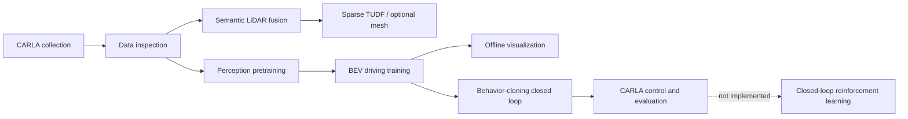
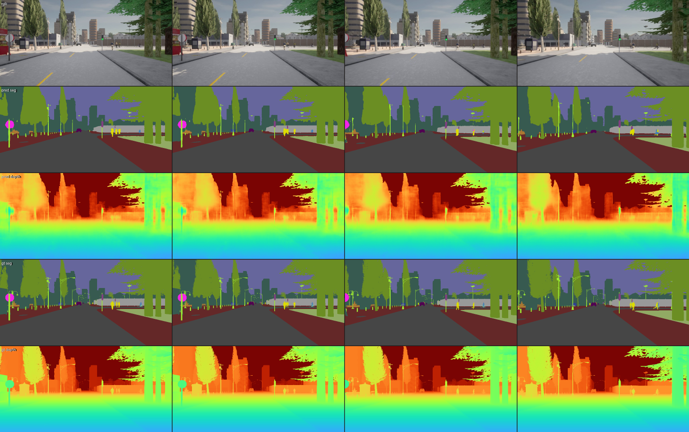
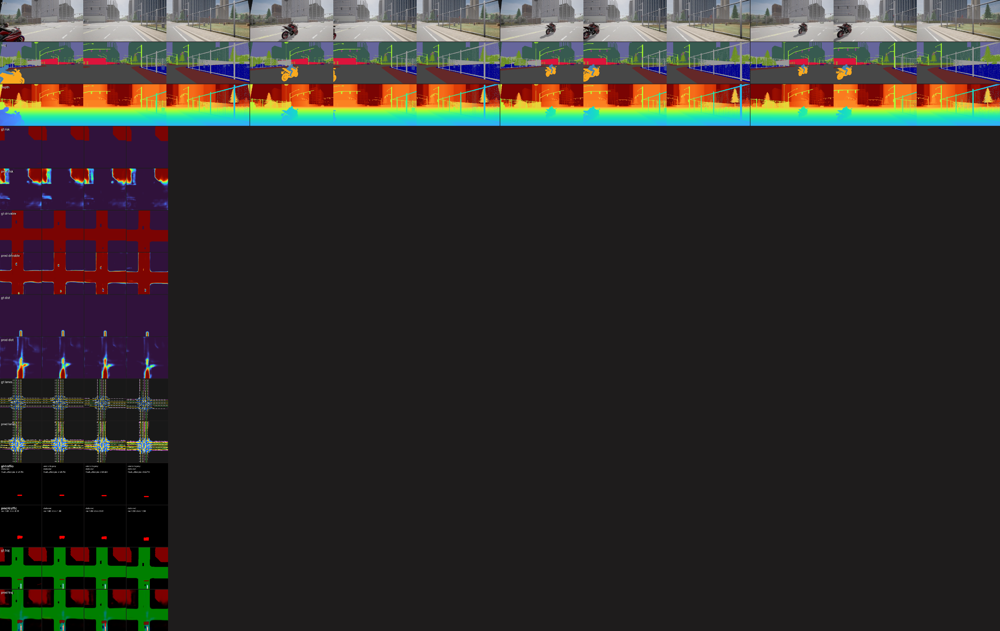
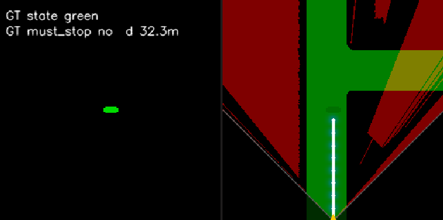
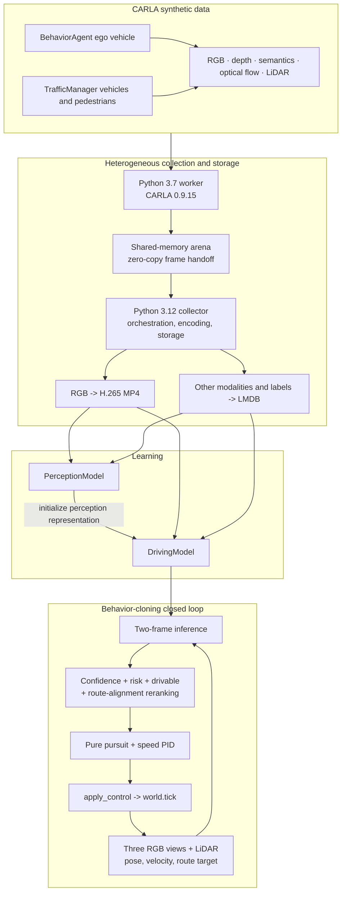
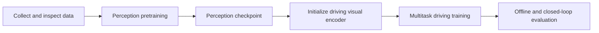

# ByteDrive-Toy

<p align="center">
  
</p>

<p align="center">
  <strong>A research prototype for three-camera + LiDAR, two-frame temporal behavior-cloning driving on synthetic CARLA data</strong><br/>
  Frozen DINOv3 visual backbone · semantic/depth pretraining · geometry-aware BEV · joint multimodal trajectory and behavior prediction · CARLA closed-loop evaluation
</p>

<p align="center">
  <a href="README.zh-CN.md">简体中文</a> · <strong>English</strong>
</p>

<p align="center">
  
  
  
  
</p>

> [!IMPORTANT]
> ByteDrive-Toy covers CARLA data collection, perception pretraining, BEV driving training, offline prediction and visualization, and **behavior-cloning closed-loop driving in CARLA 0.9.15**. `clone_loop/` performs two-frame inference, safety-aware trajectory reranking, vehicle control, episode evaluation, and recording in synchronous simulation. This remains a simulation research prototype, not a complete autonomous-driving system for deployment on real vehicles.

> [!WARNING]
> The driving model is trained by supervised **behavior cloning** on CARLA `BehaviorAgent` expert trajectories. This repository does not implement reward-based reinforcement learning, online policy updates, replay, or backpropagation from closed-loop episodes. The current data and released weights are concentrated on `Town02_Opt`, one expert style, and a fixed collection recipe. Distribution shift and compounding error are expected; stopping, drifting, collisions, low route completion, and weak cross-map generalization do not by themselves indicate a broken installation.

## Contents

- [Overview](#overview)
- [Visual results](#visual-results)
- [System architecture](#system-architecture)
- [From pixels to steering](#from-pixels-to-steering)
- [Model architecture](#model-architecture)
- [Data system](#data-system)
- [Training](#training)
- [Pretrained weights](#pretrained-weights)
- [Installation](#installation)
- [Quick start](#quick-start)
- [End-to-end workflow](#end-to-end-workflow)
- [Configuration](#configuration)
- [Visualization](#visualization)
- [Repository layout](#repository-layout)
- [Limitations and troubleshooting](#limitations-and-troubleshooting)
- [Development and license](#development-and-license)

## Overview

ByteDrive-Toy divides the driving research pipeline into two consecutive learning stages:

1. **Perception pretraining.** A frozen DINOv3 ViT-S+/16 backbone supplies full token sequences from shallow, middle, and deep layers. A shared trainable trunk jointly learns 29-class semantic segmentation and metric depth estimation.
2. **Driving learning.** The perception representation is reused to aggregate three camera frustums, LiDAR voxel statistics, and a rigidly aligned previous-frame BEV into a forward-facing BEV. The model jointly predicts spatial fields, lane geometry, traffic control, eight future-trajectory modes, mode confidence, and eight behavior labels.

At runtime, the closed-loop runner connects `DrivingModel` to synchronous CARLA simulation:

```text
observation -> two-frame inference -> trajectory selection
            -> pure-pursuit/PID control -> next observation
```

It records terminal state, progress, controls, diagnostics, and videos for every route.

| Capability | Current implementation |
| --- | --- |
| Learning paradigm | Supervised behavior cloning on CARLA `BehaviorAgent` data; no online update, reward function, or closed-loop RL |
| Visual input | Current and previous `front/front_left/front_right` RGB frames, normally `768x384`; identity transform plus invalid flag for the first frame |
| Visual backbone | Local frozen DINOv3 ViT-S+/16; full token sequences from layers 3, 6, and 12 |
| Perception tasks | 29-class semantic segmentation, symlog depth regression, and in-range/out-of-range depth classification |
| Geometry | Camera intrinsics/extrinsics back-projection; center and corner samples for each patch with depth-aware spacing |
| BEV | Forward `64 m x 64 m`; `32x32` working grid; `256x256` field outputs |
| Driving outputs | Risk, drivable, and trajectory-distribution fields; lane geometry; relevant stop line and light state; 8 modes x 20 waypoints at 10 Hz; 8 behavior labels |
| Training | AdamW; BF16 trunk with FP32 output/loss paths; differential learning rate for perception modules |
| Data | CARLA 0.9.15; RGB in H.265 and non-RGB modalities in LMDB; sensors at 2 Hz and kinematics at 10 Hz |
| Reconstruction | Multi-frame semantic LiDAR fusion; static/dynamic separation; sparse TUDF by default and optional Poisson mesh |
| Closed loop | Synchronous CARLA, online two-frame inference, safety reranking, pure-pursuit lateral control, speed PID, episode metrics, and recording |


```mermaid
flowchart LR
    A["CARLA collection"] --> B["Data inspection"]
    B --> C["Perception pretraining"]
    B --> R1["Semantic LiDAR fusion"]
    R1 --> R2["Sparse TUDF / optional mesh"]
    C --> D["BEV driving training"]
    D --> E["Offline visualization"]
    D --> F["Behavior-cloning closed loop"]
    F --> G["CARLA control and evaluation"]
    G -.->|"not implemented"| H["Closed-loop reinforcement learning"]
```

## Visual results

### CARLA closed-loop driving

The videos show online `clone_loop` episodes. The top row contains the left/front/right cameras and vehicle state; the middle row shows risk, drivable, trajectory-distribution, lane, and traffic-control predictions; the bottom row shows all candidates and the executed trajectory.

<video src="assets/visualizations/driving_video_1.mp4" controls="controls" width="768"></video>
<video src="assets/visualizations/driving_video_2.mp4" controls="controls" width="768"></video>

[Closed-loop example 1](assets/visualizations/driving_video_1.mp4) · [Closed-loop example 2](assets/visualizations/driving_video_2.mp4)

### Perception predictions

Each column is one frame. From top to bottom: RGB, predicted semantics, predicted depth, semantic ground truth, and depth ground truth.



### Driving predictions

The renderer compares RGB/semantic/depth views, the three BEV fields, lane geometry, traffic controls, and multimodal trajectories against ground truth with identical geometry and colors.



The traffic-control view colors stop lines by red/yellow/green state and overlays them on the trajectory BEV.



## System architecture


```mermaid
flowchart TB
    subgraph SIM["CARLA synthetic data"]
        C1["BehaviorAgent ego vehicle"]
        C2["TrafficManager vehicles and pedestrians"]
        C3["RGB · depth · semantics · optical flow · LiDAR"]
        C1 --> C3
        C2 --> C3
    end
    subgraph STORE["Heterogeneous collection and storage"]
        W["Python 3.7 worker<br/>CARLA 0.9.15"]
        SHM["Shared-memory arena<br/>zero-copy frame handoff"]
        COL["Python 3.12 collector<br/>orchestration, encoding, storage"]
        MP4["RGB -> H.265 MP4"]
        DB["Other modalities and labels -> LMDB"]
        W --> SHM --> COL
        COL --> MP4
        COL --> DB
    end
    subgraph LEARN["Learning"]
        P["PerceptionModel"]
        D["DrivingModel"]
        P -->|"initialize perception representation"| D
    end
    subgraph CLOSED["Behavior-cloning closed loop"]
        OBS["Three RGB views + LiDAR<br/>pose, velocity, route target"]
        INF["Two-frame inference"]
        SELECT["Confidence + risk + drivable<br/>+ route-alignment reranking"]
        CTRL["Pure pursuit + speed PID"]
        STEP["apply_control -> world.tick"]
        OBS --> INF --> SELECT --> CTRL --> STEP --> OBS
    end
    SIM --> W
    MP4 --> P
    DB --> P
    MP4 --> D
    DB --> D
    D --> INF
```

Configuration, implementation, and runtime validation are separated: experiment parameters live in `config/default.yaml`, module implementations live in their package directories, and input/shape checks live in adjacent `checks/` directories.

## From pixels to steering

The central idea is to preserve both appearance and geometry. The visual backbone explains *what* is in each patch; camera calibration and depth candidates explain *where it may be*; the BEV encoder turns those observations into a local world representation; the planning decoder turns that representation into several plausible futures.

### Perception first

Semantic and depth pretraining gives the visual trunk dense, physically meaningful supervision before driving optimization. The frozen DINOv3 backbone supplies general visual features, while trainable fusion and transformer layers adapt them to CARLA semantics and metric depth. Driving training reuses only the shared `fusion.*` and `trunk.*` parameters—not the semantic/depth output heads.

### Camera and LiDAR geometry

For each camera patch, the model encodes possible 3D locations by combining the patch center and four corners with near-to-far depth samples. The three cameras keep their own calibration. BEV queries start from metric xyz grid centers and cross-attend to image tokens. LiDAR is voxelized in ego coordinates and represented by the mean and population standard deviation of center-relative xyz values. A visual-conditioned gate injects those statistics before camera cross-attention.

### Temporal alignment

The previous BEV cannot be reused in its original coordinate frame after the vehicle moves. `previous_to_current` rigidly maps historical BEV coordinates into the current ego frame. The current BEV queries then attend to aligned historical tokens; `previous_valid=0` strictly bypasses missing history.

### Joint spatial and planning objectives

Dense fields and lane/traffic predictions force the BEV to represent road structure, visibility, and hazards. Eight learned mode tokens query intermediate BEV features while conditioned on the navigation target and ego velocity. The decoder predicts trajectories, confidence, and behavior labels. At runtime, neural confidence is combined with sampled risk, drivable probability, and route alignment before a low-level controller executes the winner.

Behavior cloning alone does not train recovery from arbitrary states. Offline losses optimize agreement with expert data, while closed-loop success depends on stability under the model's own state distribution. Broader data, recovery perturbations, DAgger-style aggregation, or a separately implemented closed-loop optimization method are needed to address that gap.

## Model architecture

### Tensor overview

| Stage | Typical tensor or resolution |
| --- | --- |
| Camera input | 3 views x RGB, `768x384`, current and previous frames |
| DINO patch grid | `48x24` per view at patch size 16 |
| Perception outputs | semantic/depth at input resolution |
| LiDAR voxel grid | statistics `[6,22,128,128]`, occupancy `[1,22,128,128]` |
| BEV working grid | `32x32` over the forward `64 m x 64 m` region |
| Dense BEV outputs | `256x256` |
| Trajectories | 8 modes x 20 ego-frame waypoints covering 2 seconds |

### Perception model

1. The local DINOv3 ViT-S+/16 is loaded with `local_files_only=True`, held in `eval()` mode, and permanently frozen.
2. Full token sequences from configured layers are RMS-normalized, concatenated, and projected to the working dimension.
3. Three pre-norm transformer layers with patch-only 2D RoPE adapt the representation.
4. PixelShuffle heads decode 29 semantic classes and two depth channels: symlog metric depth plus an in-range logit.

### Driving model

1. **Driving neck:** combines the adapted perception tokens with raw DINO features and frustum geometry.
2. **BEV initialization:** metric xyz grid centers define geometry-only queries; gated LiDAR features are injected into them.
3. **BEV encoder:** queries all camera tokens, queries the aligned previous BEV, then refines the result with a six-layer 2D-RoPE transformer and register tokens.
4. **Unified BEV decoder:** shares spatial upsampling before predicting risk, drivable, distribution, lane class/direction, stop line, and traffic-light state.
5. **Planning decoder:** eight learned mode tokens query BEV features and produce future waypoints, confidence logits, and multi-label behavior logits.

The BEV coordinate system is ego-centric and left-handed: `x` points forward and `y` points right. Always use the configured bounds and raster conversion helpers instead of assuming image-axis direction.

## Data system

### Heterogeneous CARLA collection

CARLA 0.9.15 runs in a Python 3.7 worker; modern encoding, storage, model code, and orchestration run in Python 3.12. Newline-delimited JSON carries control messages, while a named shared-memory arena carries large sensor payloads.

```mermaid
sequenceDiagram
    participant C as Python 3.12 collector
    participant S as Shared-memory arena
    participant W as Python 3.7 CARLA worker
    participant D as Disk
    C->>S: create fixed-capacity arena
    C->>W: init(config, arena_name)
    C->>W: run_scene(seed, weather, route)
    loop every synchronous tick
        W->>W: agent control -> world.tick()
        W->>W: gather every sensor with the same frame_id
        W->>S: append sensor payloads
    end
    W-->>C: return offset/size/shape/dtype index
    C->>S: read frames lazily
    C->>D: encode RGB to H.265; write remaining data to LMDB
```

See [the collector design](data/carla_data_collector/README.md) for protocol, schema, and lifecycle details.

### Scene layout

```text
data/carla_data_collector/dataset/
└── scenes/
    └── scene_000000/
        ├── rgb_front.mp4
        ├── rgb_front_left.mp4
        ├── rgb_front_right.mp4
        └── lmdb/
            ├── data.mdb
            └── lock.mdb
```

The LMDB stores scene metadata, per-frame ego and actor state, camera calibration, depth, semantic labels, optional optical flow, semantic LiDAR, traffic-light state, and route-relevant traffic-control data. RGB remains in per-camera video files.

`SingleFrameSceneBase` builds a lightweight `(scene_dir, frame_idx)` index. Readers and video decoders are created lazily inside DataLoader workers, use a bounded per-worker LRU cache, and close LMDB/video handles on eviction. Batches favor consecutive frames from one scene before shuffling at batch granularity to reduce random H.265 seeks.

### Reconstruction

An independent semantic-LiDAR pipeline fuses static points in CARLA world coordinates and builds local models for vehicles and pedestrians. It produces sparse truncated unsigned distance fields (TUDF) by default and optional Poisson meshes. These artifacts support inspection and scene-representation experiments; they are not inputs to `DrivingModel` and provide no reinforcement-learning signal.

```powershell
python -m data.multiframe_pointcloud_fusion.run
python -m data.mesh_reconstruction.run
python -m data.mesh_reconstruction.run --mesh

python -m vis.reconstructed_pointcloud_vis.run --input 0
python -m vis.reconstructed_udf_vis.run --input 0
python -m vis.reconstructed_mesh_vis.run --input 0
```

## Training

Both stages are supervised on a fixed dataset. `clone_loop/` consumes trained checkpoints for inference and evaluation only; collisions, progress, and terminal states are not converted into rewards and never trigger backpropagation.


```mermaid
flowchart LR
    A["Collect and inspect data"] --> B["Perception pretraining"]
    B --> C["Perception checkpoint"]
    C --> D["Initialize driving visual encoder"]
    D --> E["Multitask driving training"]
    E --> F["Offline and closed-loop evaluation"]
```

### Stage 1: perception

The trainable components are multi-layer token fusion, the three-layer pre-norm transformer, and semantic/depth heads. DINOv3 remains frozen.

| Loss | Definition |
| --- | --- |
| `semantic` | 29-class cross-entropy; class 0/unlabeled is ignored |
| `depth` | Smooth L1 in symlog space, in-range pixels only, with near-to-far weighting |
| `depth_grad` | Smooth L1 on horizontal and vertical neighboring differences |
| `depth_range` | Full-image binary cross-entropy for depth `<128 m` |

### Stage 2: driving

Only `fusion.*` and `trunk.*` are imported from the perception checkpoint. By default the new driving modules use learning rate `1e-4`, the perception representation uses `1e-5`, and DINOv3 is excluded from the optimizer.

The multitask objective includes trajectory regression, mode confidence, behavior labels, the three spatial fields, lane class/direction, centerline alignment, vehicle-footprint boundary cost, stop-line segmentation, light-state classification, and red-light crossing cost. Hungarian matching selects the closest mode to ground truth; all modes receive a small trajectory update, while footprint and red-light constraints apply to every candidate.

### Default optimizer settings

| Setting | Default |
| --- | ---: |
| Optimizer | AdamW |
| `epochs` | 10 total epochs |
| `batch_size` | 32 |
| `num_workers` | 4 |
| `compile` | true on CUDA |
| `lr` | `1e-4` |
| `weight_decay` | `1e-5` |
| `resume` | true |

`train.epochs` is the target total epoch, not the number of extra epochs. A checkpoint at epoch 40 requires `epochs > 40` to continue. Use `--perception-ckpt` once to initialize a new driving run; use `--resume` to restore the same task, optimizer, and epoch. Automatic resume happens after perception initialization and will overwrite it if an existing driving checkpoint is found.

## Pretrained weights

- Baidu Netdisk: [ByteDrive-Toy pretrained weights](https://pan.baidu.com/s/1Fc8xh40ODsYug3Sc2GMBjQ?pwd=v5pw), extraction code `v5pw`
- Current driving checkpoint: [ByteDrive-Toy Releases](https://github.com/ByteDriveTeam/ByteDrive-Toy/releases), file `driving20260803.pt`

> [!IMPORTANT]
> Older driving weights from the Netdisk are incompatible with the current model. Put `driving20260803.pt` in `train/ckpt/driving/`; do not mistake an older local `driving.pt` for the current release.

> [!NOTE]
> Load `.pt` files only from trusted sources. PyTorch checkpoints are serialized objects, and this project cannot verify third-party downloads or credentials.

Expected layout:

```text
ByteDrive-Toy/
├── model/dinov3-vits16plus-pretrain-lvd1689m/
│   ├── config.json
│   └── model.safetensors
├── train/ckpt/
│   ├── perception/perception.pt
│   └── driving/driving20260803.pt
└── data/map/
    ├── Town02_HD_map.npz
    └── Town05_HD_map.npz
```

## Installation

| Runtime | Purpose | Main dependencies |
| --- | --- | --- |
| Python 3.12 | Encoding, datasets, training, inference, reconstruction, visualization | PyTorch, Transformers, PyYAML, NumPy, OpenCV, LMDB, msgpack, PyAV, Open3D |
| Python 3.7 | CARLA 0.9.15 worker | `carla`, NumPy, Shapely, NetworkX |

Reference development versions are Python 3.12.9, PyTorch 2.12.1, Transformers 5.13.0, PyYAML 6.0.3, NumPy 2.4.6, OpenCV 4.13.0, LMDB 2.2.1, msgpack 1.2.1, PyAV 17.1.0, and Open3D 0.19.0. They are not pinned; select the PyTorch build for your driver and CUDA runtime.

### Python 3.12 environment

```powershell
py -3.12 -m venv .venv
Set-ExecutionPolicy -Scope Process Bypass
.\.venv\Scripts\Activate.ps1
python -m pip install --upgrade pip

# Install the CUDA-compatible PyTorch build from https://pytorch.org/get-started/locally/ first.
pip install transformers pyyaml numpy opencv-python lmdb msgpack av open3d
```

CPU fallback is supported but DINOv3 and high-resolution BEV decoding are very slow. Full training should use a BF16-capable CUDA GPU.

### Python 3.7 CARLA worker

```powershell
py -3.7 -m venv data/carla_data_collector/py37_venv
.\data\carla_data_collector\py37_venv\Scripts\Activate.ps1
python -m pip install numpy==1.21.6 shapely networkx

# Install the CARLA 0.9.15 wheel or egg supplied with your CARLA distribution.
```

Start a CARLA 0.9.15 server reachable at `127.0.0.1:2000`. The collector accepts only `*_Opt` maps and defaults to `Town02_Opt`. PyAV/FFmpeg must provide `libx265`. Training newly collected data requires enabling the depth and semantic camera modalities used to construct supervision. The driving dataset also requires the matching `data/map/{Town}_HD_map.npz`.

## Quick start

After installing both runtimes and downloading `train/ckpt/driving/driving20260803.pt`, create `config/release20260803.yaml`:

```yaml
driving_vis:
  checkpoint: train/ckpt/driving/driving20260803.pt

clone_loop:
  inference:
    checkpoint: train/ckpt/driving/driving20260803.pt
```

Run offline visualization if a compatible local scene exists:

```powershell
python -m vis.driving_vis.run --env release20260803 `
  --checkpoint train/ckpt/driving/driving20260803.pt
```

Start CARLA and run one closed-loop episode:

```powershell
.\.venv\Scripts\python.exe clone_loop\run.py --env release20260803 --max-episodes 1
```

## End-to-end workflow

For a smoke test from newly collected data, create `config/basic_chain.yaml`:

```yaml
carla_collector:
  cameras:
    modalities:
      rgb: true
      depth: true
      semantic: true
      optical_flow: false

train:
  epochs: 1
  batch_size: 1
  num_workers: 0
  resume: false

pred_vis:
  checkpoint: train/ckpt/perception/epoch_001.pt

driving_vis:
  checkpoint: train/ckpt/driving/epoch_001.pt

clone_loop:
  inference:
    checkpoint: train/ckpt/driving/epoch_001.pt
```

This is a pipeline check, not a recipe for useful driving performance.

1. Validate configuration and the local backbone:

   ```powershell
   python -c "from config import load_config; c=load_config(env='basic_chain'); print(c.train.device, c.model.driving.work_dim)"
   python -c "from model.perception_model import PerceptionModel; from config import load_config; m=PerceptionModel(load_config(env='basic_chain')); print(sum(p.numel() for p in m.parameters()))"
   ```

2. Start CARLA and collect one or two scenes:

   ```powershell
   python data/carla_data_collector/collector/run.py --env basic_chain --max-scenes 2
   ```

3. Inspect a scene:

   ```powershell
   python -m vis.data_vis.run --env basic_chain --scene 0
   ```

4. Train perception:

   ```powershell
   python -m train.run --task perception --env basic_chain
   ```

5. Initialize and train driving:

   ```powershell
   python -m train.run --task driving --env basic_chain `
     --perception-ckpt train/ckpt/perception/epoch_001.pt
   ```

6. Inspect predictions:

   ```powershell
   python -m vis.pred_vis.run --env basic_chain `
     --checkpoint train/ckpt/perception/epoch_001.pt

   python -m vis.driving_vis.run --env basic_chain `
     --checkpoint train/ckpt/driving/epoch_001.pt
   ```

7. Run one closed-loop episode:

   ```powershell
   .\.venv\Scripts\python.exe clone_loop\run.py --env basic_chain --max-episodes 1
   ```

Press `q` to end the current episode while preserving its logs and videos. Results are written under `clone_loop/out/run_<timestamp>/`: stepwise JSONL, a driving video, an inference diagnostics video, and `summary.json`.

## Configuration

`config/default.yaml` is the single source of default values. `config/schema.py` defines types and constraints. `config.load_config()` recursively merges an optional `config/<env>.yaml` override and validates the result.

Example override:

```yaml
train:
  device: cuda
  batch_size: 2
  num_workers: 2
  epochs: 10
  resume: false

model:
  driving:
    freeze_perception: false
```

```powershell
python -m train.run --task driving --env fresh_driving `
  --perception-ckpt train/ckpt/perception/perception.pt
```

When memory is limited, first reduce `train.batch_size` to 1–4, optionally freeze the perception representation, reduce BEV upsampling channels, and reduce register tokens. Camera height and width must remain divisible by the DINO patch size of 16.

## Visualization

### Raw data browser

```powershell
python -m vis.data_vis.run --scene scene_000000
```

Use `Space` to play/pause; arrow keys or `A`, `,`, and `.` to step; `R/D/M/F/V` for RGB, depth, semantic, flow, and BEV/LiDAR layers; `B/S` for dynamic/static boxes; `W` to save a composite; and `Q` or `Esc` to quit.

### Model predictions

```powershell
python -m vis.pred_vis.run --checkpoint train/ckpt/perception/perception.pt
python -m vis.driving_vis.run --checkpoint train/ckpt/driving/driving20260803.pt
```

The perception renderer compares semantic and depth predictions with ground truth. The driving renderer applies sigmoid/argmax as appropriate, draws directed lane tangents, colors stop lines by light state, overlays multimodal trajectories by confidence, and labels native versus legacy traffic-control associations.

## Repository layout

```text
ByteDrive-Toy/
├── config/                         # Default parameters, schema, and environment overrides
├── data/
│   ├── carla_data_collector/       # Python 3.7/3.12 CARLA collection system
│   ├── perception_dataset/         # Single-frame perception dataset
│   ├── driving_dataset/            # Two-frame driving inputs and multitask ground truth
│   ├── driving_targets/            # Trajectory, behavior, and spatial-field targets
│   ├── hd_map/                     # HD-map rasterization and off-road distances
│   ├── multiframe_pointcloud_fusion/
│   └── mesh_reconstruction/        # Sparse TUDF and optional Poisson mesh
├── model/
│   ├── dinov3_backbone/            # Frozen local DINOv3
│   ├── perception_model/           # Shared representation plus semantic/depth heads
│   ├── bev_encoder/                # Camera/history cross-attention and BEV transformer
│   ├── bev_decoder/                # Fields, lanes, and traffic controls
│   ├── trajectory_decoder/         # Multimodal trajectory, confidence, behavior
│   └── driving_model/              # Complete driving model
├── train/                           # Unified CLI, losses, optimizer, checkpoints
├── vis/                             # Raw data, predictions, and reconstruction viewers
├── clone_loop/                      # Synchronous CARLA inference/control/evaluation
├── Doc/                             # File index and development rules
├── assets/visualizations/
├── LICENSE
├── README.md                        # English (primary)
└── README.zh-CN.md                  # Simplified Chinese
```

Most modules use a stable package layout:

```text
<module>/
├── __init__.py
├── <module>.py
└── checks/
    ├── __init__.py
    └── <module>_checks.py
```

## Limitations and troubleshooting

### Research limitations

- Training is offline supervised behavior cloning. `clone_loop` is an inference/control/evaluation loop, not a training loop.
- Current data and released weights focus on `Town02_Opt`, one `BehaviorAgent` style, and a narrow traffic/sensor recipe.
- The model uses two frames, three cameras, and LiDAR; it has no long-term memory beyond one aligned historical BEV.
- The controller targets synchronous CARLA 0.9.15 and does not imply real-vehicle readiness.
- There is no official train/validation/test split, data augmentation, learning-rate schedule, metric suite, early stopping, or best-checkpoint selection by default.
- Perception pretraining uses only `front`; driving uses `front/front_left/front_right`.
- Driving supervision depends on CARLA depth, semantics, traffic-light state, and HD maps. Real-data transfer requires new supervision sources.

### Common issues

<details><summary><strong>DINOv3 cannot be found</strong></summary>

The project uses `local_files_only=True`. Verify `model/dinov3-vits16plus-pretrain-lvd1689m/config.json` and `model.safetensors`, or override `model.dinov3_backbone.model_dir`.
</details>

<details><summary><strong>CUDA configuration falls back to CPU</strong></summary>

Install a CUDA-enabled PyTorch build compatible with the local driver. The entry point falls back when `torch.cuda.is_available()` is false.
</details>

<details><summary><strong>The driving dataset reports a missing HD map</strong></summary>

`Town02_Opt` maps to `data/map/Town02_HD_map.npz`. Supply the matching file for other maps or override `data.driving.map_dir` and `map_name_template`.
</details>

<details><summary><strong>Windows DataLoader or VideoCapture failures</strong></summary>

Run the supported `python -m train.run ...` entry point from the repository root. For diagnosis, set `train.num_workers: 0`.
</details>

<details><summary><strong>`--perception-ckpt` appears to load an old driving model</strong></summary>

`train.resume` defaults to true. Disable it for a new experiment; use `--resume <driving-checkpoint.pt>` only when continuing the same run.
</details>

<details><summary><strong>H.265 encoding fails</strong></summary>

Verify that the active PyAV/FFmpeg build provides `libx265`, and inspect `carla_collector.output.video_codec`.
</details>

<details><summary><strong>The closed-loop model stops, drifts, or collides</strong></summary>

First verify checkpoint coverage, input modalities, camera order, temporal spacing, and calibration against training. Then inspect `episode_XXXX.jsonl` and the inference video. If the pipeline is consistent, poor closed-loop performance can still be an expected limitation of the current narrow offline dataset.
</details>

## Development and license

- [File and documentation index](Doc/Index.md)
- [Development guidelines](Doc/DevelopmentGuidelines.md)
- [CARLA collector design](data/carla_data_collector/README.md)
- [Closed-loop runner design](clone_loop/README.md)
- [Full Simplified Chinese documentation](README.zh-CN.md)

Configurable values must live in `config/`; runtime checks live in adjacent `checks/` directories; source-file comments and docstrings remain Chinese by project convention; and `Doc/Index.md` must be updated whenever files are added or removed.

ByteDrive-Toy is licensed under the [Apache License 2.0](LICENSE).

## Acknowledgements

- [PETR](https://github.com/megvii-research/PETR)
- [CARLA](https://github.com/carla-simulator/carla)
- [BEVFormer](https://github.com/fundamentalvision/BEVFormer)
- [BEVFusion](https://github.com/mit-han-lab/bevfusion)
